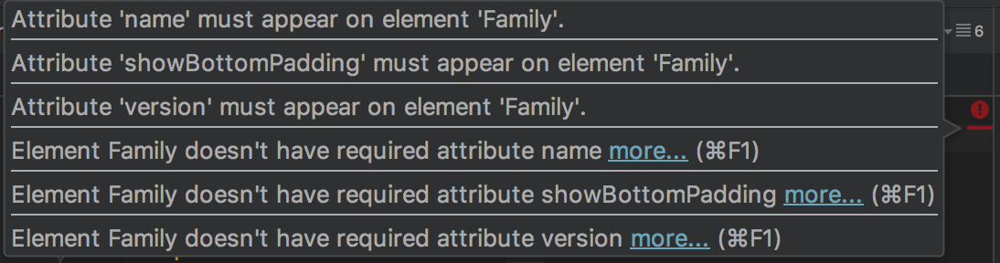
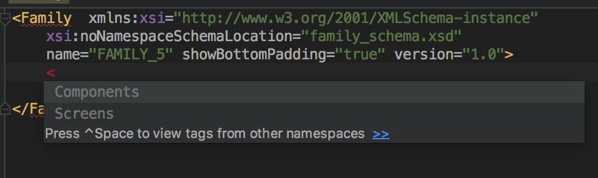
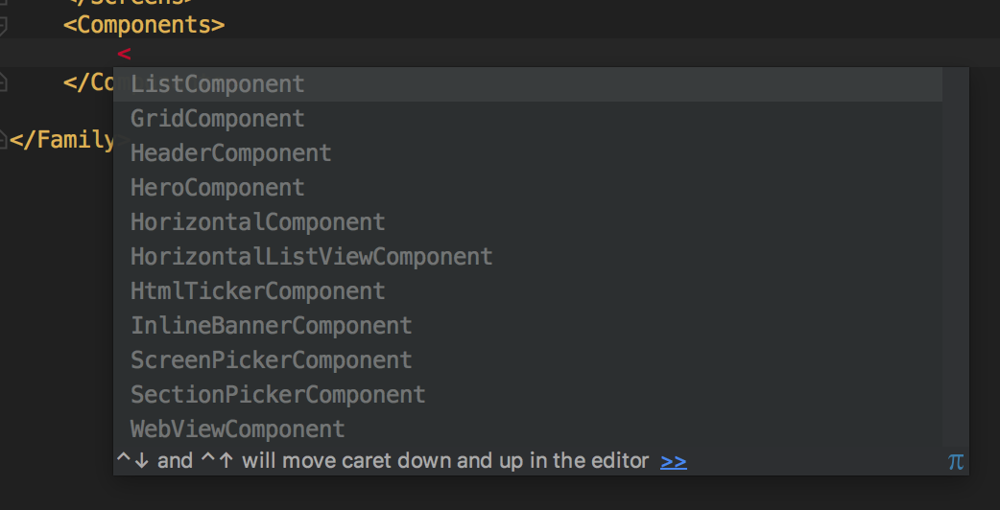
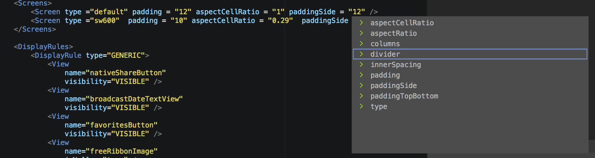
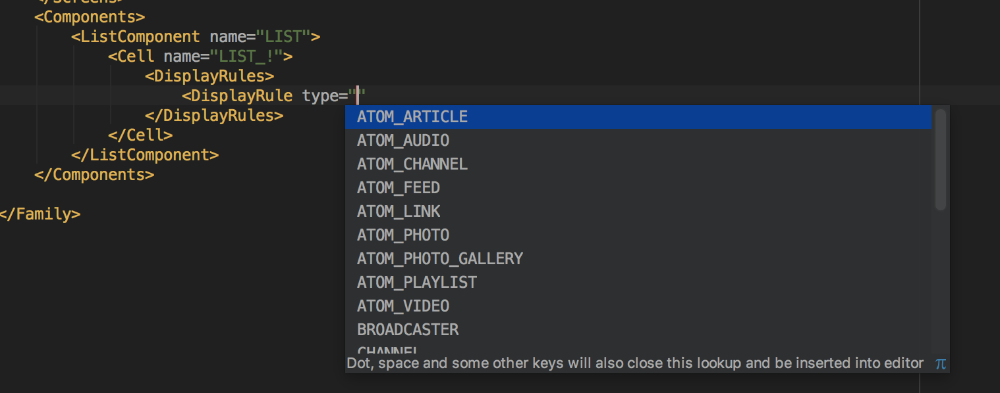

# Family syntax intelligent code completion

### Adding Schema to Family XML:

Start your document with **Family** xml element and add schema location as follows:
```
<Family xmlns:xsi="http://www.w3.org/2001/XMLSchema-instance"
        xsi:noNamespaceSchemaLocation="family_schema.xsd">
```
Intelligent code completion should start work at that point

### Errors and warnings:
 After adding namespaces it should show you errors and warnings about missing attributes and elements - example below.




### Autofill XML elements:





### Autofill XML attributes:



### Autofill XML predefined values:




### Notes:

Please bear in mind whenever you change Family Entity you should’ve to update family_schema.xsd file as well.
