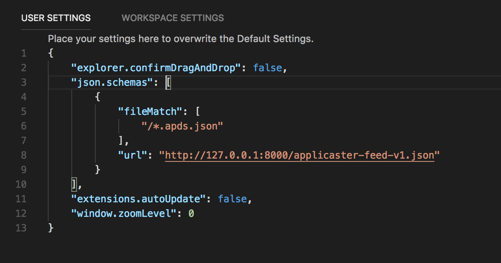
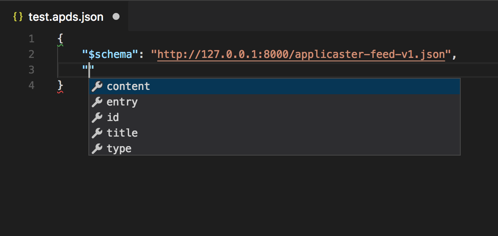

# How to Validate a JSON Feed

## VSCode

To bind a JSON file to a schema, you can use either one of the following methods:

### 1. User Settings

* Use a local or public URL to point to the schema, for example: `http://127.0.0.1:8000/applicaster-feed-v1.json`

* Add the following section under **User Settings** (click **_⌘,_** to open)

```json
"json.schemas": [ { "fileMatch": [ "/*.apds.json" ], "url": "http://127.0.0.1:8000/applicaster-feed-v1.json" } ],
```



### 2. Special Attribute

* Add the following attribute at the top level of your JSON:

```json
{
    "$schema": "http://127.0.0.1:8000/applicaster-feed-v1.json",
    ....
}
```

* Then you'll get intellisense


