# Feeds for Developers/QA/Demo

## Overview

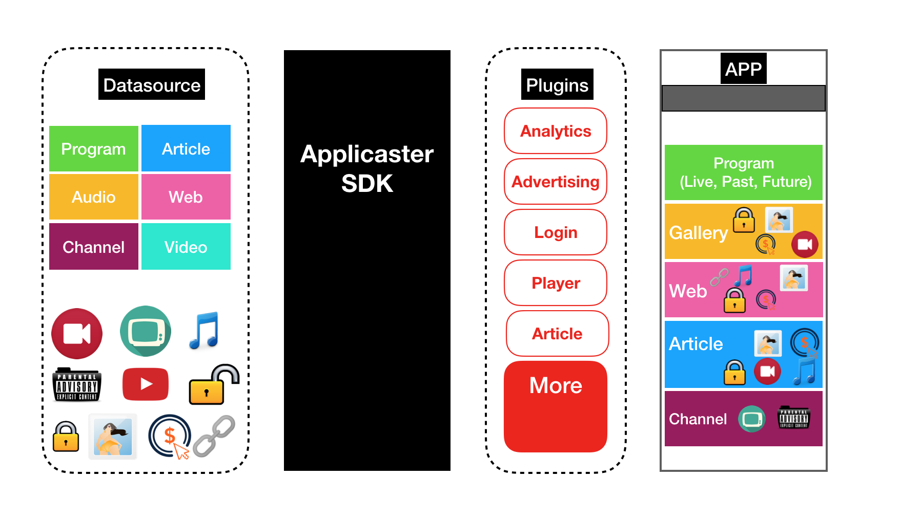

A feed generator API that create feeds to make your app fully functional, while the customer's provider is being developed.

It can also be used as reference, to guide developers to troubleshoot their own DataSource.

## Automatic Feeds

This API generates Feed Json URLs based on your needs. 

### 1. Flat Feed: Grid/List/Hero etc...

In order to populate your List/Grid/Hero/Rail with Applicaster items: 

#### 1.1 DataSource

- Go to [http://zapp-pipes.herokuapp.com/feed_generator/help](http://zapp-pipes.herokuapp.com/feed_generator/help)
- Check the items you need in your app, then click `Get Link`

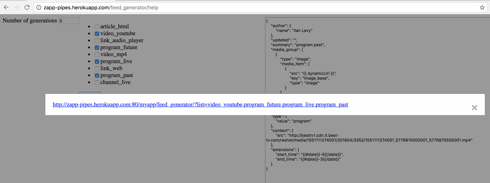

#### 1.2 Zapp

- From UIBuilder, create a Feed JSON that uses the URL
- Add a List to the Screen and connect it to your feed

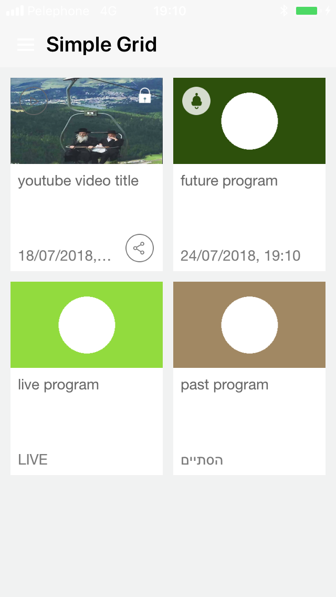

### 2. Sibling Feeds: TabBar

In order to populate your TabBar with Applicaster items: 

#### 2.1 DataSource

- Go to [http://zapp-pipes.herokuapp.com/feed_generator/help](http://zapp-pipes.herokuapp.com/feed_generator/help)
- In `Number of Generation`, type: `1`
- For the 1st generation node, type the number of tabs = `3`
- Check the items you need in your app, then click `Get Link`

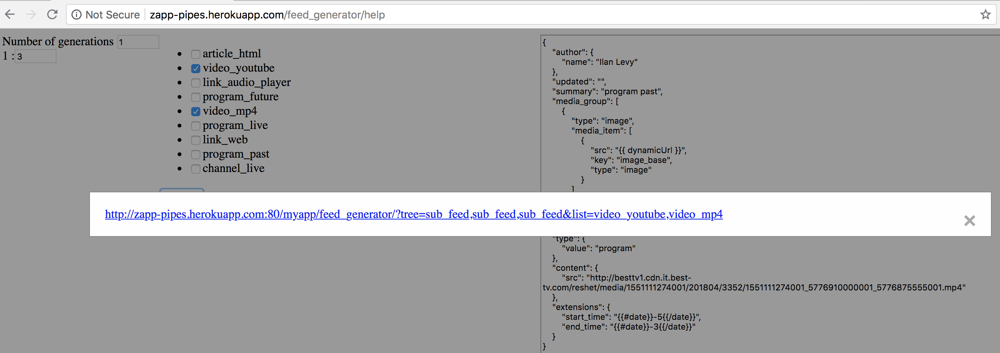

#### 2.2 Zapp

- From UIBuilder, create a Feed JSON that uses the URL
- Add a TabBar to the Screen and connect it to your feed

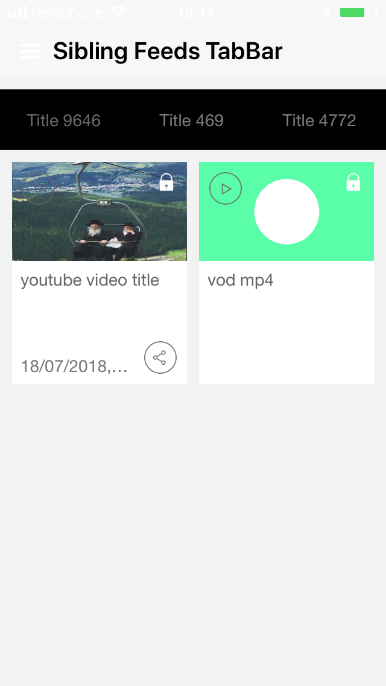

### 3. Nested Feeds for connecting Screens

In order to populate `Screen 1:Hero` that opens a `Screen 2:TabBar` that is populated with Applicaster items:

#### 3.1 DataSource

- Go to [http://zapp-pipes.herokuapp.com/feed_generator/help](http://zapp-pipes.herokuapp.com/feed_generator/help)
- In `Number of Generation`, type: 2
- For 1st generation node, type: 1
- For 2nd generation node, type the number of tabs: 3
- Check the items you need in your app, then click `Get Link`

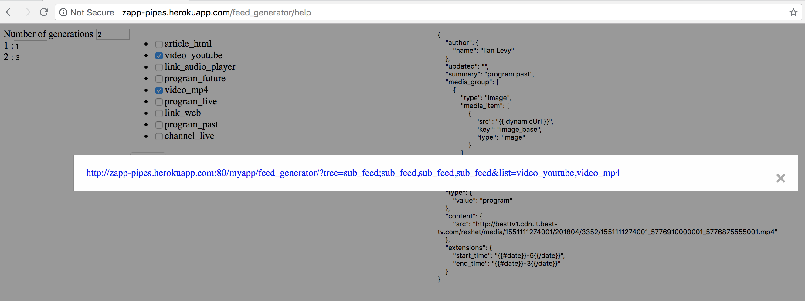

#### 3.2 Zapp

- From UIBuilder, create a new Feed JSON with the URL, name it `Screen1-to-Screen2-Feed`
- Add `Screen 2` with a `Tab Bar` on it, no feed should be defined
- Add `Screen 1` with a `Hero` on it
- Connect the `Hero` to the screen target `Screen 2`
- Set the feed of `Hero` to be Feed JSON `Screen1-to-Screen2-Feed`

Now screen 1, shows a hero that points to screen 2 which contains the tabs with grid/list

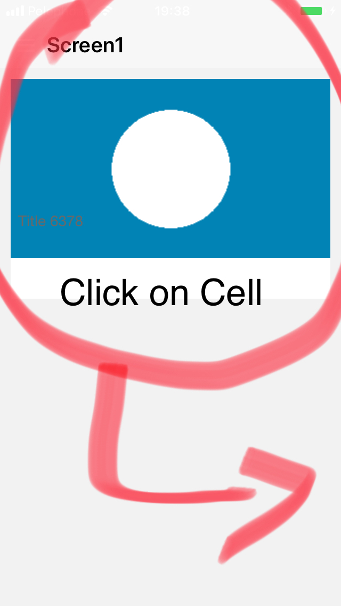    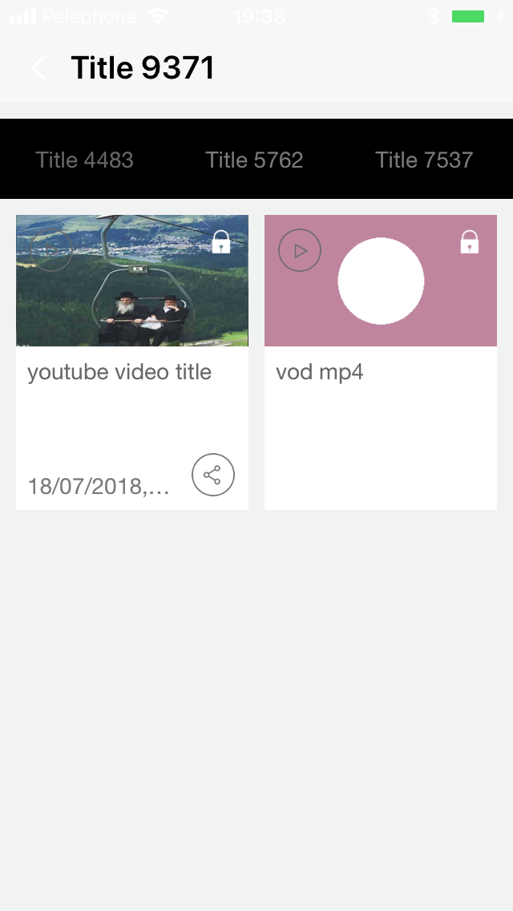

## Issues?

If you don't find what you need:

- Go to [http://zapp-pipes.herokuapp.com/feed_generator/help](http://zapp-pipes.herokuapp.com/feed_generator/help)
- Fill-in the [form](https://airtable.com/shrySQY7afjadi4Sl) to `suggest a new template` 
  
- Click `Submit`

Let us know about your needs so we can add a new template for you

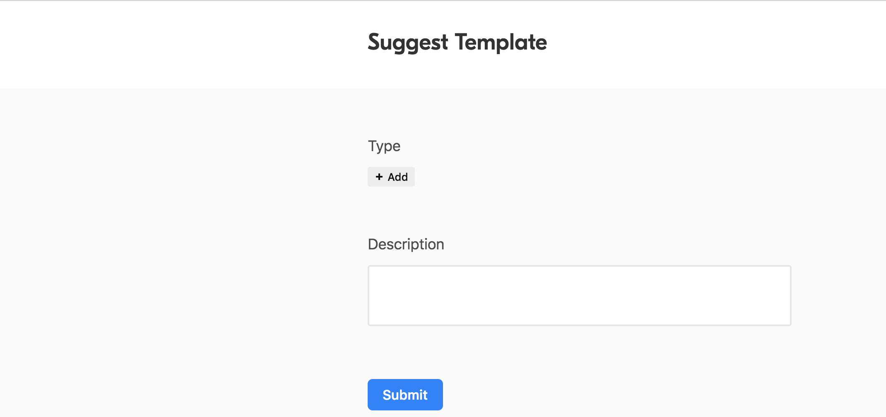

# Templates


## Adding a template, for demo/qa/developers

Only if you are the one responsible to add new templates. Follow these steps:

* Choose a unique name describing the scenario for this template. For example: ```article_react```

* Go to the ```form``` to add new template (should be owned by QA/Product)

- Fill-in the ```Key```, for example ```article_react```

- Fill-in a description, for example: ```article that is opened by the react plugin, according to the plugin_identifier```

- Fill-in the ```Raw``` json formatted text of the template, for instance:

```json
{
    "summary": "Summary",
    "content": {
        "type": "html"
    },
    "author": {
        "name": "Author"
    },
    "id": "{{ id }}",
    "media_group": [
        {
            "type": "thumbnail",
            "media_item": [
                {
                    "key": "thumbnail-small",
                    "type": "thumbnail",
                    "src": "{{ dynamicUrl }}",
                    "scale": "small"
                },
                {
                    "key": "thumbnail-large",
                    "type": "thumbnail",
                    "src": "{{ dynamicUrl }}",
                    "scale": "large"
                }
            ]
        }
    ],
    "title": "Title React Article {{ id }}",
    "link": {
        "rel": "alternate",
        "type": "text/html",
        "href": "{{ app }}://presentRN?plugin={{ plugin_identifier }}&presentation=push&reactProps[item_id]={{ id }}"
    },
    "type": {
        "value": "link"
    }
}
```

- Choose a ```Type``` from the list of supported types (article,video,program etc...)

Then `Submit`

## Variables

As you've probably noticed in the template above there are variables. To understand the variables in use check this [view](https://airtable.com/shrcnGPRBVWOJyoze)

There are 2 kinds of variables:

- Internal (Default): Those are the variables/functions built-in the feed generator, for example to generate an id, use ```{{ id }}``` or a date etc...
- Explicit: Those are variables that can't be generated internally and requires an explicit value.

### Explicit variable

In order to add your own new explicit variable, in this case ```{{ plugin_identifier }}```

Go to the Airtable form, and add it like the following:  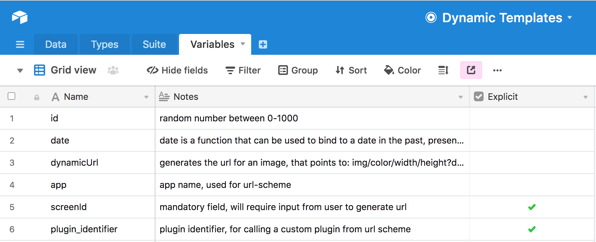

IMPORTANT: Mark it as ```Explicit```

### How to use ?

Go to the [console](http://zapp-pipes.herokuapp.com/feed_generator/help)

Check the new template ```article_react``` it will open a list of explicit variables

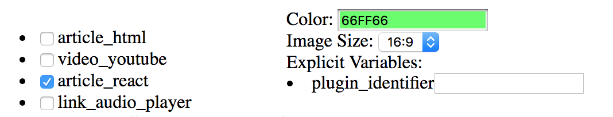

Fill-in the `plugin_identifier`, for example: `ReactNativeArticle-SoYummy`

Click `Get Link`

Now the generated feed looks like the following

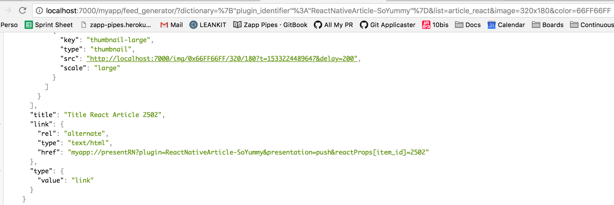


