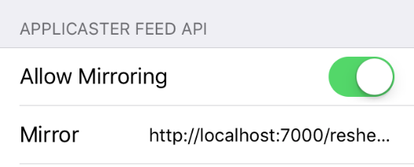
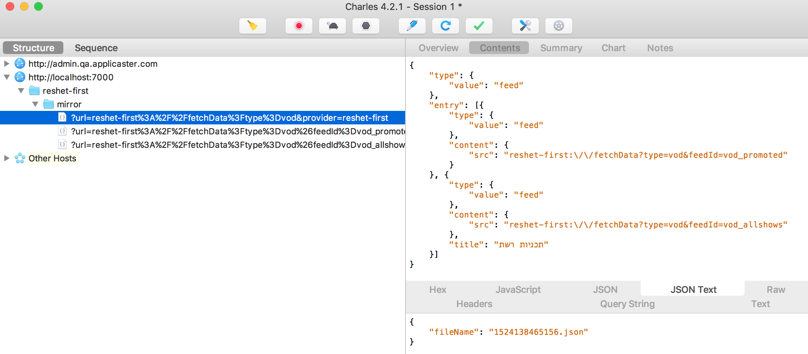
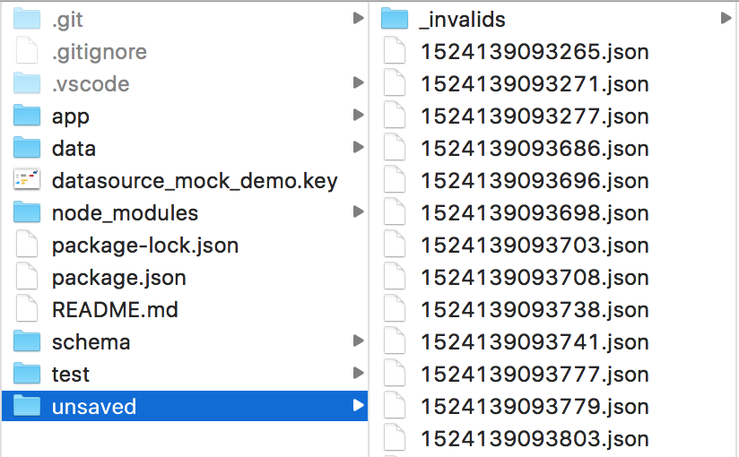
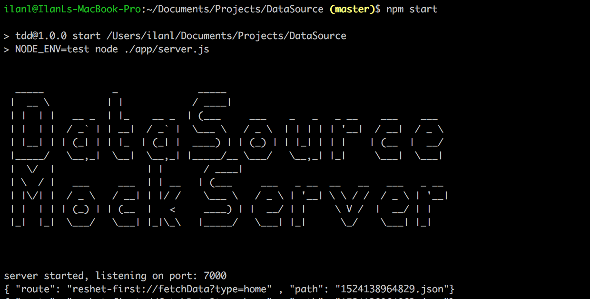
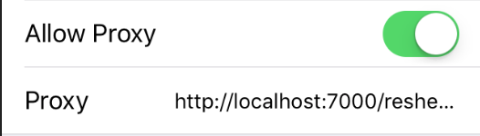
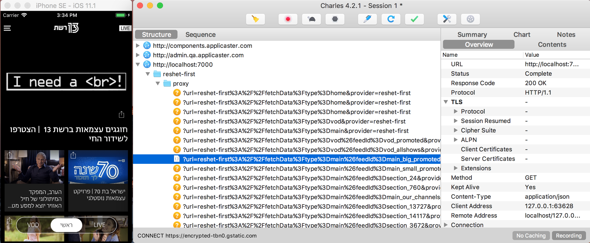

# Prerequisites

* Clone the [DataSourceMockServer](https://github.com/applicaster/DataSourceMockServer).

* Run the following command in terminal, by default the server listens on port 7000.
`npm install && npm start`

# Mirroring

**By using this feature, QA and Developers can solve issues related to the customers' feed**

### Settings

* First, enable Mirroring in the App Settings:

  

### Sniffing via [Charles Proxy](https://www.charlesproxy.com/)

* After running the server, you can see in **Charles Proxy** the following:

  

### Recording Feed

- Enabling **Mirroring** means that the App always posts a copy of the JSON produced by the customer's feed

- Each JSON is flushed into the `unsaved` directory:

  

- In the **Console Log**, the Server prints the _route_ processed and the _path_ of captured JSON

  

# Proxy

**The goal of the Proxy is to redirect a _route_ to a _JSON file_ instead of the real feed**. The proxy feature is independent from the mirroring described above

This can be used for the following case scenarios:
- Test a _Family Cell Style_'s behavior upon each one of the supported feed items (_videos_, _articles_, _links_, _images_, etc)
- Quickly solve issues related to _url schemes_ without involving a third-party
- Use identical feeds between Android and iOS apps
- Use expected data for _demo purposes_/_acceptance tests_

### Settings

* First, enable Proxy in the App Settings:

  

### Alter Route

- Using **Mirroring**, we learn what's the current feed for a specific route. See in the console which route you wish to override, for example: 

```json
{ 
  "route": "reshet-first://fetchData?type=main&feedId=main_big_promoted", "path": "1524139093698.json"
}
```

- Open file: `unsaved/1524139093698.json`

- For example, before changing the feed:

    

- Change the feed, for example, change the promoted image to a more geeky one

- Save the JSON file as `data/main.json` (just for the sake of the example)

- In `routes.json`, add a rule to redirect the _route_ to the _path_ of `main.json`

- The rule should be created under the *provider* as defined in the _Proxy URL Settings_. See `http://localhost:7000/<provider>/proxy/?url=`. For example `reshet-first`, as shown below:

```json

{
  "reshet-first": [
    {
      "route": "reshet-first://fetchData?type=main&feedId=main_big_promoted",
      "path": "data/main.json"
    }    
  ]
}

```

- Navigate to the section in app, see that **Charles Proxy** is showing a request to the proxy server which returns our custom JSON.

- Check that all routes return `Http Status Code: 404`, except the one we redirected, which returns `Http Status Code: (200)`

  

# Demo

Coming soon - By @Avi

# Troubleshooting

1. Make sure the Zapp-Pipes Mock Server is running on the port you want to use

2. Check that in the App > Settings > Advanced Settings > Feed > Mirroring > Allow Mirroring is ON and points to your server. In case  you're using a real device the server url should point to your IP instead of localhost.

3. Check that in the App > Settings > Advanced Settings > Feed > Proxy > Allow Proxy is ON and points to your Server, if you're using a real device the url should point to your IP instead of localhost.

4. If **Charles Proxy** is not capturing the traffic to your <IP:PORT>, check that Charles's Proxy is enabled and recording properly.

5. When using Proxy/Mirroring from a physical device (iOS or Android), follow those [instructions](https://www.charlesproxy.com/documentation/faqs/using-charles-from-an-iphone/) to connect your device thru Charles Proxy.

5. In case your route is not intercepted, open _Charles Proxy_ to see the HTTP request that is mirrored instead of being intercepted, then change your rule accordingly. It should appear in `routes.json` under the correct parent environment, such as `reshet-first` as appears in the App > Settings > Proxy > URL. Feel free to change the URL and point to your custom `environment`.

  


