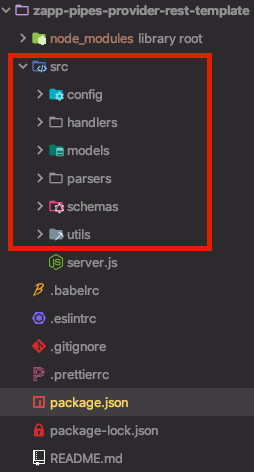

# Data Source Provided (DSP) for Roku-TV

**This documentation is in beta**

The Roku-TV system cannot use the current DSP solution, because the javascript code can't be parsed by Roku. This documentation explain how to solve this problem in a few steps.

Applicaster provide a plugin for Roku-tv, this plugin parse the DSP `manifest.json`. This Roku plugin read the endpoint's described inside the `manifest`. Then the Roku App can call an external (rest) service, in order to receive the feed data from the client API.

This is the steps to follow for enable the data source provided inside roku tv :

1. [Prerequisites](#step1)
2. [Update The manifest to V2](#step2)
3. [About the ContextKeys](#step3)
4. [Create a external service](#step4)

#### Prerequisites {#step1}
Before the next step, please make sure you are familiar with the DataSource Provider (DSP) concept, documentation [here](Home.md) .

#### Update the manifest to V2 {#step2}
The Roku system parses the plugin manifest and uses the endpoint provided inside the ```zapp_pipes.v2``` section for call the external rest service.

The following JSON object needs to be added into the DSP plugin manifest file (`plugin-manifest.json`).

***Complete Manifest Real Example*** [Here](https://zapp.applicaster.com/admin/plugin_versions/9909/plugin_manifests/9909)

```json
    {
      "zapp_pipes": {
        "v2": {
          "data_types": [
            {
              "label": "(string) Name of the feed",
              "value": "(string) ex.: APPLICASTER_COLLECTION",
              "endpoint": "(string) name of the endpoint",
              "documentation": {
                "link": "(string) link to the doc, ex: https://applicaster.zendesk.com/hc/en-us/articles/204644569-Collections",
                "feed_id_description": "(String) Feed description For example: `accounts/xxx/broadcasters/yyy/collections/zzz`",
                "feed_id_description_image_url": "(String) Link to image url description",
                "feed_id_placeholder": "(String) Type the Applicaster Collection ID"
              }
            }
          ],
          "endpoints": [
            {
              "name": "(String) name of the endpoint: for Example : 'app'",
              "remoteUrl": "(String) Path to the remote server, for Example: https://admin.applicaster.com/pipesv2/app/feed",
              "contextKeys": [
                "(String) Parameters inside the app configuration need to be sent to the external server, for Example: 'bundleIdentifier'"
              ]
            }
          ]
        }
      }
    }  
```

#### Note about the ContextKeys {#step3}
The `ContextKeys` array, send to the server (if needed) some parameter stored on the roku system (like authorization ID etc..) .

The server receive this parameter as a normal query string, named CTX, that's base64 encoded strings.

An example of query can be: "https://pipes.applicaster.com/v2/applicaster/2.0.0/live?feedId=1&ctx=#CTX"

#### Create a Rest server {#step4}
PreRequisite : You have to be familiar with the concepts of a rest server.
Good documentation can be read [here](https://www.codecademy.com/articles/what-is-rest)

Each Developer can write a rest server in any language, the important thing is return, on the responses, the objects described on the applicaster feed schema API documentantion [here](https://developer.applicaster.com/Zapp-Pipes/5.-Feed-API.html).

We provide a starting template of a rest server build in `node.js` and `express` .

The template can be cloned/downloaded [here](https://github.com/applicaster/zapp-pipes-provider-rest-template) .

Please go over the main readme file to understand how to install and run the project rest server [here](https://github.com/applicaster/zapp-pipes-provider-rest-template/blob/master/README.md).


**note about the node template** :

The Template provided, mirror the same logic of a normal dsp. The developer can easy replicate/copy the logic inside the `src` folder.

The `server.js` wrap the logic, and allow to manage the request/response using the `express` framework.


