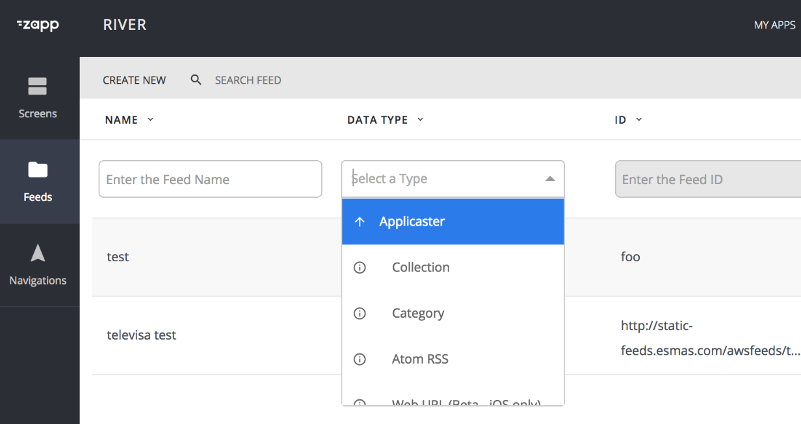
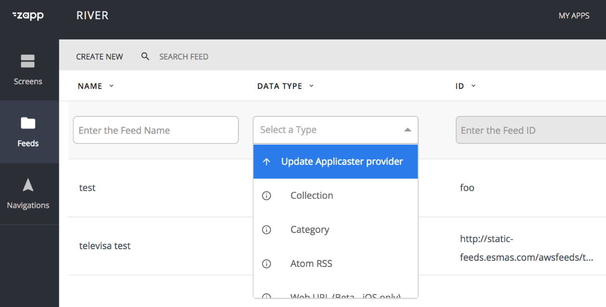

# How to publish a provider in Zapp

In order to use a data source provider in Zapp, it needs to be published to the Zapp platform. This will make the provider available for selection when users are setting up their app.

## Get a Zapp Token

Like many other procedures, you will need a zapp token for publishing a provider in Zapp. If this isn't done yet, you will need to create a `ZAPP_TOKEN` environment variable with a valid zapp token.
* Go to your [applicaster account settings](https://accounts.applicaster.com/admin/users). Find your username and click the info button in front of your username
* Scroll down to the bottom of the page, to the `Access Tokens` section
* Click the `+ Add` button. Give a name to your token, and click on the `Create access token button`
* Click on the info button in the actions column of the newly created token. Select and copy the token
* Open your terminal to add the token as an environment variable
  * using standard bash : `echo 'export ZAPP_TOKEN=<paste_your_token_here>' >> ~/.bash_profile`
  * using zshrc : `echo 'export ZAPP_TOKEN=<paste_your_token_here>' >> ~/.zshrc`
* run `source ~/.bash_profile` or `source ~/.zshrc` in your terminal to update your environment variables.
* run `echo $ZAPP_TOKEN` in your terminal to make sure the token is properly set in your environment variables

## Publishing for the first time

Now that your provider is ready to be used in any Zapp app, you need to create a plugin manifest, and upload it to the Zapp platform. This process is done with the zappifest tool, which you can install with homebrew : `brew install zappifest`.

Start by running `zappifest init`. The zappifest tool will guide you through the required steps to create your plugin manifest.
important notes : 
* when requested the type of plugin, select `Data Source Provider`
* the `Package name` should match exactly the name of the npm package
* the `Package version` should match exactly the latest version of the npm package - don't use wildcards here, only fixed version

Once you have filled all the required fields, the zappifest tool will create a `plugin-manifest.json` file which contains your manifest.
From there, all you need to do is to publish the manifest, with the zappifest tool : 
`zappifest publish --manifest path/to/plugin-manifest.json --access-token $ZAPP_TOKEN`

Voila ! Your provider is published in zapp, and ready to be used in our apps

## Updating a plugin 

If you need to update the plugin (for instance, to update the npm package version), download your plugin manifest from [Zapp plugins page](https://zapp.applicaster.com/admin/plugins). Simply update the manifest (don't forget to change the manifest version), and publish the manifest using the zappifest tool's publish command. This will create a new version of the provider in zapp, to which you can very easily update in Zapp.

In the Feed Manager, the providers which can be updated will be marked by a specific icon and mouseover message. Simply click on the provider name to start the update.

Avoid as much as possible to use the `plugin-id` argument of the zappifest tool's publish command, as this will not create a new version of the provider, but override its manifest. If you use this argument, you won't be able to see the update icon for this provider in the Feed manager.

