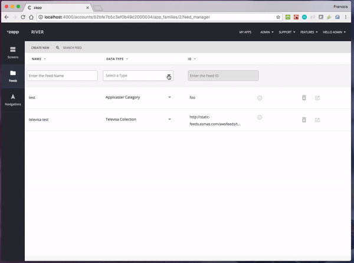

# Use a provider in an app 

Once your provider is published both to the npm registry and the Zapp platform, it becomes available for users to select in the UI Builder feed manager.

In the feed manager, click on the feed type dropdown. Providers which are available for you to add to your app should appear in the list with a `+` icon. Click on the provider you wish to add, and it will trigger a background process to build a new bundle with the selected provider for your app.

The 'installation' of a provider can take up to roughly 5 minutes. Once this process is done, the provider will be available for your app, and you will be able to add feeds to your app using the types available from this new provider.

