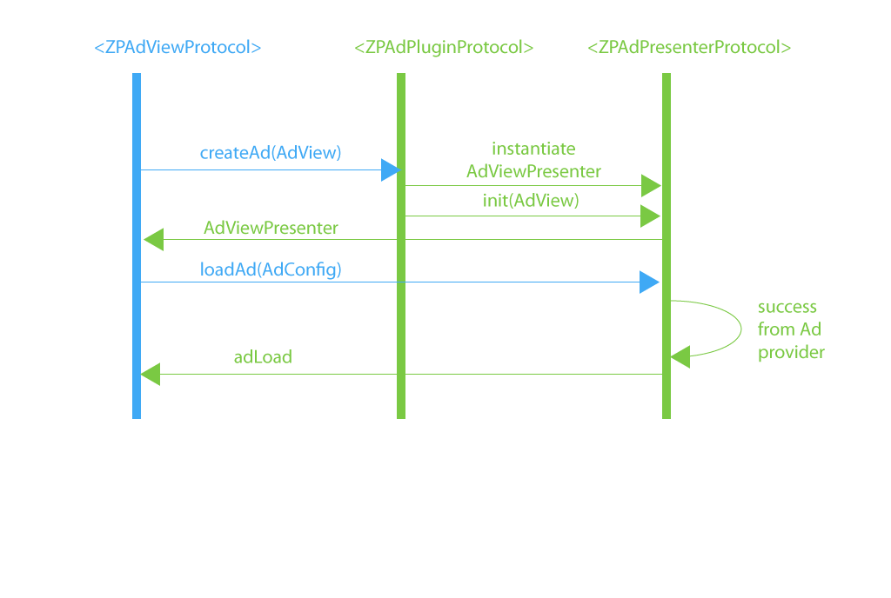
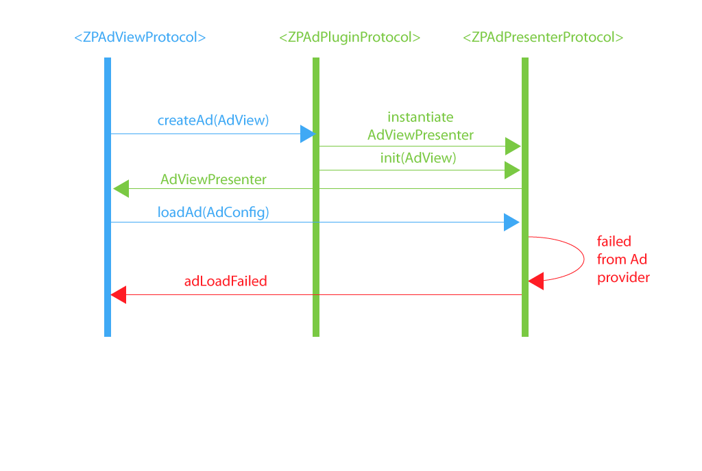
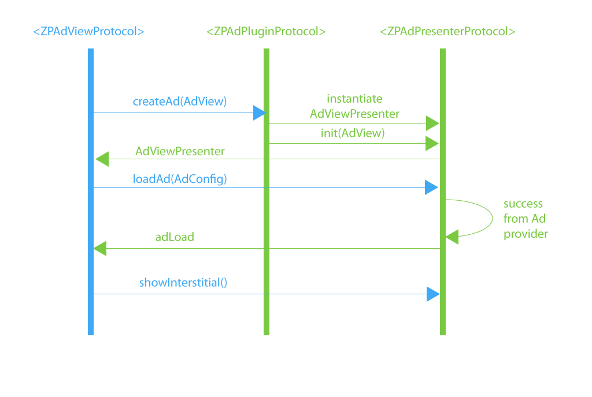

# Advertisement Plugin

## OVERVIEW

The following document describes Applicaster API for pluggable advertisement.

### BANNER FLOW

The diagrams below show banner and interstitial loading flow. The blue part is called by the `SDK` and the green by the `plugin`.

#### Success



#### Failure



### INTERSTITIAL FLOW

#### Success



#### Failure


## PROTOCOLS IMPLEMENTATION

### Ad View (ZPAdViewProtocol) - implemented on Applicaster SDK

Inside the ApplicasterSDK there are 3 classes that implement `ZPAdViewProtocol` protocol: `CABannerCellViewController` for inline banners, `GABannerController` for screen banners, and `GAInterstitialManager` for interstitials. It contains 3 callback methods:

``` swift
func adLoaded(view: UIView?)
func stateChanged(adViewState: ZPAdViewState)
func adLoadFailed(error: Error)
```

###### adLoaded

Method `adLoaded` is called whenever presenter loads an Ad.

|Parameters|Type           | Description                                                  |
|----------|---------------|--------------------------------------------------------------|
|view      |UIView?           |  A view returned by the advertisement provider in the case of screen  banners and inline banners. Nil in case of interstitial.                  |

###### stateChanged

Method `stateChanged` is called every time the state changes. We have defined the following states:

`Uninitialized` - whenever the ad hasn't been initialized yet

`Loading` - whenever ad is loading

`Loaded` - whenever ad has been loaded

`Impressed` - whenever ad has been shown on screen with atleast 50% visibility

`Failed` - whenever ad view has failed to load

`Clicked` - whenever user open the ad

`Closed` - whenever ad view has been loaded

|Parameters |Type           | Description                                                  |
|-----------|---------------|--------------------------------------------------------------|
|adViewState|ZPAdViewState    |  Current state of advert as described above            |

###### adLoadFailed

Method `adLoadFailed` is called whenever presenter failed to load an Ad.

|Parameters|Type           | Description                                                  |
|----------|---------------|--------------------------------------------------------------|
|error       |Error      |  Reason of advertisement failure                             |

### Ad View Presenter (ZPAdPresenterProtocol)

`AdViewPresenter` should be implemented on plugin level. Interface should implement following methods:

``` swift
init(adView: ZPAdViewProtocol, parentVC: UIViewController)
func load(adConfig: ZPAdConfig)
func getSize() -> CGSize
func showInterstitial()
```

###### init

Method `init` creates a new ad presenter.

|Parameters|Type           | Description                                                  |
|----------|---------------|--------------------------------------------------------------|
|adView |ZPAdViewProtocol         | ZPAdViewProtocol that will receive the callbacks from the presenter when important events are happening. |
|parentVC |UIViewController         | View controller where the ad will be added or presented from. |

###### load

Method `load` is called whenever ad configuration need to be setup and ad suppose to start loading its content. As a parameter it takes `ZPAdConfig` which defines everything that Ad view needs to present content.

|Parameters|Type           | Description                                                  |
|----------|---------------|--------------------------------------------------------------|
|adConfig  |ZPAdConfig       |  Configuration of specific advert (size, type, unit id)      |

###### getSize

Returns the size of a banner.

|Return type                                    | Description                        |
|-----------------------------------------------|------------------------------------|
|CGSize|  Returns the size of a banner |

###### showInterstitial

Show an interstitial ad. Only call this method when the ad has being loaded.

### Ad Plugin (ZPAdPluginProtocol)

`ZPAdPluginProtocol` protocol should be implemented on plugin level to provide single layer of **Model-View-Presenter**. So for every single **Model**(`AdConfig`) and View there should exist **Presenter**. Class implemets 3 methods:

``` swift
func createAdPresenter(adView:ZPAdViewProtocol, parentVC:UIViewController) -> ZPAdPresenterProtocol
func size(forInlineBannerSize inlineBannerSize: String) -> CGSize
func providerName() -> String
```

###### createAdPresenter

Method `createAdPresenter` is called whenever the plugin needs to create a presenter for an ad and initializes it.

|Parameters|Type           | Description                                                  |
|----------|---------------|--------------------------------------------------------------|
|adView |ZPAdViewProtocol         | ZPAdViewProtocol that will receive the callbacks from the presenter when important events are happening. |
|parentVC |UIViewController         | View controller where the ad will be added or presented from. |

|Return type                                    | Description                            |
|-----------------------------------------------|----------------------------------------|
|AdViewPresenter                                |  Returns an instance of AdViewPresenter    |

###### getSize:forInlineBannerSize

Returns the size of an inline banner.

|Parameters|Type           | Description                                                  |
|----------|---------------|--------------------------------------------------------------|
|inlineBannerSize   |String        |  Size identifier of the inline banner                   |

|Return type                                    | Description                        |
|-----------------------------------------------|------------------------------------|
|CGSize|  Returns the size of an inline banner |

###### getProviderName

Returns human name of advertisement provider. It is used by the analytics system.

|Return type  | Description                           |
|-------------|---------------------------------------|
|String       |  Human name of advertisement provider |
