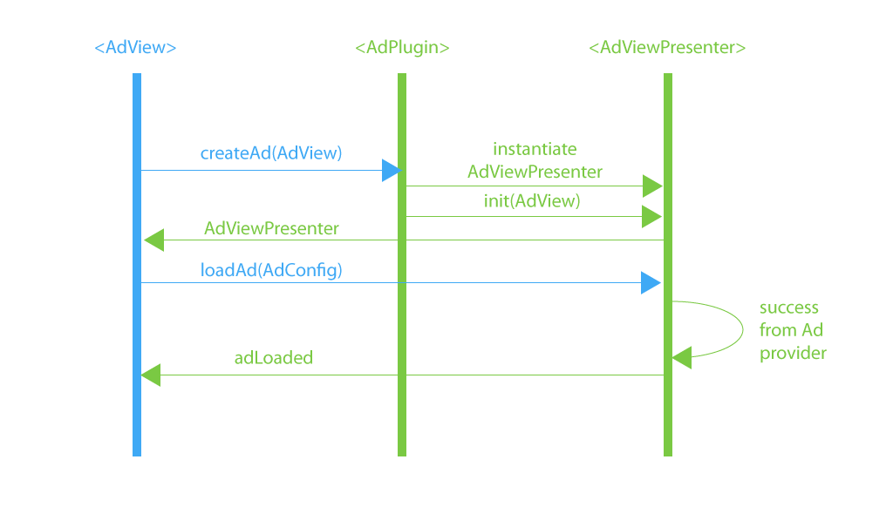
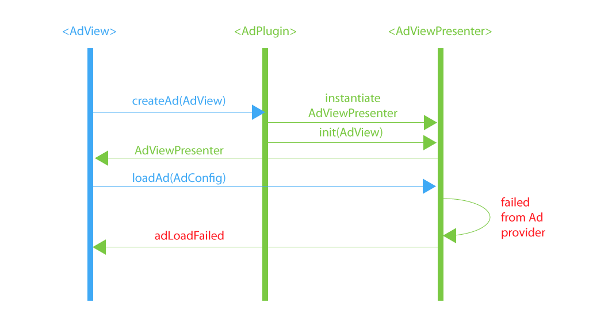
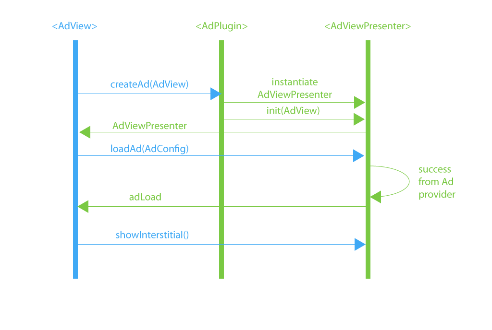

# Advertisement Plugin - Android
## OVERVIEW

The following document describes Applicaster API for pluggable advertisement
### BANNER FLOW

Bellow diagrams show Banner and interstitial loading flow. Blue part is called by `SDK` green by `plugin`.

#### Success



#### Failure



### INTERSTITIAL FLOW

#### Success



#### Failure


## INTERFACE IMPLEMENTATION
### Ad View - implemented on Applicaster SDK
`BannerComponent` on generic app level implements `AdView` interface. It contains 3 callback methods:

    fun adLoaded(sender: AdViewPresenter, view: View)
    fun stateChanged(sender: AdViewPresenter, adViewState: AdViewState)
    fun adLoadFailed(sender: AdViewPresenter, exc: Exception)

###### adLoaded

Method `adLoaded` is called whenever presenter loads an Ad. As a parameter it takes`View` and sender which is implementation of `AdViewPresenter`.

|Parameters|Type           | Description                                                  |
|----------|---------------|--------------------------------------------------------------|
|sender    |AdViewPresenter|  AdViewPresenter implementation instance - caller            |
|view      |View           |  AdView returned by advertisement provider                   |

###### stateChanged

|Parameters |Type           | Description                                                  |
|-----------|---------------|--------------------------------------------------------------|
|sender     |AdViewPresenter|  AdViewPresenter implementation instance - caller            |
|adViewState|AdViewState    |  Current state of advert. States are listed below            |


Method `stateChanged` is called every time the state is changing. For this plugin we have defined states:
`Uninitialized` - whenever the ad hasn't been initialized yet
`Loading` - whenever ad is loading
`Loaded` - whenever ad has been loaded
`Impressed` - whenever ad has been shown on screen with atleast 50% visibility
`Failed` - whenever ad view has failed to load
`Clicked` - whenever user open the ad
`Closed` - whenever ad view has been loaded

###### adLoadFailed

Method `adLoadFailed` is called whenever presenter failed to load an Ad. As a parameter it has instance of`Exception`.


|Parameters|Type           | Description                                                  |
|----------|---------------|--------------------------------------------------------------|
|sender    |AdViewPresenter|  AdViewPresenter implementation instance - caller            |
|exc       |Exception      |  Reason of advertisement failure                             |

### Ad View Presenter
`AdViewPresenter` should be implemented on plugin level. Interface should implement following methods:

    fun init(component: AdView)
    fun loadAd(adConfig: AdConfig)
    fun getSize(withContainer:Boolean): Size
    fun getProviderName(): String
    fun reloadAdWithSize(adSize: String)
    fun showInterstitial()
    fun getConfig() : AdConfig

###### init
Method `init` is called whenever presenter is initialised. it creates an intance of Ad Provider views.
```
fun init(component: AdView)
```
|Parameters|Type           | Description                                                  |
|----------|---------------|--------------------------------------------------------------|
|component |AdView         |  Imprementation of AdView interface on Applicaster SDK level |


###### loadAd
Method `loadAd` is called whenever ad configuration need to be setup and ad suppose to start loading its content. As a parameter it takes `AdConfig` which defines everything what Ad view needs to present content.

|Parameters|Type           | Description                                                  |
|----------|---------------|--------------------------------------------------------------|
|adConfig  |AdConfig       |  Configuration of specific advert (size, type, unit id)      |

###### getSize
Method get advertisement size in dp

|Return type                                    | Description                        |
|-----------------------------------------------|------------------------------------|
|com.applicaster.plugins.advertisement.view.Size|  Return Size class specified below |

```
class Size(var width: Int, var height: Int){
    override fun toString(): String {
        return "(${width}x${height})"
    }
}
```

###### reloadAdWithSize
Method `reloadAdWithSize` is called whenever presenter should reload size of the Ad.

|Parameters|Type           | Description                                                  |
|----------|---------------|--------------------------------------------------------------|
|adSize    |String         |  Key name of ad size eg. "BOX_BANNER", "SMART_BANNER"        |

###### getProviderName
Return human name of advertisement provider

|Return type  | Description                           |
|-------------|---------------------------------------|
|String       |  Human name of advertisement provider |

###### showInterstitial
Fire show interstitial on presenter class.

###### getConfig
Method return advert configuration

|Return type                                    | Description                            |
|-----------------------------------------------|----------------------------------------|
|AdConfig                                       |  Return AdConfig class specified below |

```
class AdConfig (var adUnitId : String,
                var component : AdView) {

    var customizedLayout = false

}
```


### Ad Plugin
`AdPlugin` interface should be implemented on plugin level to provide single layer of ** Model-View-Presenter**. So for every single **Model**(`AdConfig`) and View there should exist **Presenter**. Class implemets 2 methods:

    fun createAd(context: Context, component: AdView): AdViewPresenter
    fun setPluginModel(Plugin plugin)


###### createAd
Method `createAd` is called whenever plugin need to crete presenter for add and initialize it

|Parameters|Type           | Description                                                  |
|----------|---------------|--------------------------------------------------------------|
|context   |Context        |  Context in which advert will be presented                   |
|component |AdView         |  Imprementation of AdView inderface                          |

|Return type                                    | Description                            |
|-----------------------------------------------|----------------------------------------|
|AdViewPresenter                                |  Return instance of AdViewPresenter    |

###### setPluginModel
Method `setPluginModel` is called from inherited interface `GenericPlugin` and provides configuration of the plugin - not used in this implementation.


