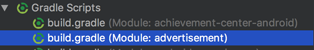
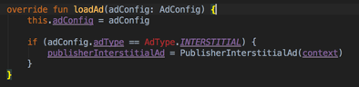

# How to create advertisement plugin
To create advertisement plugin for Applicaster you need to configure you project enviroment (link here).
When you have your project first thing you need to do is to add module library to this project - this will be your plugin.
## Creating library module

To create new module in your Applicaster project you need to select `File -> New -> New Module`


Then you should select `Android Library` and name your project. For purpose of this tutorial we Named it advertisement, however name should be related to provider or specific project, eg. for DSP provider it will be called `DSP Plugin` for AdMob it will be `AdMob Plugin` . If your plugin is whitelisted for specific project then please name it with pattern `ProjectName + Provider + "Plugin"`


Press Finish to create your module.

## Import module to Applicaster project solution
To make sure that module has been imported to your solution and you can implement it please open `settings.gradle` file and make sure gradle settings contain project and include it to solution as shown below.


Before you will be able to proceed you need to synchronize your gralde so you could see your module imported in your project tree view.


After syncing you should be able to see your plugin gradle. Please open it.



TIP: If you can't find advertisement gradles, please change view type above to Android


In your plugin gradle please add access to applicaster maven. Please note `MAVEN_USERNAME` and `MAVEN_PASSWORD` are enviroment variabled if you don't have them, please check this link. if you don't have `repositories` block please add this to you `android` block. 
###### IMPORTANT you should NEVER modify any other gradle file then `your pluggin` or `app`


After you congigured Maven please add Applicaster SDK to `your plugin gradle`. Please check actual version for Applicaster SDK. Also make sure you use the same android tools version.


Ones you successfully imported SDK to your plugin it is time to import your plugin to `app gradle`. Don't worry it is absolutely save to modify `app gradle` as it is autogenerated file and excluded from github, so you can't even commit this change. Open `app gradle`


in dependencies section import your plugin. Please use exactly same name you have setup in `settings.gradle`. To avoid sync errors please exclude 2 groups just like it is shown below.


At this step all configuration is done and you can sync the project to apply all the changes.


## Implementation
Advertisement Plugin is using MVP pattern, so your plugin needs to implement interface for AdViewPresenter. Presenter is holding reference to AdView and AdView interface implementation is a real View used in Applicaster SDK.

### import AdViewPresenter
For DFP Ad Provider context is needed toinitialize both itnerstitials and banners. Adding var to Kotlin constructor will add variable to class.


### AdViewPresenter itenrface implementation
Android Studio makes interface implementation quicker using autogenerated code like it is shown below:


Please sekect all methods to generate.


Ones the methods are generated you can start adding some code.

###Variables

This tutorial will show 2 types of advertisement. `Banner` and `Interstitial` and for both of them class variables should be created. Next variable is `AdView` interface which is implemented by Applicaster SDK and on this view Banner or Interstitial will be shown.


### AdConfig

`AdConfig` is a configuration variable which specify `banner size`, `banner type` and `advertisment unit ID` and it will be used for loading banner or interstitial.


For advertisement purpose `getAdConfig()` should return configuration provided in `loadAd(...)` method


### AdView

Like in most MVP cases view handler will be hold by presenter. Presenter get instance `AdView` in `init(...)` method.


###Size Mapper
Representation of advertisement sizes in Applicaster SDK is based on string keynames. In your plugin you need to provide a mapper which return a size in pixels from specific keyname.

`map` function of `SizeMapper` takes 2 arguments both taken from `AdConfig`. `AdType` deteterminate is this an `INTERSTITIAL` or `BANNER`. `AdViewSize` is keyword for size of na advert.
```
object SizeMapper {
    var SMART_BANNER = 50
    fun map(adType: AdType, adviewSize: String): Size {
        val width = Resources.getSystem().displayMetrics.widthPixels.px2dp()
        val height = Resources.getSystem().displayMetrics.heightPixels.px2dp()
        return when (adviewSize) {
            "BANNER" -> Size(AdSize.BANNER.width, AdSize.BANNER.height)
            "SMART_BANNER" -> Size(width, SMART_BANNER)
            "BOX_BANNER" -> Size(300, 250)
            else -> when(adType) {
                AdType.INTERSTITIAL -> Size(width, height)
                AdType.SCREEN_BANNER -> Size(AdSize.BANNER.width, AdSize.BANNER.height)
                else -> Size(AdSize.BANNER.width, AdSize.BANNER.height)
                }
        }
    }
}
```
Please note that `px2dp()` is an Kotlin extension as below:
```
fun Int.px2dp() : Int {
    val metrics = Resources.getSystem().displayMetrics
    return (this / (metrics.densityDpi.toFloat() / DisplayMetrics.DENSITY_DEFAULT)).toInt()
}
```

Ones you have implement you mapper you can use it in your `Presenter` class:
```
override fun getSize(withContainer: Boolean): Size = SizeMapper.map(adConfig.adType, adConfig.adSize)
```

###Provider Name

Due to analytics needs in Applicaster infrastructure you need to provide a human name for your provider. In this case it will be `"DFP"`, so implementation will look as follows:
```
override fun getProviderName(): String = "DFP"
```

## INTERSTITIAL

Implementing interstitial require importing `AdType` from `com.applicaster.plugin.advertisement.AdType`



Android studio help identify specific class.


To show intersitial you need to follow the steps:
**Step 1** Check if config type is `AdType.INTERSTITIAL`
**Step 2** Initialize PublisherInterstitialAd with Context
**Step 3** Setup advertisement unit ID
**Step 4** Call `loadAd` on your interstitial variable.
```
    override fun loadAd(adConfig: AdConfig) {
        this.adConfig = adConfig

        if (adConfig.adType == AdType.INTERSTITIAL) { //Step 1
            publisherInterstitialAd = PublisherInterstitialAd(context)// Step 2
            publisherInterstitialAd.adUnitId = adConfig.adUnitId //Step 3
            loadInterstitialAd()
        }
    }

    @SuppressLint("MissingPermission")
    fun loadInterstitialAd() {
        publisherInterstitialAd.loadAd(PublisherAdRequest.Builder().build())//Step 4
    }
```

**Step 5** Add loaded callback
To show view in SDK container you have to add callback to your advertisement provider. For DFP it will look as follows:
```
override fun loadAd(adConfig: AdConfig) {
        this.adConfig = adConfig

        if (adConfig.adType == AdType.INTERSTITIAL) {
            publisherInterstitialAd = PublisherInterstitialAd(context)
            //Step 5 - adding callbalck
            publisherInterstitialAd.adListener = object : AdListener() {
                override fun onAdLoaded() {
                    super.onAdLoaded()
                    //Step 5 inform Applcaster SDK to show the Ad
                    adView.adLoaded(this@Presenter, null)
                }

                override fun onAdFailedToLoad(errorCode: Int) {
                    super.onAdFailedToLoad(errorCode)
                    adView.adLoadFailed(this@Presenter, Exception(javaClass.simpleName
                    + " could not load AdView. Failed with error code " + errorCode))
                }
            }
            publisherInterstitialAd.adUnitId = adConfig.adUnitId
            loadInterstitialAd()
        }
    }

    @SuppressLint("MissingPermission")
    fun loadInterstitialAd() {
        publisherInterstitialAd.loadAd(PublisherAdRequest.Builder().build())
    }
 ```
Calling `adView.adLoaded(this@Presenter, null)` is crutial for showing interstitial.
Calling `adView.adLoadFailed(...)` is important to inform sdk that loading advert has failed.


**Step 6** Analytics callbacks
In terms of proper work of analytics plugins in our Applicaster infrustructure you should've use adView.stateChange to inform SDK about all state changes occuring for you advert.

```
    override fun loadAd(adConfig: AdConfig) {
        this.adConfig = adConfig

        if (adConfig.adType == AdType.INTERSTITIAL) {
            publisherInterstitialAd = PublisherInterstitialAd(context)
            publisherInterstitialAd.adListener = object : AdListener() {
                override fun onAdLoaded() {
                    super.onAdLoaded()
                    adView.adLoaded(this@Presenter, null)
                    adView.stateChanged(this@Presenter, AdViewState.Loaded)//Step 6
                }

                override fun onAdFailedToLoad(errorCode: Int) {
                    super.onAdFailedToLoad(errorCode)
                    adView.adLoadFailed(this@Presenter, Exception(javaClass.simpleName
                    + " could not load AdView. Failed with error code " + errorCode))
                    adView.stateChanged(this@Presenter, AdViewState.Failed)//Step 6
                }

                override fun onAdOpened() {
                    super.onAdOpened()
                    adView.stateChanged(this@Presenter, AdViewState.Impressed)//Step 6
                }

                override fun onAdImpression() {
                    super.onAdImpression()
                    adView.stateChanged(this@Presenter, AdViewState.Impressed)//Step 6
                }

                override fun onAdClosed() {
                    super.onAdClosed()
                    adView.stateChanged(this@Presenter, AdViewState.Closed)//Step 6
                }
            }
            publisherInterstitialAd.adUnitId = adConfig.adUnitId
            loadInterstitialAd()
        }
    }

    @SuppressLint("MissingPermission")
    fun loadInterstitialAd() {
        adView.stateChanged(this@Presenter, AdViewState.Loading)//Step 6
        publisherInterstitialAd.loadAd(PublisherAdRequest.Builder().build())
    }
```

**Step7** Implement showInterstitial() in your Presenter class
```
    override fun showInterstitial() {
        publisherInterstitialAd.show()
    }
    ```

## BANNER

To show banner you need to follow the steps:
**Step 1** Check if config type is banner
**Step 2** Initialize PublisherAdView with Context
**Step 3** Setup advertisement unit ID
**Step 4** Call loadAd on your interstitial variable.
```
	override fun loadAd(adConfig: AdConfig) {
        this.adConfig = adConfig

        if (adConfig.adType == AdType.INTERSTITIAL) {
                ...
        } else {//Step 1
            publisherAdView = PublisherAdView(context)//Step 2
            publisherAdView.adUnitId = adConfig.adUnitId//Step 3
            publisherAdView.setAdSizes(AdSizeMapper.map(adConfig.adType,adConfig.adSize))

            loadBannerAd()
        }
    }
    @SuppressLint("MissingPermission")
    fun loadBannerAd() {
        publisherAdView.loadAd(PublisherAdRequest.Builder().build())//Step4
    }
```

**Step 5** Add loaded callback
To show view in SDK container you have to add callback to your advertisement provider. For DFP it will look as follows:
```

    override fun loadAd(adConfig: AdConfig) {
        this.adConfig = adConfig

        if (adConfig.adType == AdType.INTERSTITIAL) {
                ...
        } else {
            publisherAdView = PublisherAdView(context)

            publisherAdView.adListener = object : AdListener() {
                override fun onAdLoaded() {
                    super.onAdLoaded()
                    adView.adLoaded(this@Presenter, publisherAdView)//Step 5
                }

                override fun onAdFailedToLoad(errorCode: Int) {
                    super.onAdFailedToLoad(errorCode)
                    adView.adLoadFailed(this@Presenter, Exception(javaClass.simpleName
                            + " could not load AdView. Failed with error code " + errorCode))//Step 5
                }

            }
            //var v = View(context)
            publisherAdView.adUnitId = adConfig.adUnitId
            publisherAdView.setAdSizes(AdSizeMapper.map(adConfig.adType,adConfig.adSize))

            loadBannerAd()
        }
    }
    @SuppressLint("MissingPermission")
    fun loadBannerAd() {
        publisherAdView.loadAd(PublisherAdRequest.Builder().build())
    }
 ```
Calling `adView.adLoaded(this@Presenter, publisherAdView)` is crutial for showing banner.
Calling `adView.adLoadFailed(...)` is important to inform sdk that loading advert has failed.


**Step 6** Analytics callbacks
In terms of proper work of analytics plugins in Applicaster infrustructure you should've call adView.stateChange to inform SDK about all state changes occuring for you advert.

```
    override fun loadAd(adConfig: AdConfig) {
        this.adConfig = adConfig

        if (adConfig.adType == AdType.INTERSTITIAL) {
                ...
        } else {
            publisherAdView = PublisherAdView(context)

            publisherAdView.adListener = object : AdListener() {
                override fun onAdLoaded() {
                    super.onAdLoaded()
                    adView.adLoaded(this@Presenter, publisherAdView)
                    adView.stateChanged(this@Presenter, AdViewState.Loaded)//Step 6
                }

                override fun onAdFailedToLoad(errorCode: Int) {
                    super.onAdFailedToLoad(errorCode)
                    adView.adLoadFailed(this@Presenter, Exception(javaClass.simpleName
                            + " could not load AdView. Failed with error code " + errorCode))
                    adView.stateChanged(this@Presenter, AdViewState.Failed)//Step 6
                }

                override fun onAdOpened() {
                    super.onAdOpened()
                    adView.stateChanged(this@Presenter, AdViewState.Impressed)//Step 6
                }

                override fun onAdImpression() {
                    super.onAdImpression()
                    adView.stateChanged(this@Presenter, AdViewState.Impressed)//Step 6
                }

                override fun onAdClosed() {
                    super.onAdClosed()
                    adView.stateChanged(this@Presenter, AdViewState.Closed)//Step 6
                }
            }
            //var v = View(context)
            publisherAdView.adUnitId = adConfig.adUnitId
            publisherAdView.setAdSizes(AdSizeMapper.map(adConfig.adType,adConfig.adSize))

            loadBannerAd()
        }
    }
    @SuppressLint("MissingPermission")
    fun loadBannerAd() {
        adView.stateChanged(this@Presenter, AdViewState.Loading)//Step 6
        publisherAdView.loadAd(PublisherAdRequest.Builder().build())
    }
```
## AdPlugin interface implementation

In order to initialize presenter properly you need to create class which implement AdPlugin interface
 ```
class Plugin : AdPlugin {

    override fun createAd(context: Context, component: AdView): AdViewPresenter {
        var ret = Presenter(context)
        ret.init(component)
        return ret
    }

    override fun setPluginModel(plugin: Plugin?) {}
}

 ```

## How to publish plugin

Ones you have implemented your plugin it is ready to publish. You can read more about publishing here

## How to use plugin in app

You can read more about how to use plugin in your app here

## Custom sizes

As we mentioned earlier when implementing the **Size Mapper**, inline banners can have different sizes and each different size is represented by a string.

This string can have any value and your plugin must define those values, but usually there are 3 that are common to any kind of plugin provider, these are: **BANNER** (standar size banners), **BOX_BANNER** (squared size banners) and **SMART_BANNER** (usually occupying the full width of the device and a fixed height).

If your plugin wants different sizes that the standard defined, you need to declared them in the manifest using the **exporting attributes functionality** to override these 3 values with your desired ones. 

For the full documentation, [Click Here](/zappifest/plugins-manifest-format.md)

This is an example of what you should add to the manifest (here we add 2 new sizes, apart of the 3 standard ones):
```
"export": {
		"allowed_list": [{
			"identifier": "banner",
			"group": {
				"label": "Ads",
				"folded": false
			},
			"section": "styles",
			"allowed_fields": [{
				"section": "styles",
				"key": "banner_type",
				"min_zapp_sdk": {
					"ios": "6.0.0",
					"android": "7.0.0"
				}
			}]
		}, {
			"identifier": "list",
			"group": {
				"label": "Ads",
				"folded": false
			},
			"section": "advertising",
			"allowed_fields": [{
				"section": "advertising",
				"key": "banner_type",
				"min_zapp_sdk": {
					"ios": "6.0.0",
					"android": "7.0.0"
				}
			}]
		}, {
			"identifier": "grid",
			"group": {
				"label": "Ads",
				"folded": false
			},
			"section": "advertising",
			"allowed_fields": [{
				"section": "advertising",
				"key": "banner_type",
				"min_zapp_sdk": {
					"ios": "6.0.0",
					"android": "7.0.0"
				}
			}]
		}]
	},
	"styles": {
		"fields": [{
			"key": "banner_type",
			"label_tooltip": "SOM supports Smart Banners, Standard Banners (320x50 for smartphone and 728x90 for tablet), Box Banners (300x250, often referred to as \"medium rectangles\"), Billboard banners (320x150) and Sponsor banners (320x51). Please select the size banner you'd like to use",
			"type": "select",
			"options": [{
					"label": "STANDARD BANNER",
					"value": "BANNER"
				},
				{
					"label": "SMART BANNER",
					"value": "SMART_BANNER"
				},
				{
					"label": "BOX BANNER",
					"value": "BOX_BANNER"
				},
				{
					"label": "BILLBOARD BANNER",
					"value": "BILLBOARD_BANNER"
				},
				{
					"label": "SPONSOR",
					"value": "SPONSOR"
				}
			]
		}]
	},
	"advertising": {
		"fields": [{
			"key": "banner_type",
			"label_tooltip": "SOM supports Smart Banners, Standard Banners (320x50 for smartphone and 728x90 for tablet), Box Banners (300x250, often referred to as \"medium rectangles\") Billboard banners (320x150) and Sponsor banners (320x51). Please select the size banner you'd like to use",
			"type": "select",
			"options": [{
					"label": "STANDARD BANNER",
					"value": "BANNER"
				},
				{
					"label": "SMART BANNER",
					"value": "SMART_BANNER"
				},
				{
					"label": "BOX BANNER",
					"value": "BOX_BANNER"
				},
				{
					"label": "BILLBOARD BANNER",
					"value": "BILLBOARD_BANNER"
				},
				{
					"label": "SPONSOR",
					"value": "SPONSOR"
				}
			]
		}]
	}
```
