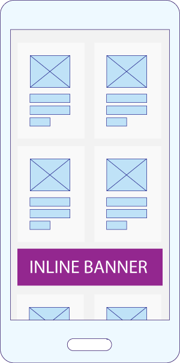
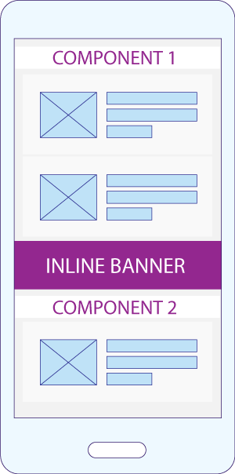
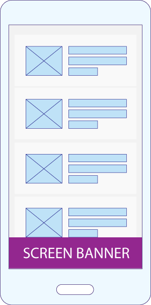
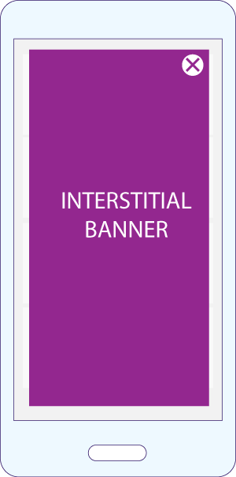

# Introduction

Applicaster offers an array of advertising functionality for customers to use for monetization.
Video ads are typically handled by the player plugin, and for the Applicaster Player, video ads are currently part of core SDK and coupled to GAM (Google Ad Manager). However, we’ve made display ads (banners and interstitials) fully pluggable so that developers can build advertising plugins which can take advantage of this functionality.
This means for customers who prefer to work with options other than GAM, plugins can be built and supported and these can be used to deliver display ads within the apps. The functionality provided includes:

* Inline Banners

 

* Fixed (aka “Sticky”) Banners
  * Screen-level
  * Set a default for the app-level

* Interstitials
  * Screen-level
  * Set a default for the app-level

The developer documentation here outlines how to build and maintain advertising plugins, and how to enable these plugins to utilize this functionality. For both platforms, we provide a tutorial with an example as well API Documentation

## Documentation:

* [Android](advertisement/android/android.md)
  * [Tutorial](/advertisement/android/tutorial.md)
  * [API](/advertisement/android/api.md)
* [iOS](advertisement/ios/android.md)
  * [Tutorial](/advertisement/ios/tutorial.md)
  * [API](/advertisement/ios/api.md)
