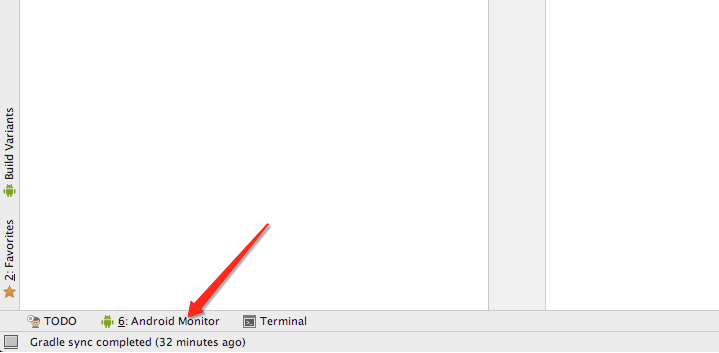
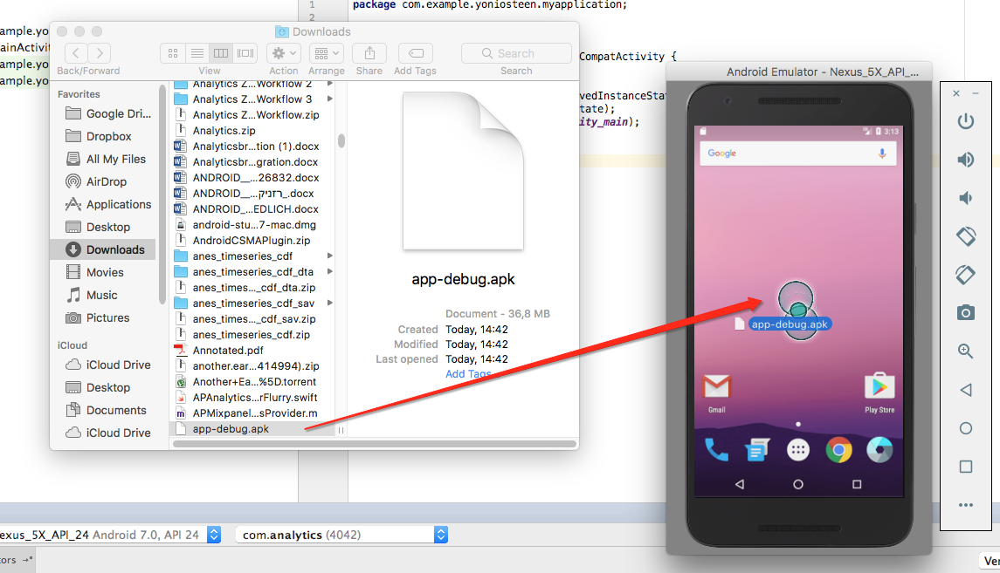

# Analytics Utility

## Overview

Applicaster provides utilities for the development and testing of analytics functionality. All data handled by [Morpheus](/analytics/morpheus/morpheus.md), the analytics manager, can be viewed in the logs of the console for whatever platform you are working on. Additionally, data that is delivered to analytics providers will appear in an alert when using Applicaster Debug Mode. 

## Using Alerts: Viewing delivered data within the app

Analytics data that is delivered to third party analytic providers are sent through Morpheus pipelines. Any data that is delivered can be viewed while in Debug Mode within the app directly, via alerts. These alerts will show:

* Data Type
	* i.e. Event, Timed Event Started, Timed Event Ended, Error Event, Screen View, User Properties
* Data Value
	* i.e. Event Name, Screen View Name, User Property Name + Value
		* User Properties will also identify if they are PII User Properties (Personally Identifiable Information) or Generic User Properties
* Target Providers
	* Which providers the data is delivered to
* Properties
	* When the Data Type is Event, this will list an array of associated custom properties and their values

## iOS

1. Download your app in debug mode
2. Go to your app in Settings and turn on “Show Analytic Utility Alerts" within the *Applicaster Member Mode* section:
	
3. Now launch the app
4. You should now be able to see the alerts:
	

### Viewing Logs in the Console

If you do not have XCode, you’ll need to download it. You can do so by clicking the button to download it [here](https://developer.apple.com/xcode/).

1. Go to Zapp and download whatever app you want to test. Our example app is named “Analytics”:
	* Click the download button here:
	
	* Then click on Debug Version:
	
	* You can now download the app via the QR code in the corner:
	
2. Connect your device to a computer
3. Open XCode
4. Go to Window → Devices:
	
5. Select your device:
	
6. You should now be able to see the run logs:
	
7. If you don’t see the logs, tap on the arrow here:
	
8. Start the app. Now the logs should reflect what is going on in the app.
9. You can filter for analytics related activity.
To do so, tap on the console panel and hit cmd+f for the search line. Enter there “Analytics Log:”
10. Now, all activity related analytics handling will appear in the monitor, which you can use to assist with your debugging, QA, and development testing.

## Android

Download the app in debug mode. When you launch the app an alert will appear, asking if you want to receive notifications on analytics data delivered. If you hit yes, you'll be able to use the utility within the app directly.

Once you do, if you do anything which should trigger sending one of the data types, an alert describing the data that was delivered (and to where) should appear.

For example, when you click on the Side Menu, you’ll see:

	

You may notice that the Data Property field does not have values. That suggests that this particular event does not include any custom properties.

### Viewing Logs in the Console

If you do not have Android Studio, you’ll need to download it. You can do so [here](https://developer.android.com/studio/index.html).

1. Create a new project
2. Be Patient… this may take a while
3. Open AVD Manager:
	
4. Create a virtual device:
	
5. Select hardware:
	
6. Download a version that you want to test with (typically the latest Android OS, unless that was just released):
	
7. Accept the license agreement
8. After it installs, select the release and hit next:
	
9. Then hit finish (unless you want to change any of the configuration settings)
10. Launch the emulator via the icon in the Actions column:
	
11. Your emulator will appear. Let the device load
12. Go to Zapp and click the download button for whatever app you want to test. Our example app is named “Analytics”:
	
	
	
13. Open Android Monitor in Android Studio
	
14. Drag and drop the apk you downloaded into your emulator:
	
15. Open the app in the emulator:

	
16. Type “APDebugUtil” into the Search field and hit enter:
	
17. Now, all activity related analytics handling will appear in the monitor, which you can use to assist with your debugging, QA, and development testing.