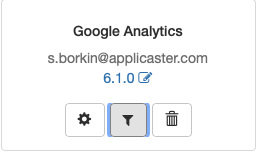
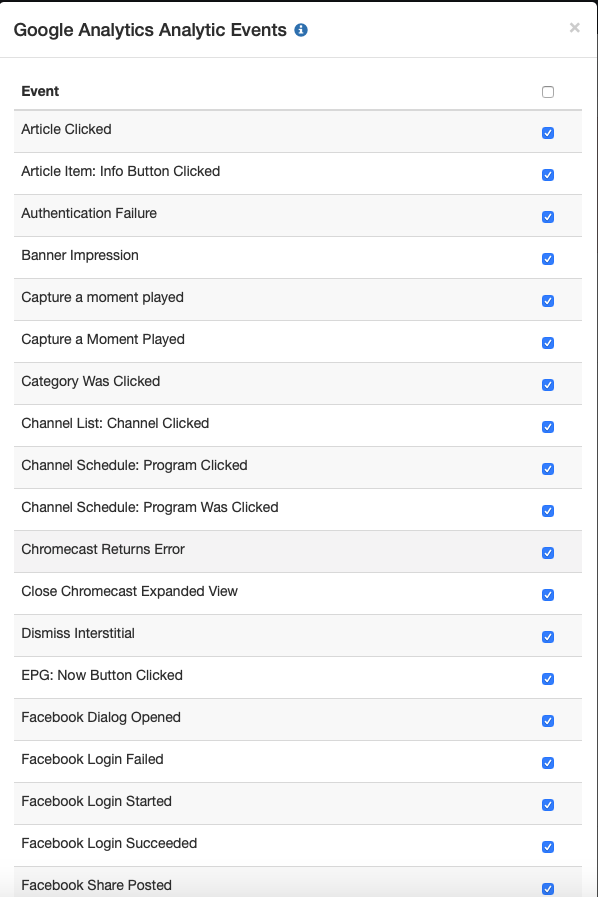

# Analytics Plugin - Android

The Android Analytics plugin for Zapp is based on extending the `BaseAnalyticsAgent` class.
This class goes through all of the functions for creating a new provider, initializing it and dispatching events.

In order to see a basic implementation of an analytics plugin, we suggest reviewing the [Analytics Plugin Sample Project](https://github.com/applicaster/zapp-plugins-examples/tree/master/AnalyticsPlugin/Android) as it's a good starting point for implementing an analytics plugin.

This guide will go through the basic terms and functions that need to be implemented in order to create an analytics.

For more info about Initial Android Plugin Setup, [Click Here](/dev-env/Android.md)

## Initialization and general properties
The following functions are used to create a plugin for an analytics provider and to configure it..

``` java
    public void initializeAnalyticsAgent(Context context)
```

The following function is used to set the parameters from the plugin configuration:
``` java
  public void setParams(Map params)
```

## Session tracking
The following functions exist to frame a session, called when the app is opened and closed respectively.

``` java
  public void startTrackingSession(Context context)
  public void stopTrackingSession(Context context)
```

## Log events
The following are the main event logging functions:

``` java
  public void logEvent(String eventName)
  public void logEvent(String eventName, TreeMap<String, String> params)
```

## Timed events
If the analytics provider supports timed events, these functions would be called to track a timed event.

``` java
  public void startTimedEvent(String eventName)
  public void startTimedEvent(String eventName, TreeMap<String, String> params)
  public void endTimedEvent(String eventName)
```

## User ID
This function should send or store the User ID (UUID)

``` java
  public void sendUserID(String userId)
```

## Player tracking
The following functions represent the lifecycle of a player.
If the analytics plugin implements player analytics - these events should be implemented.

``` java
  public void initPlayerSession(Playable playable, PlayerViewWrapper playerWrapper, int duration)
  public void handlePlayerError(String message)
  public void logPlayEvent(long currentPosition) /** Track when the player starts playing content */
  public void logPlayerEnterBackground()
  public void logPauseButtonPressed()
  public void logResumeButtonPressed()
  public void logPauseEvent(long currentPosition)
  public void logStopEvent(long currentPosition)
  public void logVideoEndEvent(long currentPosition)
  public void logSeekStartEvent(long position)
  public void logVideoEvent(String eventName, TreeMap<String, String> params)
  public void logSeekEndEvent(int position)
  public void logBufferingStartEvent()
  public void logBufferingEndEvent()
  public void generalPlayerInfoEvent(Map<String, String> params)
  public void logFullscreenPressed(int currentPosition)
```

## Base activity
The following events track the behavior of the base activity for all Zapp applications

``` java
  public void createTracking(Context context)
  public void pauseTracking(Context context)
  public void resumeTracking(Context context)
```

## Screen Views
If the analytics provider supports screen views the following functions should be implemented

``` java
  public void setScreenView(String screenView)
```

## Blacklisted events
Events can be marked as blacklisted to be filtered by the analytics provider.
In order to test this - from Zapp's specific app plugin configuration screen do the following 2 steps:

Click on the funnel button on the plugin:


Select the unwanted event


The following function checks if an event is blacklisted or not:
``` java
  public boolean isNotBlacklisted(String eventName)
```

## Track campagin params from URL
Tracking url params if implemented on one of the plugins.

``` java
  public void trackCampaignParamsFromUrl(String url)
```