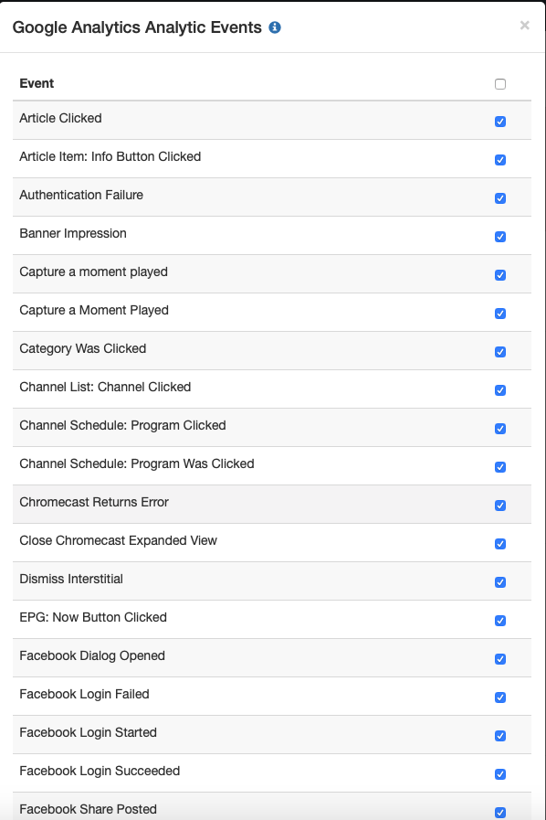

# Analytics Plugin - iOS

The iOS Analytics plugin for Zapp is based on implementing the `ZPAnalyticsProviderProtocol`.
This protocol goes through all of the functions for creating a new provider, initializing it and dispatching events.

For simplicity and uniformaty reasons - it is advised to inherit `ZPAnalyticsProvider`, as it implements a lot of the overhead functions such as tracking events with completions, blacklisted events handling, presenting toasts in debug mode for the users, etc.

In order to see a basic implementation of an analytics plugin, we suggest reviewing the [Analytics Plugin Sample Project](https://github.com/applicaster/zapp-plugins-examples/tree/master/AnalyticsPlugin/iOS) as it's a good starting point for implementing an analytics plugin.

This guide will go through the basic terms and functions that need to be implemented in order to create an analytics.

For more info about Initial iOS Plugin Setup, [Click Here](/dev-env/iOS.md)

## The Analytics Provider protocol
The main protocol used for Analytics plugins is `ZPAnalyticsProviderProtocol`.
All analytics plugins must implement this protocol as it's part of what Zapp apps are expecting when initializing an analytics plugin.

### Initialization and general properties
The following functions are used to create a plugin for an analytics provider and to configure it.
Default `ZPAnalyticsProvider` calls the configuration function from the creation function.

``` swift
    func createAnalyticsProvider(_ allProvidersSetting: [String:NSObject]) -> Bool
    func configureProvider() -> Bool // Not implemented by ZPAnalyticsProvider
```
The create analytics provider and configure provider functions are used to create the single instances of the provider and to configure it.
In both cases - a `true` value presents a success and means that events can be dispatched to those providers

#### Default initialization functions
The `ZPAnalyticsProviderProtocol` protocol inherits from the `ZPAdapterProtocol`.
While the following functions exist from inheritence - the specific analytics provider creation methods are the ones that will be called for configuration.

The following initialization methods must be implemented:
``` swift
  public init(configurationJSON: NSDictionary?)
  public init()
```

The `configurationJSON` property should be then set as a property and exposed:
``` swift
  public var configurationJSON: NSDictionary? { get }
```

#### Analytics specific general properties
The following parameters allow further configurations of the analytics provider

##### Maximum parameters
Allows setting a maximum number of parameters to be sent to the provider.
By default `ZPAnalyticsProvider` returns a `-1` value to indicate unlimited.

``` swift
  func analyticsMaxParametersAllowed() -> Int
```

##### Base parameters
Allows setting a base parameter that should be sent with all analytics events.

``` swift
  func setBaseParameter(_ value:NSObject?, forKey key:String)
```

##### Sort and trim properties
If needed - allows sorting and triming properties by specific limitations.

``` swift
  func sortPropertiesAlphabeticallyAndCutThemByLimitation(_ properties: [String:NSObject]) -> [String:NSObject]
```

##### Provider key
Get the provider identifier key.

``` swift
  func getKey() -> String // Not implemented by ZPAnalyticsProvider
```
##### User properties
Set user profile properties.

``` swift
  @objc func updateGenericUserProperties(_ genericUserProfile: [String:NSObject])
```

##### In depth user profile properties
An analytics provider can further set parameters for a specific user profile including optionally seperating PII properties by implementing the following optional functions:

``` swift
  optional func setUserProfile(parameters:[String:NSObject])
  @objc optional func setUserProfile(genericUserProperties dictGenericUserProperties: [String:NSObject], piiUserProperties dictPiiUserProperties: [String:NSObject])
```
##### Default event properties
Set default event properties that should be attached to all events.

``` swift
  @objc func updateDefaultEventProperties(_ eventProperties: [String:NSObject])
```
##### Push notifications device token
If the analytics provider supports tracking push notifications device token, please implement the following function

``` swift
  @objc optional func setPushNotificationDeviceToken(_ deviceToken:Data)
```
### Tracking events
The following function represent the various ways to track events.

#### Mandatory functions
The following functions are mandatory for tracking events:

``` swift
  @objc func trackEvent(_ eventName:String, parameters:[String:NSObject], completion: ((_ wasSent:Bool, _ logText:String?) -> Void)?)
  @objc func trackScreenView(_ screenName:String, parameters:[String:NSObject], completion: ((_ wasSent:Bool, _ logText:String?) -> Void)?)
  @objc func presentToastForLoggedEvent(_ eventDescription:String?)
  @objc func canPresentToastForLoggedEvents() -> Bool
  @objc func shouldTrackEvent(_ eventName:String) -> Bool
```

The track events and screenviews should lead to the relevant track events functions.
Presenting toast for logger event allows printing on screen analytics events and statuses
Should track events enables implementing a blacklist of events to filter out unwanted events.

All of these mandatory functions are implemented in the base `ZPAnalyticsProvider` class - and you should override them only if needed.

#### Main functions
The following present the different tracking options that Zapp will try to use:

``` swift
  @objc optional func trackEvent(_ eventName:String)
  @objc optional func trackEvent(_ eventName:String, parameters:[String:NSObject])
  @objc optional func trackEvent(_ eventName:String, parameters:[String:NSObject], model: Any?)
  @objc optional func trackEvent(_ eventName:String, message:String, exception:NSException)
  @objc optional func trackEvent(_ eventName:String, message:String, error:NSError)
  @objc optional func trackEvent(_ eventName:String, action:String, label:String, value:Int)
  @objc optional func trackError(_ errorID:String, message:String, exception:NSException)
  @objc optional func trackError(_ errorID:String, message:String, error:NSError)
```

#### Timed events
If the implemented provider supports timed events please implement also the folloing events:

``` swift
  @objc optional func trackEvent(_ eventName:String, timed:Bool)
  @objc optional func trackEvent(_ eventName:String, parameters:[String:NSObject], timed:Bool)
  @objc optional func endTimedEvent(_ eventName:String, parameters:[String:NSObject])
```

#### Tracking screen views
If the analytics provider supports screen views - the following screen view function will be called:

``` swift
  @objc optional func trackScreenView(_ screenName:String, parameters:[String:NSObject])
```

#### Track Capaign Parameters from URL
Tracking url params if implemented on one of the plugins.

``` swift
  @objc optional func trackCampaignParamsFromUrl(_ url:NSURL)
```

### Player Analytics provider
The following functionality is optional and achieved by implementing the `ZPPlayerAnalyticsProviderProtocol`.
This gives a more in depth option to track analytics events by letting the analytics provider attach itself to the player instance.

If your analytics provider provides player analytics capabilities please implement this protocol, as well as the relevant functions.

#### Start tracking player events
Get the instance of the player (Usually AVPlayer) in order to start tracking events.

``` swift
  @objc optional func startTrackingPlayerEvents(forPlayer player: Any)
```

#### Stop tracking player events
Stop tracking the current player.
Please make sure to clear any existing referances, KVOs and notification observers to the current player.

``` swift
  @objc optional func stopTrackingPlayerEvents()
```

#### Start streaming with URL
A simplified tracking option that gets the URL of the currently played back item.

``` swift
  @objc optional func startStreaming(withURL url: URL)
```

#### Stop streaming with URL
A simplified tracking option that indicates the current playback session ended.

``` swift
  @objc optional func stopStreaming()
```

### Event Blacklisting
Events can be marked as blacklisted to be filtered by the analytics provider.
If inheriting from `ZPAnalyticsProvider` - the base implementation will do this by default.

In order to test this - from Zapp's specific app plugin configuration screen do the following 2 steps:

Click on the funnel button on the plugin:


Select the unwanted event


#### Implementing custom behavior
The blacklisted events are sent as a string in the `self.configurationJSON?["blacklisted_events"]` separated by `;` characters.
Here's an example function to fetch them:

``` swift
  lazy var blacklistedEvents:[String] = {
        if let events = self.configurationJSON?["blacklisted_events"] as? String {
            return events.components(separatedBy: ";").filter { $0.isEmpty == false }.map { $0.lowercased() }
        }
        else {
            return []
        }
    }()
```

From there - the `shouldTrackEvent` function should look like this:

``` swift
open func shouldTrackEvent(_ eventName:String) -> Bool {
        return !self.blacklistedEvents.contains(eventName.lowercased())
    }
```

This implementation helps Morpheus to send only the relevant events.

A plugin can add additional events to that list or custom functionality in order to further customize this behavior