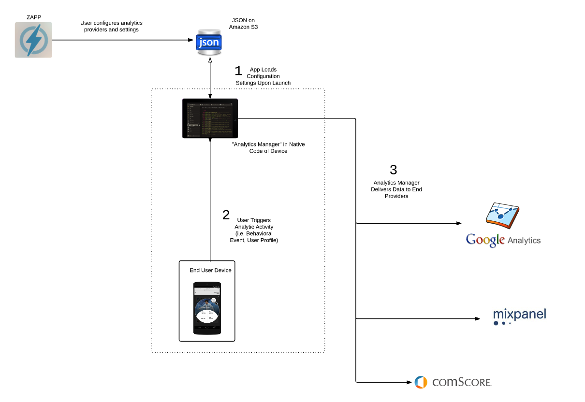

# Morpheus

### Overview

Other developer documentation refers to an Applicaster product called "Morpheus". This document outlines what Morpheus is.

### Product Description
 
Morpheus enables Applicaster to remotely configure which analytics providers to send data to. Users can configure the analytics providers in Zapp. 

The aim of Morpheus is to provide greater flexibility and scalability around analytics as opposed to a traditional approach of hardcoded direct integrations.

The infrastructure works as illustrated in the diagram below:

Morpheus supports a "Plugin" system, where third party analytics providers can be "plugged in" to the system and automatically start receiving all of the events referenced above. Every analytics provider has their own set of "out-of-the-box" functionality and events (i.e. retention reporting, session tracking) as part of their SDK, which Applicaster also supports. 
