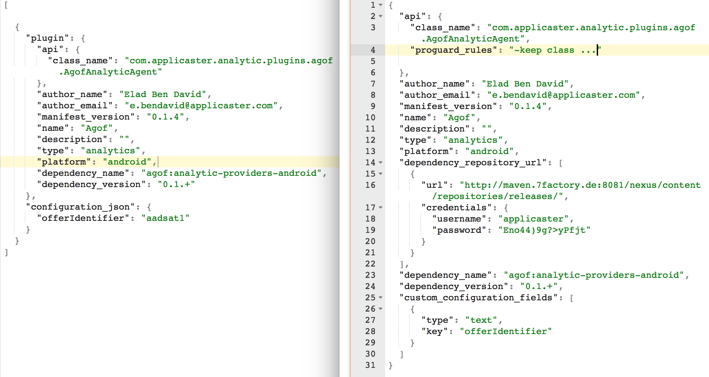
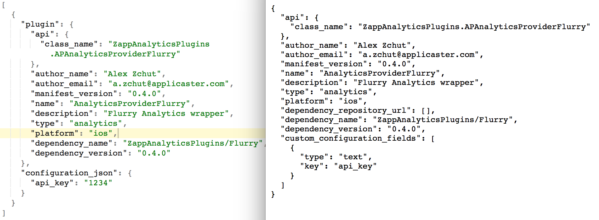

## How to add an analytics plugin to an integration application:
Applicaster supports a variety of analytics providers to which you can send your analytics data. All the analytics providers are handled via a “plugin” system.

The directions below outline how to add an analytic plugin to an Applicaster product or feature integrated into a non-Applicaster app:  

###Android

1. Get plugin manifest json(Plugin section in Zapp).
2. Concatenate the dependency_name and the dependency_version with ‘:’ between.  
    for example:  
    ```bash
    ‘flurry:analytic-providers-android:0.1.0’.  
    ```
    past the result dependency on the build gradle in the dependencies section.  
For example:  

    ```bash
    dependencies {   
        compile 'com.applicaster:FlurryAnalyticsProvider:0.2.0'
        compile 'akamai:akamai-analytic-providers-android:1.1.0+'
        compile 'comscore:comscore-analytic-providers-android:1.1.+'
        compile 'mixpanel:mixpanel-analytic-providers-android:1.0.+'
        compile 'google_analytics:google-analytic-providers-android:1.0.+'
    }
    ```
3. Copy proguard_rules property into the ‘proguard-rules.pro’
4. If dependency_repository_url property is not empty, create new maven repository in the build.gradle and copy it into. If not, make sure you have credentials for applicaster account in maven.
5. In ‘res/raw’ folder create new file ‘plugin_configurations.json’ and copy the
    json below:

    ```bash
      [
            {
          "plugin": ‘Here past the content of the plugin manifest’,
          “Configuration_json”:{
            "api_key": "23498efsdhkj324"
          }
        }
      ]
    ```
    *   In the ‘plugin’ property past the content of the plugin manifest.  
    Remove proguard_rules and dependency_repository_url properties.
    * In the ‘Configuration_json’ you need to configure the json variable, you can find the json variable list in custom_configuration_fields property in plugin manifest.  
    
For example:  
   You can see from the left the plugin_configurations.json’ file and from the right the plugin manifest.  
   

You can find more examples of our analytics plugins [here](./zappifest_example_plugins.md).

###iOS

1. Get json plugin manifest (from Zapp plugin section). 
2. Concatenate the dependency_name and the dependency_version and past the result dependency in shared_pods.   
   For example:  
    ```bash
        def shared_pods
            pod 'ZappAnalyticsPlugins/Flurry', '~> 0.4.0'
        end 
    ```
    *  if it already there, this is because it default plugin. Please jump to step 4.

3. If the ‘dependency_repository_url’ property exist, copy it and set it as source in shared_pods,  
   For example: 
    ```bash
        source 'git@github.com:CocoaPods/Specs.git'
    ```
    
4. In ‘Resources’ folder create new file ‘plugin_configurations.json’ and copy the json below:
    ```bash
        [
            {
                "plugin": ‘Here past the content of the plugin manifest’,
                “Configuration_json”:{
                    "api_key": "23498efsdhkj324"
                }
            }
        ]
    ```
    * In the ‘plugin’ property past the content of the plugin manifest.  
    Remove dependency_repository_url property.
    * In the ‘Configuration_json’ you need to configure the json variable, you can find the json variable list in custom_configuration_fields property in plugin manifest.  
    
For example:  
You can see from the left the plugin_configurations.json’ file and from the right the plugin manifest.  
    
