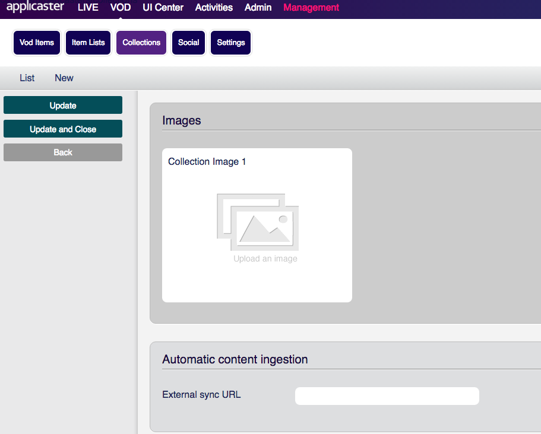

# Collection ingestion

## Overview
Collections are sets of items which can be
* videos
* categories
	* generic,
	* shows,
	* seasons,
	* genres,
	* links
* programs

These items can be groupped independently of their type.
In order to make the collection creation process faster applicaster allows this to happen in an automatic way from a remote URL. This URL should be inserted within the collection form into the (`external_sync_url`) input in the *Automatic Content ingestion* section and should point to an XML document with the correct structure.



When a collection is ingested, existing collection items are removed. For example, upon changing the XML file, the collection content should reflect the **new** file.

## XML structure

## Identifying the XML document

This is the first line in the XML response.

```xml
<?xml version="1.0" encoding="utf-8"?>
```

## The `<resources>` element

The resources XML should always start with a `<resources`> node

```xml
<resources>
  <!-- rest of XML comes here -->
</resources>
```
## The `<resource>` element

The resource element defines a single resource.

| Element | Description | Required |
|---------|-------------|----------|
| type | Resource type. One of `category`, `show`, `season`, `genre`, `link`, `video`, `program` | Yes |
| attributes | Resource attributes (see `<attributes>` below) | Yes |

## The `<attributes>` element

The attributes element holds the attributes that are necessary for the item to be added to a specific
collection as a collection item.

These are the same for all resource types:

| Element     | Description                                                          | Required | Types |
|-------------|----------------------------------------------------------------------|----------|-------|
| external_id | The item’s external ID that was sent in the content ingestion process| Yes      | all   |

# Example
```xml
<?xml version="1.0" encoding="utf-8"?>
<resources>
  <resource>
    <type>show</type>
    <attributes>
      <external_id>show_external_id</external_id>
    </attributes>
  </resource>
  <resource>
    <type>season</type>
    <attributes>
      <external_id>season_external_id</external_id>
    </attributes>
  </resource>
  <resource>
    <type>genre</type>
    <attributes>
      <external_id>genre_external_id</external_id>
    </attributes>
  </resource>
  <resource>
    <type>link</type>
    <attributes>
      <external_id>link_external_id</external_id>
    </attributes>
  </resource>
  <resource>
    <type>video</type>
    <attributes>
      <external_id>video_external_id</external_id>
    </attributes>
  </resource>
  <resource>
    <type>program</type>
    <attributes>
      <external_id>program_external_id</external_id>
    </attributes>
  </resource>
  <resource>
    <type>category</type>
    <attributes>
      <external_id>category_external_id</external_id>
    </attributes>
  </resource>
</resources>
```

If a given `external_id` doesn't match any item, the corresponding resource is ignored (not added to the collection).
