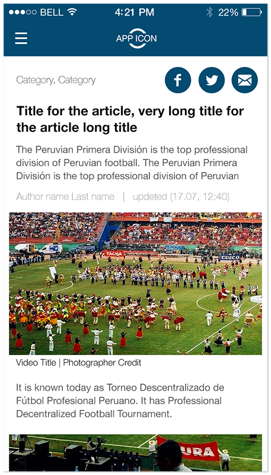
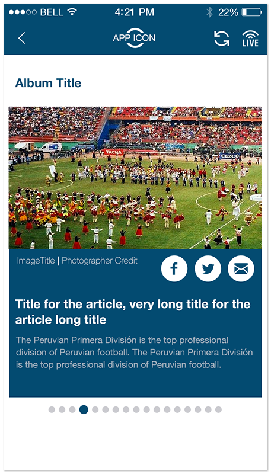
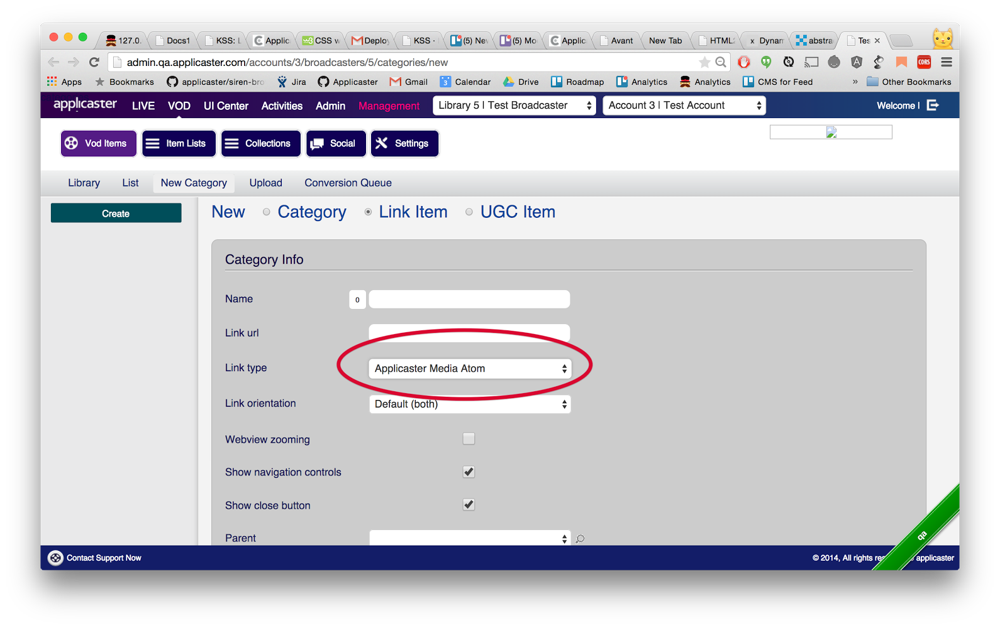

# Overview

Applicaster *Media Atom Feed* is a feature that allows the broadcaster to integrate list of external resources and present them in the app.


Currently Applicaster supports the following resource types: 
* Article
* Gallery
* Video
* YouTube Video

The content owner should host the resources in its own servers and provide Applicaster with the links to the Atom feeds according to the specifications below.

The following are examples for behaviors that can be configured using plugins in Zapp:
* Article - Upon tapping, the article will be presented in the following layout:

* Gallery - Upon tapping, the gallery will be presented in the following layout:

* Video - HLS video content, upon tapping the content will be presented on a video player.
* YouTube Video - YouTube video content, upon tapping the content will be presented using a YouTube player.

# Setup

Each Atom Feed link will need to be added to Applicater CMS into the appropriate Applicaster Category link and declared as an "Applicaster Media Atom" link type.

>The app will maintain the same order and structure as those in the provided Atom Feed.



# Media Atom Feed Specifications
The key words "MUST", "MUST NOT", "REQUIRED",
"SHALL", "SHALL NOT", "SHOULD", "SHOULD NOT",
"RECOMMENDED", "MAY", and "OPTIONAL" in this
document are to be interpreted as described in
[RFC 2119](http://tools.ietf.org/html/rfc2119).

The *Applicaster Media Atom Feed* format conforms with the Atom 1.0 Standard as described at [RFC 4287](http://tools.ietf.org/html/rfc4287) and MUST pass the [W3C Atom Validator](http://validator.w3.org/feed/).

Each Atom feed SHOULD hold multiple “atom:entry” nodes.

Any change done in an existing Atom Feed will be available immediately on the client after app start up and without the need to change anything on the Applicaster CMS.

> **Note:** Make sure your servers can hold the amount of expected concurrent users. As a rule of thumb the Atom Feed should be cached and served via a CDN.

>  **Note:** Any caching mechanism set on the broadcaster's servers will be reflected on the client. HTTP\`s `Cache-Control` header with a `max-age` directive. [Section 14.9 of RFC
2616](http://www.w3.org/Protocols/rfc2616/rfc2616-sec14.html#sec14.9) conditional GET using `If-Modified-Since`, `If-None-Match` (sections 14.25 & 14.26).

Feed examples can be found by [Clicking Here](./examples/examples.md)

## Elements and Attributes Description
Described below are all the custom extensions added to the Atom 1.0 Standard.

### feed
``` xml
<feed>
```

The `<feed>` element MUST contain the `xmlns:applicaster="http://schemas.applicaster.com/atom/1"` namespace.

### entry
``` xml
<entry>
```

The `<entry>` element block represents a single item in the Feed list. There SHOULD NOT be more than 30 entries on a single feed.

### applicaster type
``` xml
<applicaster:type>
```

The **entry** <applicaster:type> element MUST be added and its `value` attribute MUST be set to one of the following:
* For Article use: `<applicaster:type value="article"/>`
* For Video (HLS or YouTube) use: `<applicaster:type value="video"/>`
* For Image-Gallery: `<applicaster:type value="imageGallery"/>`
* For Image use: `<applicaster:type value="image"/>`
* For Link use: `<applicaster:type value="link"/>`
* For Playlist use: `<applicaster:type value="playlist"/>`
* For Atom Feed use: `<applicaster:type value="atom"/>`
* For Program use: `<applicaster:type value="program"/>`

### updated
``` xml
<updated>
```

If added the field will be visible for the end user.

### title
``` xml
<title>
```

The `<title>` element represents the title of the entry. The title element SHOULD NOT exceed the total of 33 characters. 

Titles that have more than 33 characters will get truncated on the item teaser.

### summary
``` xml
<summary>
```

If added the field will be visible for the end user.

### name
``` xml
<name>
```

If added the field will be visible for the end user.

### ui tag
``` xml
<ui_tag>
```

Applicaster's unique identifier.

### screen type
``` xml
<screen_type>
```

Applicaster's screen identifier as defined in screen settings of Zapp ux builder

### link [rel="alternate", type="text/html"]
``` xml
<link>
```

If `<link>` element exists and its set rel attribute is "alternate"
and its set type attribute is "text/html". The
href value of the link will be used as the shared link URL of the entry.

If using entry type `feed|imageGallery` the `<link>` element href value will hold the nested feed.

**Note:** If the nested feed is using a custom data source provider, the url should be constructed as follows:
`<custom_provider_scheme>://fetchData?type=<provider_data_type>&url=<original_feed_url>`

### id
``` xml
<id>
```

A unique identifier for an entry

### advertisement
``` xml
<advertisement>
```

This tag may include two tags:
#### interstitial
`<interstitial ios_iphone_adUnit = "" ios_ipad_adUnit = "" android_smartPhone_adUnit = "" android_tablet_adUnit = ""/>`

This tag should represent where interstitial content comes from.
When this tag is added it MUST includes properties any device types.

#### banner
`<banner ios_iphone_adUnit = "" ios_ipad_adUnit = "" android_smartPhone_adUnit = "" android_tablet_adUnit = ""/>`

This tag should represent where banner content comes from.
When this tag is added it MUST includes properties any device types.

All options are described here:
* `ios_iphone_adUnit`  - adUnit for iphones.
* `ios_ipad_adUnit`  - adUnit for ipads.
* `android_smartPhone_adUnit`  - adUnit for smartphones.
* `android_tablet_adUnit`  - adUnit for tablets.

### content
``` xml
<content>
```

The `<content>` element `type` attribute
depends on the Entry type:
* For Article use <kbd>html</kbd>
* For Image use one of the following types:
  * <kbd>image/png</kbd>, <kbd>image/gif</kbd>,
  * <kbd>image/jpg</kbd>, <kbd>image/jpeg</kbd>
* For Video use <kbd>video/hls</kbd>
* for YouTube Video use <kbd>youtube-id</kbd>
* For Image-gallery use <kbd>application/atom+xml</kbd>

Article type MUST contain the escaped embedded HTML markup
within.

Any HTML tags that are not of the following `<p>`, `<a>`, `<strong>`, `<h2>`, `<h3>`, `<h4>`, `<h5>`, `` aren't recommended and can cause bad article formatting.

* Image type MUST have a `src` attribute with the link to the full sized image. The maximum image size SHOULD NOT be bigger than 1200x1200px. The image is responsive to the device screen on Android only. One Image is allowed per row. Multiple inline images are possible per article.
* Image-gallery type MUST have a `src` attribute with the link to an *Applicaster Atom Feed* that holds image entries with an element set to `<applicaster:type value="image"/>`. Entries without the `<applicaster:type value="image"/>` element will be discarded.

* YouTube Video type MUST have a `src` attribute with the YouTube video ID.

### applicaster Extensions
``` xml
<applicaster:extensions>
```

The `<applicaster:extensions>` element groups
extended features of feed entry.

### applicaster Extension
``` xml
<applicaster:extension>
```

Following are the
supported extension types:
* <kbd>start_time</kbd>: Should be used on a `Program` type to indicate the start time of the program. Format: YYYY/MM/DD HH:MM:SS UTC, e.g. 2017/06/15 18:00:00 -0600
* <kbd>end_time</kbd>: Should be used on a `Program` type to indicate the end time of the program. Format: YYYY/MM/DD HH:MM:SS UTC, e.g. 2017/06/15 18:00:00 -0600
* <kbd>applicaster_channel_id</kbd>: Should be used on in order to connect the `Entry` to an external id. Can be used in Program to connect it to an existing channel id in Applicaster system.

### applicaster media group
``` xml
<applicaster:mediaGroup>
```

The `<applicaster:mediaGroup>` element groups
media assets from the same type. Following are the
supported group types:
* <kbd>image_base</kbd>: Is an image that will be used to show the item in a collection view. The base ratio SHOULD be 16:9.
* <kbd>video</kbd>: Relevant only for articles - holds the article's item video.
* <kbd>audio</kbd>: Relevant only for articles - holds the article's item audio.

>Please note:
* The play button image will present from the app and should not be include in the video image.
* In case the entry include "detailed-view" and "audio" types the app will ignore the "detailed-view" and will show only the "audio".
* In case the entry include "audio" and "video" types the app will ignore the "audio" and will show only the "video".

### applicaster media item
``` xml
<applicaster:mediaItem>
```

The `<applicaster:mediaItem>` element MUST be contained inside a `<applicaster:mediaGroup>` element.

The `key` attribute MUST be set to a predefined key. It differentiates the media items in the media group use <kbd>image_base</kbd> as a default value.

The `type` attribute MUST be one of the following:
* <kbd>image<kbd>
* <kbd>audio<kbd>
* <kbd>video<kbd>

The `src` attribute should contain the url of the media item.
