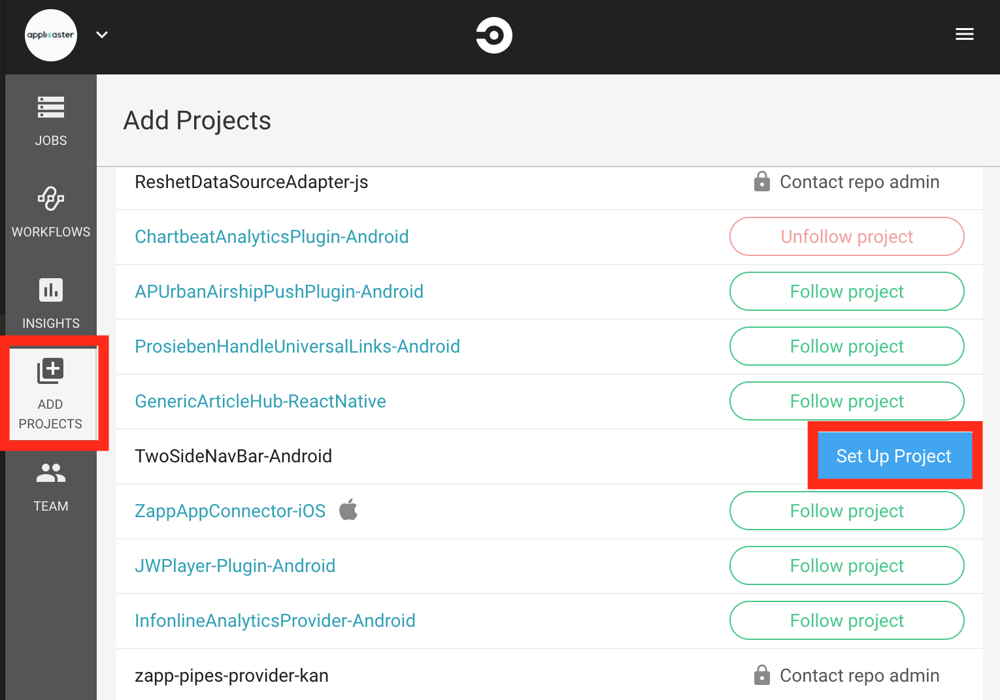

# Set up Bintray and Circle CI
## Let's start with Bintray
Make sure your project is using the gradle wrapper. If you don't have it set up, check [this article](https://medium.com/@bherbst/understanding-the-gradle-wrapper-a62f35662ab7) to know how to do it.
Then, in the gradle folder of your project create (or update) a file named `gradle-bintray-push.gradle` and paste the following content:

```
apply plugin: 'maven-publish'
apply plugin: 'com.jfrog.bintray'

/*
 * Gets the version name from the latest Git tag
 */
def getVersionName = { ->
  try {
    def stdout = new ByteArrayOutputStream()
    exec {
      commandLine 'git', 'describe', '--abbrev=0', '--tags'
      standardOutput = stdout
    }
    return stdout.toString().trim()
  } catch (ignored) {
    return null
  }
}

publishing {
  publications {
    mavenJava(MavenPublication) {
      groupId GROUP

      def versionFromTag = getVersionName()
      if (versionFromTag != null) {
        // There is a tag existing on the current commit - we can upload to Bintray
        version versionFromTag

        artifactId ARTIFACT_ID
        artifact "build/outputs/aar/" + project.name + "-release.aar"
        artifact androidJavadocsJar
        artifact androidSourcesJar
        pom.withXml {
          Node root = asNode()
          root.appendNode('name', ARTIFACT_ID)
          root.appendNode('description', POM_DESCRIPTION)
          root.appendNode('url', POM_URL)

          def issues = root.appendNode('issueManagement')
          issues.appendNode('system', 'github')
          issues.appendNode('url', ISSUE_URL)

          def scm = root.appendNode('scm')
          scm.appendNode('url', POM_SCM_URL)
          scm.appendNode('connection', POM_SCM_CONNECTION)
          scm.appendNode('developerConnection', POM_SCM_DEV_CONNECTION)

          def license = root.appendNode('licenses').appendNode('license')
          license.appendNode('name', POM_LICENCE_NAME)
          license.appendNode('url', POM_LICENCE_URL)
          license.appendNode('distribution', POM_LICENCE_DIST)

          def developer = root.appendNode('developers').appendNode('developer')
          developer.appendNode('id', POM_DEVELOPER_ID)
          developer.appendNode('name', POM_DEVELOPER_NAME)
          developer.appendNode('email', POM_DEVELOPER_EMAIL)

          def dependenciesNode = asNode().appendNode('dependencies')
          configurations.compile.allDependencies.each {
            if (!it.name.is('unspecified')) {
              def dependencyNode = dependenciesNode.appendNode('dependency')
              dependencyNode.appendNode('groupId', it.group)
              dependencyNode.appendNode('artifactId', it.name)
              dependencyNode.appendNode('version', it.version)
            }
          }
          configurations.api.allDependencies.each {
            if (!it.name.is('unspecified')) {
              def dependencyNode = dependenciesNode.appendNode('dependency')
              dependencyNode.appendNode('groupId', it.group)
              dependencyNode.appendNode('artifactId', it.name)
              dependencyNode.appendNode('version', it.version)
            }
          }
        }
      }
    }
  }
}

def getBintrayUserProperty() {
  return System.getenv("BINTRAY_USER")
}

def getBintrayApiKeyProperty() {
  return System.getenv("BINTRAY_API_KEY")
}

bintray {
  user = bintrayUserProperty
  key = bintrayApiKeyProperty
  publications = ['mavenJava']

  dryRun = false
  publish = true
  pkg {
    repo = 'maven'
    name = ARTIFACT_ID
    userOrg = 'applicaster-ltd'
    websiteUrl = POM_URL
    issueTrackerUrl = ISSUE_URL
    vcsUrl = POM_SCM_URL
    licenses = ['Apache-2.0']
    labels = ['aar', 'android']
    version {
      name = getVersionName()
      vcsTag = 'v' + getVersionName()
    }
  }
}

task androidJavadocs(type: Javadoc) {
  source = android.sourceSets.main.java.srcDirs
  classpath += project.files(android.getBootClasspath().join(File.pathSeparator))
  failOnError false
}

task androidJavadocsJar(type: Jar, dependsOn: androidJavadocs) {
  classifier = 'javadoc'
  from androidJavadocs.destinationDir
}

task androidSourcesJar(type: Jar) {
  classifier = 'sources'
  from android.sourceSets.main.java.sourceFiles
}

task androidJar(type: Jar) {
  from 'build/intermediates/classes/release'
}

artifacts {
  archives androidSourcesJar
  archives androidJavadocsJar
  archives androidJar
}
```

Next, you have to add the dependencies needed for bintray and maven. In the `build.gradle` file add the following snippet:

```
buildscript {
    repositories {
        google()
        jcenter()
    }
    dependencies {
        classpath 'com.android.tools.build:gradle:3.0.1'
        classpath 'com.github.dcendents:android-maven-plugin:1.2'
        classpath 'com.jfrog.bintray.gradle:gradle-bintray-plugin:1.4'
    }
}

repositories {
    maven {
        credentials {
            username System.getenv("MAVEN_USERNAME")
            password System.getenv("MAVEN_PASSWORD")
        }
        url 'https://dl.bintray.com/applicaster-ltd/maven'
    }
    jcenter()
    mavenCentral()
    maven {
        url 'https://maven.google.com'
    }
    maven { url 'https://jitpack.io' }
}
```
Contact an Applicaster developer to get the `MAVEN_USERNAME` and `MAVEN_PASSWORD`.

Then, in the `build.gradle`, add at the bottom
```
apply from: 'gradle/gradle-bintray-push.gradle'
```
In the root project create (or update) a file named `gradle.properties` and paste the following:
```
VERSION_NAME={VERSION_NAME}
VERSION_CODE={VERSION_CODE}
GROUP=com.applicaster
ARTIFACT_ID={NAME_OF_YOUR_PROJECT}
POM_DESCRIPTION={PROJECT_DESCRIPTION}
POM_URL={GITHUB_REPOSITORY_URL}
POM_SCM_URL={GITHUB_REPOSITORY_URL}
POM_SCM_CONNECTION=scm:{GITHUB_REPOSITORY_URL}
POM_SCM_DEV_CONNECTION=scm:{GITHUB_REPOSITORY_URL}
POM_LICENCE_NAME=The Apache Software License, Version 2.0
POM_LICENCE_URL=http://www.apache.org/licenses/LICENSE-2.0.txt
POM_LICENCE_DIST=repo
POM_DEVELOPER_ID={YOUR_ID}
POM_DEVELOPER_NAME=Applicaster
POM_DEVELOPER_EMAIL={YOUR_EMAIL}
ISSUE_URL={ISSUE_URL}
```
The following snippet is a configuration made for one of our plugins
```
VERSION_NAME=0.0.1
VERSION_CODE=1
GROUP=com.applicaster
ARTIFACT_ID=AmericaTVLoginPlugin-Android
POM_DESCRIPTION=A plugin which will handle the authentication flows (login, register and forgot password) for AmericaTV.
POM_URL=https://github.com/applicaster/AmericaTVLoginPlugin-Android.git
POM_SCM_URL=https://github.com/applicaster/AmericaTVLoginPlugin-Android.git
POM_SCM_CONNECTION=scm:https://github.com/applicaster/AmericaTVLoginPlugin-Android.git
POM_SCM_DEV_CONNECTION=scm:https://github.com/applicaster/AmericaTVLoginPlugin-Android.git
POM_LICENCE_NAME=The Apache Software License, Version 2.0
POM_LICENCE_URL=http://www.apache.org/licenses/LICENSE-2.0.txt
POM_LICENCE_DIST=repo
POM_DEVELOPER_ID=j.hernandez
POM_DEVELOPER_NAME=Applicaster
POM_DEVELOPER_EMAIL=android@applicaster.com
ISSUE_URL=https://github.com/applicaster/AmericaTVLoginPlugin-Android/issues
```
After that, you can sync your project and everything should work fine and you are ready to publish in bintray. But before that, let's configure CircleCI.

## Now it's CircleCI turn

### But before
You have to give Gradle reading and writing permissions. For that, copy and paste the following in a terminal prompt located in your project directory.
```
chmod +x ./gradlew
```
*Note: You have to make sure you have gradle wrapper set up in your project.*
### Set up project
Go to https://circleci.com/gh/applicaster. If you don't have access, request it.

Then, go to `ADD PROJECTS` and look for yours (your project has to be in the Applicaster github repository) and click `Set up project`.



Select `Linux` as Operating System and `Gradle (Java)` as Language.

Then follow the steps described in the `Next Steps` section.
**Important**: The second step, where you have to populate the `config.yml`, instead of the one that CircleCI provides, use the following:
```
# Java Gradle Circle CI 2.0 configuration file
#
# Check https://circleci.com/docs/2.0/language-java/ for more details
#
defaults: &defaults
  working_directory: ~/APPlugin
  docker:
    - image: circleci/android:api-26-alpha

version: 2
jobs:
  test:
    <<: *defaults
    steps:
      - checkout

      - restore_cache:
          key: jars-{{ checksum "build.gradle" }}-{{ checksum  "build.gradle" }}

      - run:
          name: Download Dependencies
          command: ./gradlew androidDependencies || true

      - save_cache:
          paths:
            - .gradle
          key: jars-{{ checksum "build.gradle" }}-{{ checksum  "build.gradle" }}

      - run:
          name: Run Tests
          command: ./gradlew test

      - store_artifacts:
          path: ./build/reports
          destination: reports

      - store_test_results:
          path: ./build/test-results

  deploy:
    <<: *defaults
    steps:
      - checkout

      - restore_cache:
          key: jars-{{ checksum "build.gradle" }}-{{ checksum  "build.gradle" }}

      - run:
          name: Build release package
          command: ./gradlew assembleRelease

      - run:
          name: Deploy to Bintray
          command: ./gradlew bintrayUpload

workflows:
  version: 2
  test-n-deploy:
    jobs:
      # Execute job for all branches, and all tags.
      - test:
          filters:
            tags:
              only: /.*/

      # Execute job for no branches, and all tags
      - deploy:
          requires:
            - test
          filters:
            tags:
              only: /.*/
            branches:
              ignore: /.*/

```

*Note: The `.circleci` folder has to be created in the root directory of the project.*

Before `Start building` you have to set the environment variables in the CircleCI project. For that go to the project settings (the screw icon)


You have to add four variables
- `MAVEN_USERNAME`
- `MAVEN_PASSWORD`
- `BINTRAY_API_KEY`
- `BINTRAY_USER`

For `MAVEN_USERNAME` and `BINTRAY_USER`, use the same value of `MAVEN_USERNAME` you got in the first step. For `MAVEN_PASSWORD` and `BINTRAY_API_KEY` use the same of `MAVEN_PASSWORD` you got in the first step.

## The end
Now you are ready to build with CircleCI and publish in Bintray when tagging. If you have any question please don't hesitate to contact a co-worker.