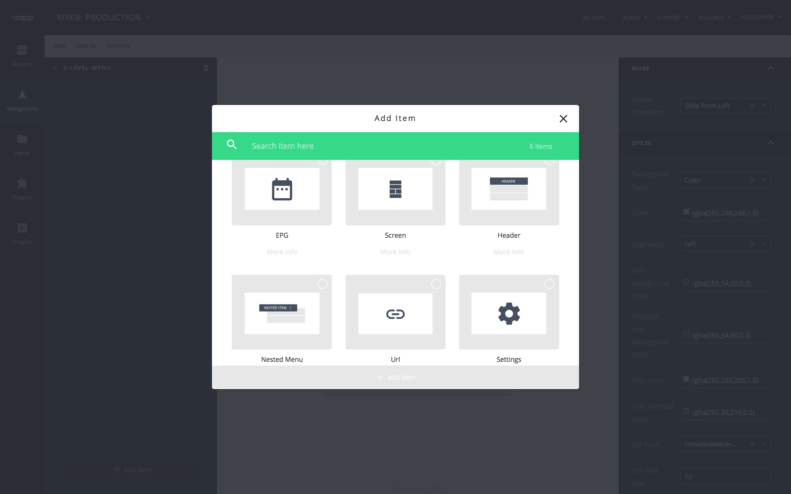

# Designing a new menu
June 2018

## Purpose
This document is a guide for designers who are designing a **new menu plugin** or a **new menu item** for an existing menu plugin.

## Definions
1. **Menu plugin**: A plugin that is used for the navigation of an app, such as ‘side menu’, ‘bottom tab bar’ and others.
1. **Menu item**: Menu items are the items that are linked from the menu, such as screen, URL, header or nested menu in some menu plugins. Not all Menus allow the same menu items. For example: The Bottom Tab bar will not have a ‘header’ or a ‘nested item’, whereas the ‘2-Level Menu’ does have them.

## Start your design
Make sure the design is responsive to support the fragmented sizes of devices on both platforms, specifically for devices of different aspect ratio. See below the suggested devices to consider:

## Deliverables
1. **Plugin Thumbnail** of your new menu. It will appear in the navigation modal.
    1. Front end size: W 268px x H 150px
     
1. **Canvas Preview** of your menu plugin. It will ppear on the canvas.
    1. Front end size: W 640px x H 976px
    1. You can choose to show a few previews that will demonstrate several configuration states.
    
1. **Menu items thumbnails**. Consult with the product person that has planned this menu plugin. If there are additional menu items that are possible to be added for this menu, create a thumbnail for each one of them.
    1. Front end size: W 268px x H 150px 
        1. Icons size: approximately 80px x 80px. Approve with Zapp Team Designer and Product Owner.
        
    1. Client size: If you use icons for the menu items, the ratio must be 1:1. (screenshot below)
    
1. **Plugin cover image** of your new menu. It will appear in the plugin gallery.
    1. Front end size: W 278px x H 146px
    
1. **Initial Values** - Provide the default configuration for each key of your design, so when a user opens the app with your plugin, it shows up in the ideal way you would like it to be demonstrated. 
    1. Styles: colors, fonts type and size, etc. 
    1. Assets: provide 3x assets of the base design in the colors that match your default colors design.
1. **Right-to-Left** - We encourage providing mirrored design for RTL apps.

## Styleguide
1. **Fonts**: Use System fonts
    1. iOS: SF Pro
    1. Android: Roboto
1. **Icons**
    1. For the both Client app and Front End Preview: Use the same icons, see [Initial Values](#initialvalue) & [Canvas Preview](#preview).
    1. Try using the [material design icons](https://material.io/icons/) for the [Menu Item Thumbnails](#menuitem).
1. **Colors** Use the following color code in your preview files:

