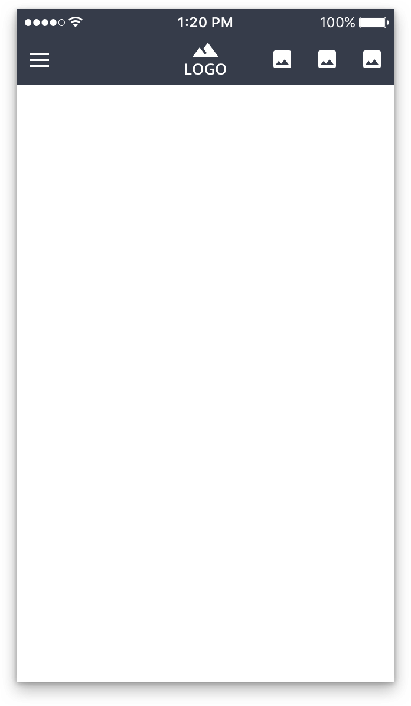
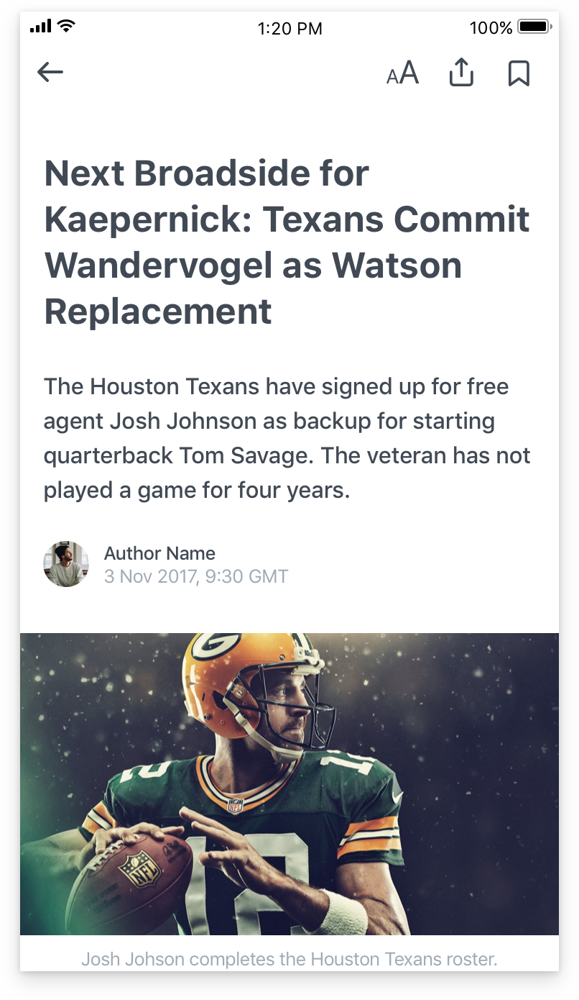
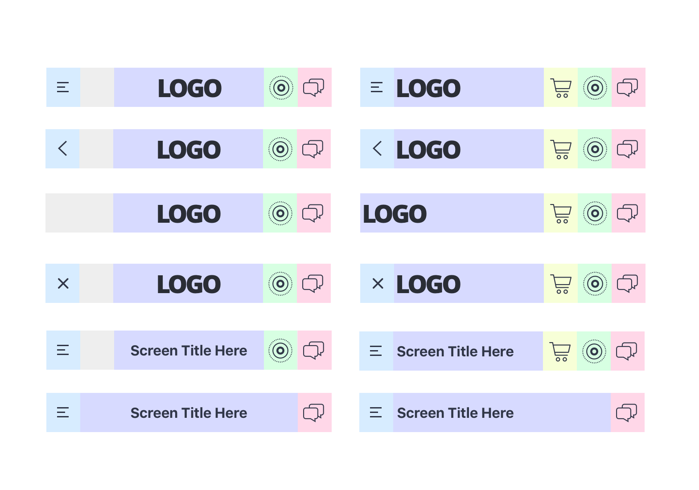
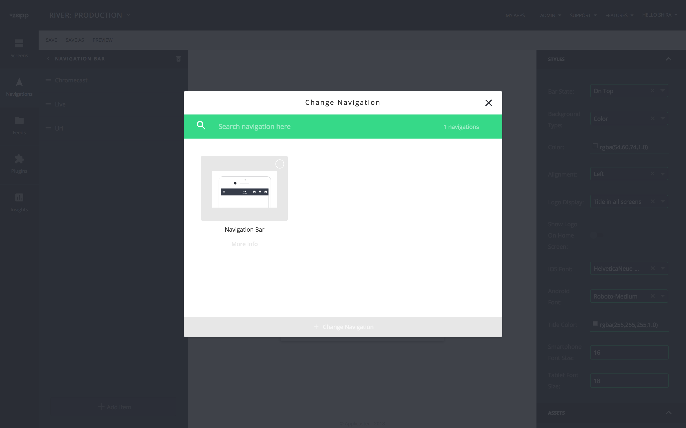
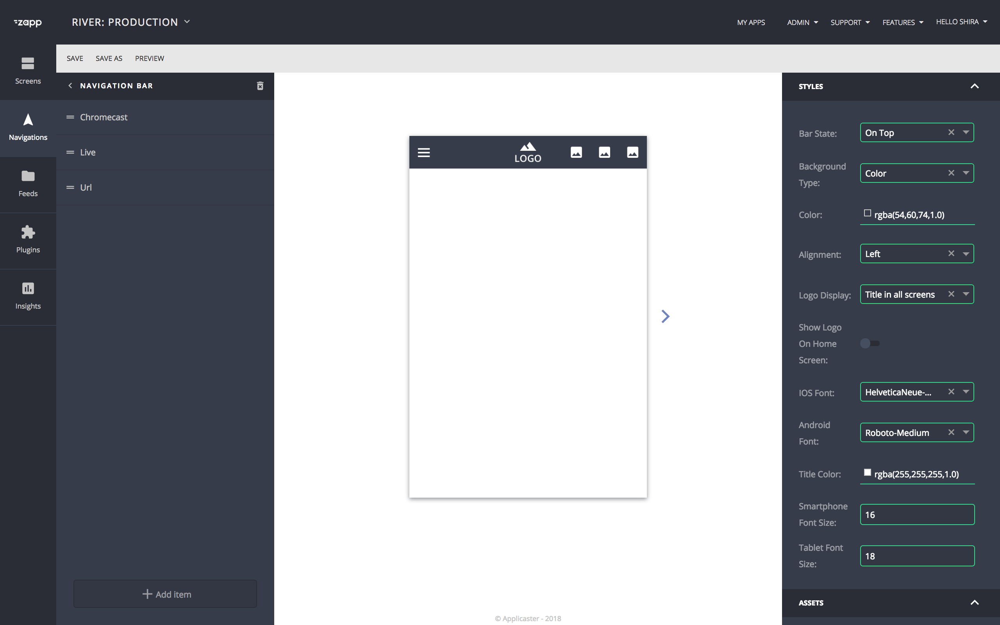
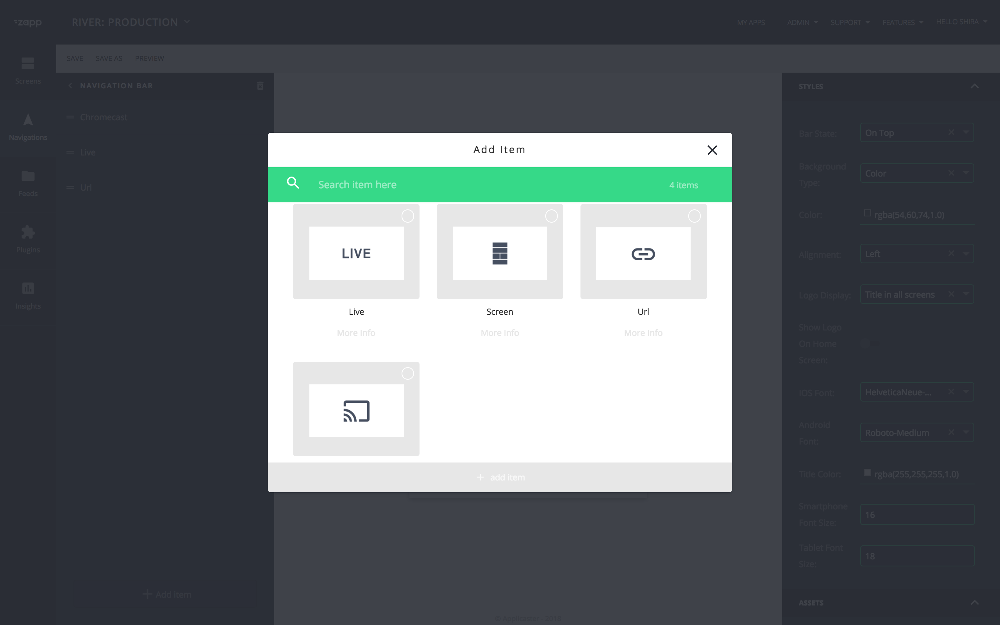
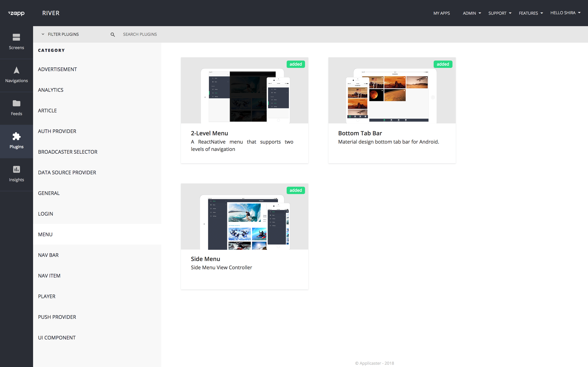
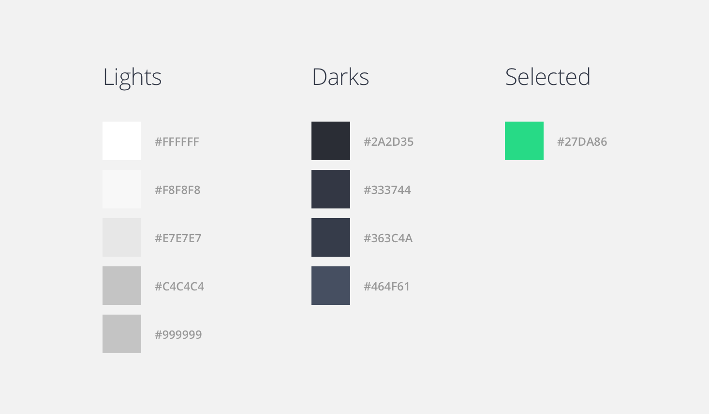

# Designing a new Navigation Bar
June 2018

## Purpose
This document is a guide for designers who are designing a **new app navigation bar plugin** or a **new screen based plugin that includes a navigation bar**.

|App navbar | Screen plugin navbar |
|--------|--------|
| |  |

## Design of a new Navigation Bar
1. Create the 3 states of a navigation bar for both platforms on all devices:
    1. Home Screen
    1. Inner Screen
    1. New screen that comes on top of a previous screen. (for iOS only)
1. Define the distance between the elements on your navigation bar.
1. Configuration can define:
    1. The interchangeability of the logo with the screen title.
    1. Alignment
    1. Other parameters.

## Design of a screen based plugin including a Navigation Bar
When designing a new screen based plugin that includes a contextual navigation bar, for example 'article' screen, the screen will open on top of the previous screen. For a good UX, please keep the same distances on both navbars, to avoid jumps when a user is moving from one screen to your new screen.
Follow the sizes of the default navigation bar in your app. Currently zapp offers one navigation bar only, with the following design spec:
1. Buttons ratio: 1:1
1. No space between the buttons.
1. Logo or title takes the available width of the navbar, subtracting the navigation buttons size.

## Deliverables
1. **Plugin Thumbnail** of your new navigation bar. It will appear in the navigation modal.
    1. Front end size: W 268px x H 150px
     
1. **Canvas Preview** of your navigation bar plugin. It will appear on the canvas.
    1. Front end size: W 640px x H 976px
    1. You can choose to show a few previews that will demonstrate several configuration states.
    
1. **Menu items thumbnails**. Consult with the product person that has planned this navigation bar plugin. If there are additional menu items that are possible to be added for this menu, create a thumbnail for each one of them.
    1. Front end: 
        1. W 268px x H 150px 
        1. Icons size: approx 80px x 80px
        
    1. Client size: If you use icons for the navigation bar items, the ratio must be 1:1.
    
1. **Plugin cover image** of your new navigation bar. It will appear in the plugin gallery.
    1. Front end size: W 278px x H 146px
    
1. **Initial Values** - Provide the default configuration for each key of your design, so when a user opens the app with your plugin, it shows up in the ideal way you would like it to be demonstrated. Include: 
    1. Styles: colors, fonts type and size, etc. 
    1. Assets: provide 3x assets of the base design in the colors that match your default colors design.
1. **Right-to-Left** - We encourage providing mirrored design for RTL apps.

## Styleguide
1. **Fonts**: Use System fonts
    1. iOS: SF Pro
    1. Android: Roboto
1. **Icons**
    1. For both Client app and Front End Preview: Use the same icons, see [Initial Values](#initialvalue) & [Canvas Preview](#preview).
    1. Try using the [material design icons](https://material.io/icons/) for the [Menu Item Thumbnails](#menuitem).
1. **Colors** Use the following color code in your preview files:

