# Plugin Submission Guideline
June 2018

## Purpose
In order for **zapp users and applicaster sales force to be aware of the available plugins**, and all their valuable information, each plugin requires metadata. The following guidelines are aimed at product people, designers and plugin developers, to provide the above information and submit it in the plugin manifest. Please refer to the [Manifest documentation](http://developer-zapp.applicaster.com/zappifest/plugins-manifest-format.html) as well.

## Plugins Section in Zapp

All public plugins will be seen in the Plugins section:

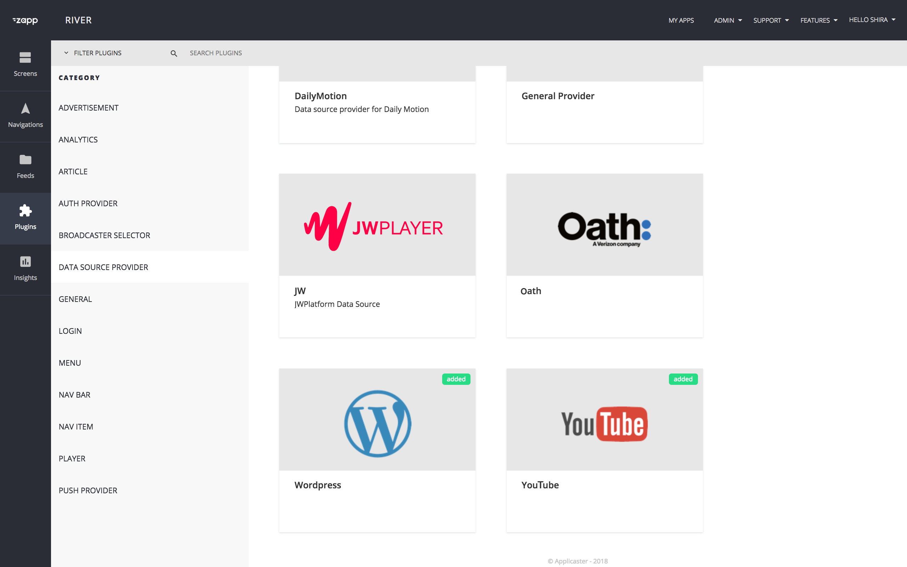

## Request for Review 
When publishing a public plugin, fill in this [form](https://airtable.com/shrmnWALC8fdDAig8) to request Marketplace team to review your plugin. An Approval / Reject with exaplanation will be sent to you by mail. 

## Whitelist to Public Plugins 
When creating a new plugin, whitelist it to your account. It will not be submitted otherwise. 
Team Zapp / Team Marketplace will approve the plugin as public, following a review that covers:
1. Assuring the specs / API are not customer specific.
1. Compliance with the guidelines specified in this document referring to:
    1. Descriptive Name 
    1. Cover image 
    1. **Plugin level** assets and styles (in case there are) 
    1. Description 
    1. About 
    1. Preview for screen based plugins.
1. Implementation of analytics events.

## Whitelist Plugins 
Whitelist plugins are assigned and used only by a specific or multiple accounts, and is up to the author to manage them. However, we recommend to fill in the information listed in the **Whitelist to Public Plugins** under bullet #2 and #3. This is essential specifically if the plugin could be public with additional development.

## Rule of Thumb
**All the information about your plugin should be written in the plugin level**.

## Manifest

Add the following fields to the latest version of the plugin manifest.

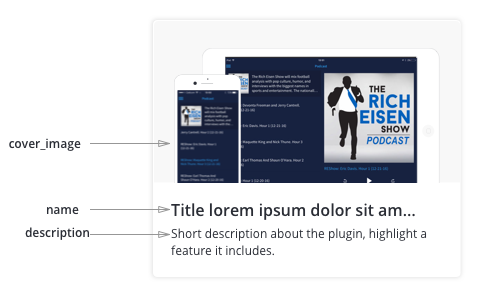 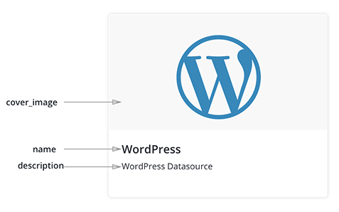

### Name
1. Update the field [name]
1. Use a **single name** for both platforms; both name and identifiers.
1. **Character limit**: 35
1. For **Screen based plugins** - use a descriptive name. Choose the unique feature of your plugin that makes it stand out and differentiates from others. For example, you could indicate if it’s a single / multi channel screen, if it has an inline player, if it has tags or any specific feature.
    1. **Don’t** include technical implementation details in the name. (e.g.: React Native)
1. For **Integration based plugins** - use the 3rd party (the vendor’s) name.
    1. When the vendor provides additional services that were developed as a plugin, add the plugin type following the name
    1. When an integration based plugin does not have yet a type, include both the [name of the 3rd party] + [a description feature]. I.e.: For Loyalty based plugins - SnapScreen AR, Applicaster Questionnaires, Playbuzz Fun Article.
1. **UI Components**: Please consult with Zapp / Product team for naming.

### Description
1. Update the field [description]
1. Include a **One-liner** that describes what the plugin does / what is the value this plugin offers.
1. **characters limit**: 80 - it's not an absolute value, but an approximate one.
1. Examples: [Sketch extensions description](http://www.sketchapp.com/extensions/plugins/). 

### Type
Choose from the current types of plugins. If it does not fit, choose to place it under ‘General’.

### Cover Image
1. Update the field [cover_image]
1. **Designers**: Use this [sketch template](https://drive.google.com/drive/folders/1FMOq3jhXgFwnB0vKEqfNCv68QBY5pIR6?usp=sharing).
    1. UI based plugins: place screenshot of tablet and smartphone in the devices. 
        1. Note the template has few screen orientations (landscape and portrait for both devices. Place the screens according to your design).
    1. Integration with 3rd party: Logo.
1. **Asset Size**: W 1668px x H 876px (this is a 6x size) 

### About

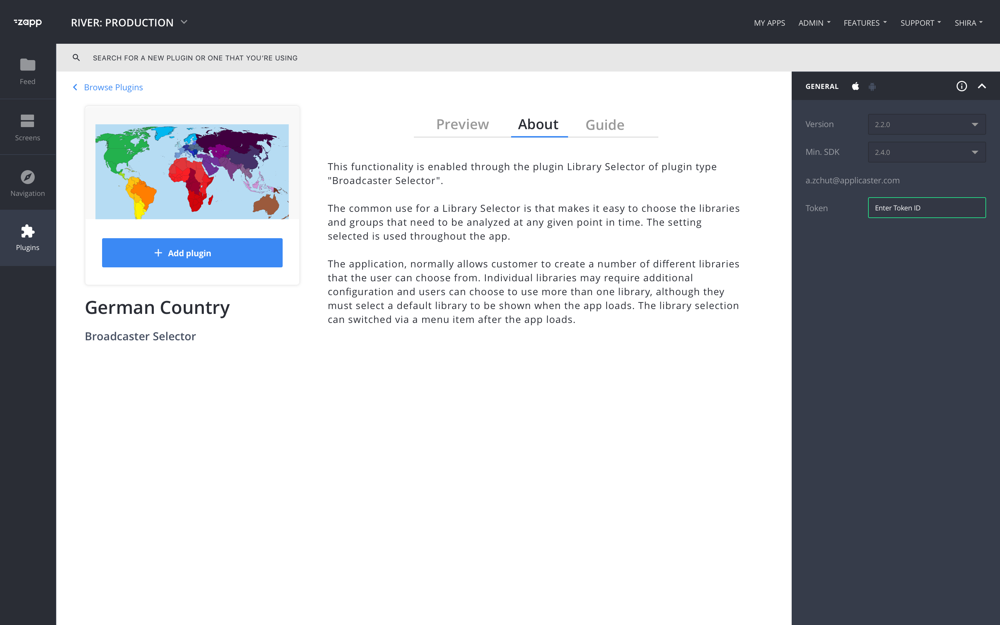

1. Update the field [about] 
1. Describe the plugin features in depth.
1. If the plugin supports only one platform, please specify it.
1. Plugin Dependencies: Specify it there’s another plugin that requires installation for this plugin to work. 
1. Describe its caveats, and/or out of scope features - specifically if there’s a core feature in your plugin that is not supported or will be supported in the future. (not mandatory).
1. Use Markdown for the About.

### Preview 

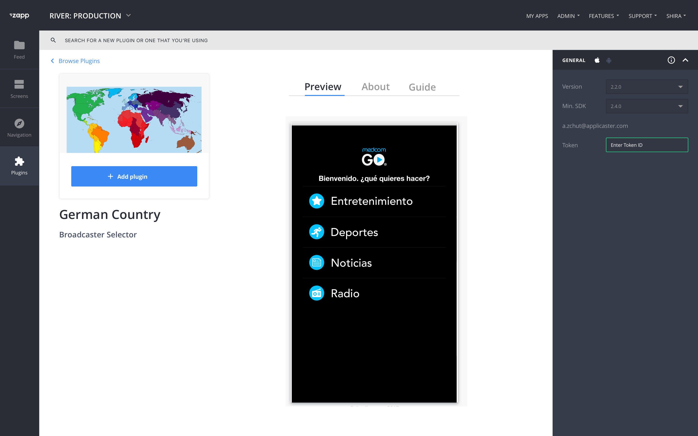

1. Update the field [preview]
1. For **UI based** plugins, add the smartphone and tablet screens.
    1. Smartphone: W 640px x H 976px 
    1. Tablet: 1024 x 768 px
    1. Create a ‘fake’ logo, which is not of Applicaster customers.
    1. Optional: Use the following color code in your preview files:
  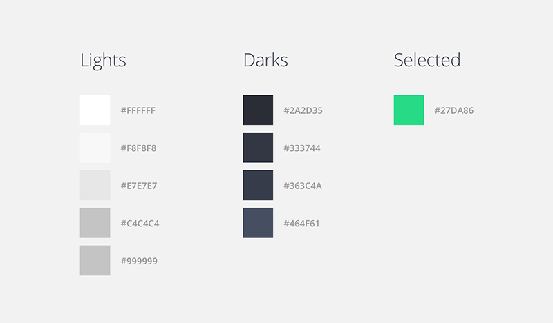

### Guide

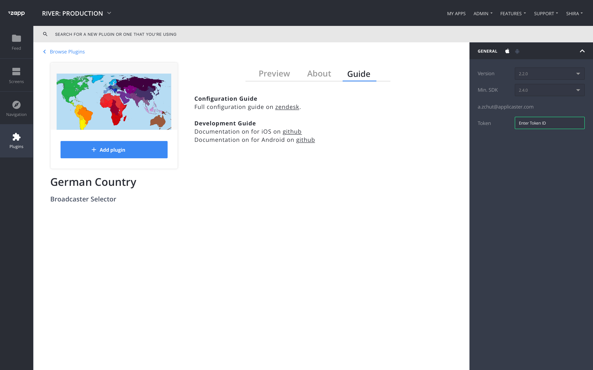

#### Configuration Documentation

1. Update the field [guide]
1. Add the steps how to configure and customize the plugin (Mandatory). Please add screenshots to the explanation. 
1. What are the analytics events & properties that are tracked?  You can also link to an external doc.
1. Don’t forget to include steps that are required (if required) in other platforms (such AP2 CMS or any other 3rd party platform).
1. If there are any differences between platforms, please indicate it.
1. If the document is long, upload it to Zendesk and add the url in this field, or use Markdown to present the documentation in this section.

#### Developer Documentation

1. Update the field [guide]
1. Add the public link to the developer documentation when required, or alternatively use Markdown to present the documentation in this section. e.g.: how to create the feed for the plugin, what are the objects of an article plugin. The link could either be on github or in the 3rd party site that the plugin is integrating.

## Plugin Configurations
Some Plugins have a vast configuration, and others a short one. Please follow the following guidelines when adding configuration keys. 
You could refer to the [‘2 Level Menu’](https://zapp.applicaster.com/admin/plugin_versions/3994/plugin_manifests/two_level_rn_menu?plugin_manifest_id=3994) Navigation plugin as a reference (link to the manifest and below is a partial screenshot of the general configuration panel): 

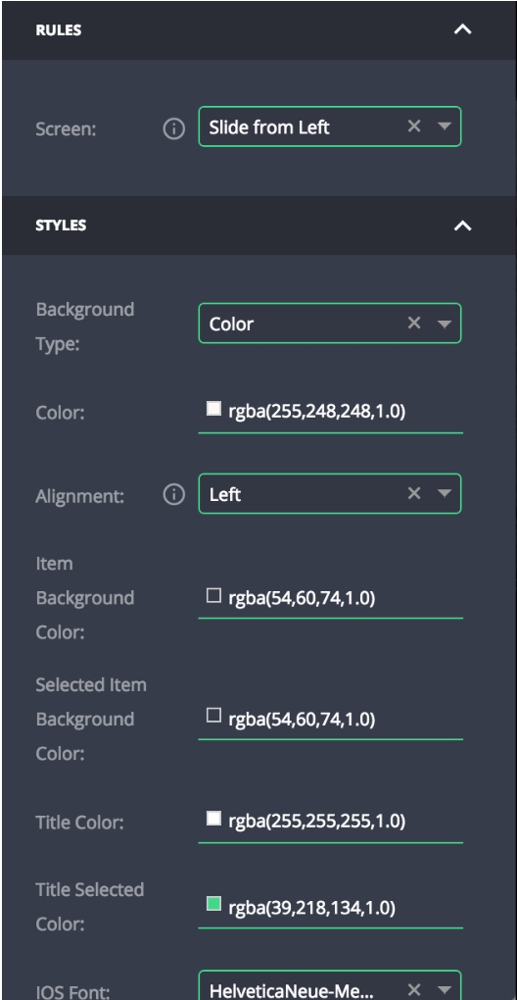

### General

1. **Label** [label]
    1. Name your key with a label that will appear in the builder, and that is clear to a zapp user.
    1. Include labels both to the main configuration keys as well as its values, when applicable. See example: configuration key: Background Type, Values: Color/Image. 
    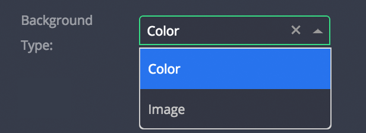
1. **Placeholders**: [placeholder]. The placeholders are the instructions that appear in a UI element before it is configured.
    1. Add an instruction for clarity. By default, it will add the name of the key following the type of UI (select, enter..). All first words in Capital. 
   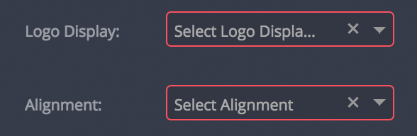
1. **Tooltip**: [label_tooltip]. Add a tooltip if you feel a clarification is needed, or if there is a prerequisite to the specific key.
1. **Condition**: [conditional_fields] + [rules]: Sometimes certain keys are not needed when a preliminary key was used. In that case, make the user experience easy, by hiding those keys that are not needed. For example: In the navbar you could configure all screens to show titles, OR to show the logo. In the second option, all the font configuration keys are not needed. See screenshots: 

| Title in all screens | Logo in all screens |
|--------|--------|
|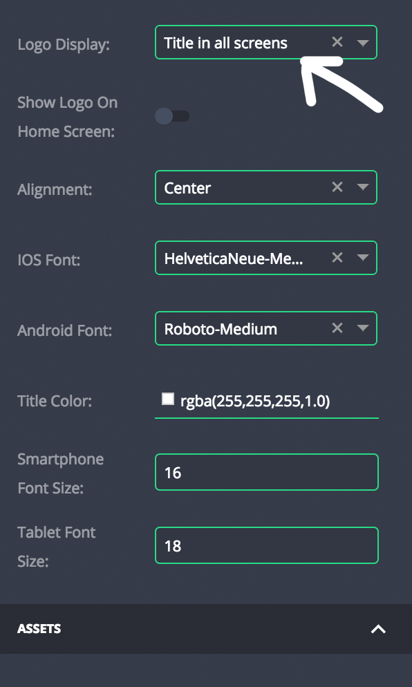 | 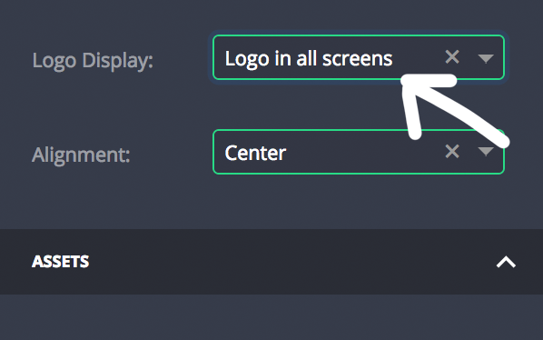 |

### Assets

1. **Plugin Level** - [uploader] Keys for assets should be added on the plugin level and not to the SDK. 
1. **3x assets** - Use 3x assets that will fit both platforms. Obtain the same aspect ratio.
1. **Tablet** - If the aspect ratio of tablet and smartphone assets is the same, use the same key for both (one asset for both platforms, and both types of devices).
1. **Placeholders**: Add a placeholder indication of the asset size to be uploaded. Use the following format: W XXXpx x H XXXpx.
1. **Initial Value**: Some plugins should have default assets before configuration. For example: a close button, an arrow of a selected item. Add a default asset as an initial value in the plugin level (not the sdk).

### Styles

1. **Placeholder**: See under [General / Placeholders](#placeholder)
1. **Initial Value**: Choose the initial values of your keys. It is very beneficial for the user who chooses your plugin and immediately see the keys configured in his/her app. Match between the [preview](#preview) that you prepare in the builder. 
