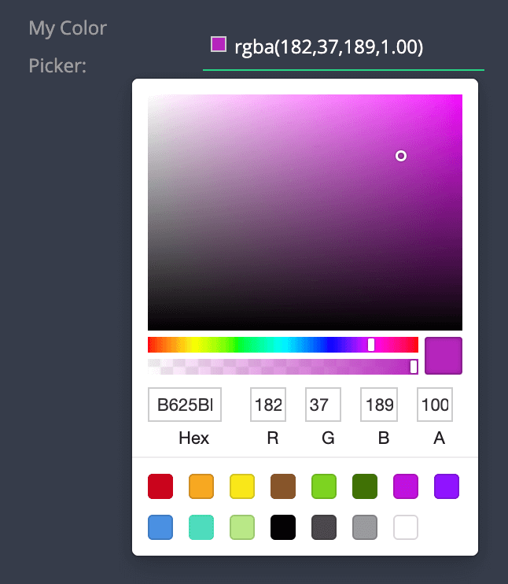

# Color Picker RGBA

| type                  | sections                                                          | value type | screenshot                         |
| --------------------- | ----------------------------------------------------------------- | ---------- | ---------------------------------- |
| **color_picker_rgba** | assets, data, general, styles, rules, custom_configuration_fields | `string`   |  |

### Description

Creates a color picker. The stored value of the color is a string in `rgba(R,G,B,A)` format (string), matching the [RGBA Colors](https://www.w3schools.com/css/css3_colors.asp) notation. Initial value is `undefined`.

### Example

```
"assets|data|general|styles|rules|": {
  "fields: [
    {
      "key": "my_rgba_color_picker",             // Required
      "type": "color_picker_rgba",               // Required
      "initial_value": "rgba(255, 128, 0, 0.7),  // Optional
      "label": "My RGBA Picker",                 // Recommended
      ...

```

### Notes

- This is the prefered color picker to use, especially when dealing with React Native / javascript reliant plugins.
- The stored value of the selected color is kept in `rgba(R,G,B,A)` format. For notation in `#AARRGGBB` format (not recommened), please use the [Color Picker](/plugins-manifest/fields/color-picker.md).
- Optional initial_value format can be either:
  - `rgba(R,G,B,A)` (recommended).
  - `#RRGGBBAA` (not recommended).
