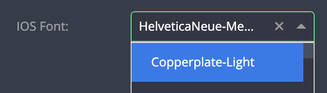

# Font selectors

| type                      | sections | screenshot                                                  |
| ------------------------- | -------- | ----------------------------------------------------------- |
| **ios_font_selector**     | any      |      |
| **android_font_selector** | any      |  |

### Description

Both field types create a `select` dropdown automatically populated with:

- System fonts (iOS or Android, accordingly)
- Custom fonts uploaded via the `Edit App > Upload fonts` section

### Example

```
"assets|data|general|styles|rules|": {
  "fields: [
    {
      "key": "my_field_key",                              // Required
      "type": "ios_font_selector|android_font_selector",  // Required
      "placeholder": "select font"                        // Recommended
      ...

```

### Notes

- It is possible to provide an initial value
- Do not provide any `"options"` object in the field's configuration
