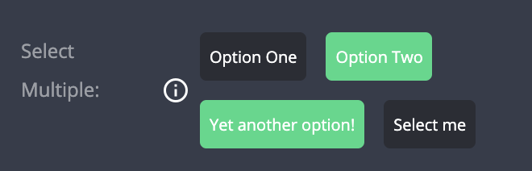

# Multi Select

| type             | sections                             | value type      | screenshot                                         |
| ---------------- | ------------------------------------ | --------------- | -------------------------------------------------- |
| **multi_select** | assets, data, general, styles, rules | `Array<string>` |  |

### Description

Creates an input that allows selection of multiple values. Selected values are shown as green labels. Initial value is an empty `Array`.

### Example

```
"assets|data|general|styles|rules|": {
  "fields: [
    {
      "key": "my_field_key",          // Required
      "type": "multi_select"          // Required
      "options": [                    // Required
        { "text": "Option One", "value": "option_1" },
        { "text": "Option Two", "value": "option_2" }
        ...
      ]
      "initial_value": ["option_1"],  // Optional
      "label": "My Field",            // Recommended
      "label_tooltip": "...",         // Recommended
      ...

```

### Notes

- `options` object is mandatory.
- `options` _must_ have at least one value.
- The options inside `options` _must_ have two properties, `text` and `value`, of type `string`.
- When using `initial_value`, it has to be an array of strings matching the value(s) presented in the `options` object.

#### User stories

> Given the field configuration of the example above

- When no values are selected

  - Input appears with two boxes
  - All boxes are black
  - Plugin configuration value is an empty array: `[]`

- When both values are selected
  - Input appears with two boxes
  - All boxes are green
  - Plugin configuration value is: `["option_1", "option_2"]`
