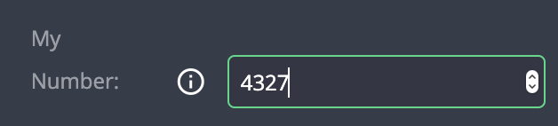

# Number Input

| type             | sections                             | value type | screenshot                                         |
| ---------------- | ------------------------------------ | ---------- | -------------------------------------------------- |
| **number_input** | assets, data, general, styles, rules | `number`   |  |

### Description

A Creates an `input` that accepts only [numbers](https://developer.mozilla.org/en-US/docs/Web/JavaScript/Reference/Global_Objects/Number) - both integers and floating points. Initial value is `undefined`.

### Example

```
"assets|data|general|styles|rules|": {
  "fields: [
    {
      "key": "my_field_key",           // Required
      "type": "number_input",          // Required
      "initial_value": 1234,           // Recommended
      "label": "My Field",             // Recommended
      "placeholder": "enter a number", // Recommended
      "label_tooltip": "...",          // Recommended
      ...

```

### Notes

- Unlike `text_input`, It is warmly recommended to set an initial value
