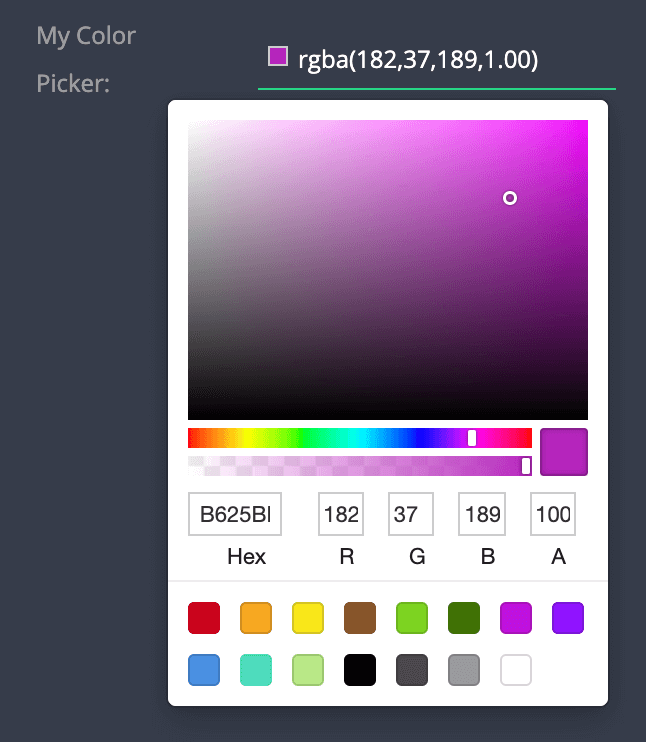

# Color Picker

| type             | sections                                                          | value type | screenshot                            |
| ---------------- | ----------------------------------------------------------------- | ---------- | ------------------------------------- |
| **color_picker** | assets, data, general, styles, rules, custom_configuration_fields | `string`   |  |

### Description

Creates a color picker. The stored value of the color is a string in `#AARRGGBB` format (string). Initial value is `undefined`.

### Example

```
"assets|data|general|styles|rules|": {
  "fields: [
    {
      "key": "my_color_picker",      // Required
      "type": "color_picker",        // Required
      "initial_value": "#00FF00FF",  // Optional - see notes!
      "label": "My Picker",          // Recommended
      ...

```

### Notes

- The stored value of the selected color is kept in `#AARRGGBB` format. For notation in RGBA format (recommened), please use the [Color Picker RGBA](/plugins-manifest/fields/public/color-picker-rgba.md).
- ⚠️ Caution: Optional initial_value is in `#RRGGBBAA` format, unlike the value! ⚠️
