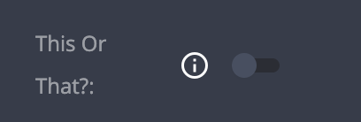

# Switch

| type       | sections                             | value type | screenshot                      |
| ---------- | ------------------------------------ | ---------- | ------------------------------- |
| **switch** | assets, data, general, styles, rules | `boolean`  |  |

### Description

Creates an `input` of type `checkbox`, shown as a switch.
Initial value is `false`.

### Example

```
"assets|data|general|styles|rules|": {
  "fields: [
    {
      "key": "my_field_key",   // Required
      "type": "switch",        // Required
      "initial_value": true,   // Optional
      "label": "My Switch",    // Recommended
      "label_tooltip": "...",  // Recommended
      ...

```

### Notes

- Like other fields, it is possible to set an `"disabled": true` property if one wishes to show a switch that cannot be modified.
