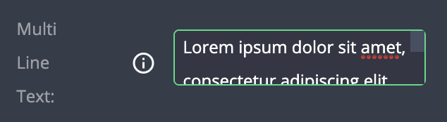

# Text Area

| type          | sections                                                          | value type | screenshot                         |
| ------------- | ----------------------------------------------------------------- | ---------- | ---------------------------------- |
| **text_area** | assets, data, general, styles, rules, custom_configuration_fields | `string`   |  |

### Description

Creates a `textarea` input. Initial value is an empty string: `""`

### Example

```
"assets|data|general|styles|rules|": {
  "fields: [
    {
      "key": "my_field_key",               // Required
      "type": "text_area",                 // Required
      "initial_value": "foo bar baz",      // Optional
      "label": "My Field",                 // Recommended
      "placeholder": "enter some string",  // Recommended
      "label_tooltip": "...",              // Recommended
      ...

```

### Notes

- It is possible to set `null` as an initial value
