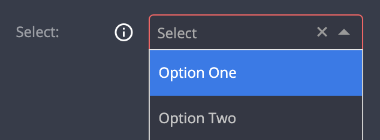

# Select

| type       | sections                             | value type | screenshot                                   |
| ---------- | ------------------------------------ | ---------- | -------------------------------------------- |
| **select** | assets, data, general, styles, rules | `string`   |  |

### Description

Creates an html `select` tag that allows a selection of a single value from the given options. Initial value is an empty string: `""`. Selected value can be set as mandatory (impossible to remove).

### Example

```
"assets|data|general|styles|rules|": {
  "fields: [
    {
      "key": "my_field_key",        // Required
      "type": "select"              // Required
      "options": [                  // Required
        { "text": "Option One", "value": "option_1" },
        { "text": "Option Two", "value": "option_2" }
        ...
      ]
      "initial_value": "option_1",  // Optional
      "mandatory: true|false,       // Optional
      "label": "My Field",          // Recommended
      "placeholder": "choose",      // Recommended
      "label_tooltip": "...",       // Recommended
      ...

```

### Notes

- `options` object is mandatory.
- `options` _must_ have at least one value.
- The options inside `options` can be _either_:
  - Objects with two properties, `text` and `value`, of type `string` (recommended).
  - Array of string values (not recommended).
- When using `initial_value`, it has to match one of the values presented in the `options` object.
- Optional property - `mandatory`
  - When present and set to `true`, there is no "remove" (&times;) button
  - Should be coupled with an `initial_value`

#### User stories

> Given the field configuration of the example above

- When there is no `mandatory` property

  - And no value is selected
    - Plugin configuration value is an empty string: `""`
  - And `"Option Two"` is selected
    - Plugin configuration value is: `"option_2"`
  - And the user click on the remove (&times;) button
    - Plugin configuration value is an empty string: `""`

- When the field has a `"mandatory": true` property
  - And `"Option Two"` is selected
    - Plugin configuration value is: `"option_2"`
    - User can select another option
    - User cannot remove a selected option
