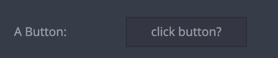

# Internal use only

| type       | sections                                                          | value type | screenshot                      |
| ---------- | ----------------------------------------------------------------- | ---------- | ------------------------------- |
| **BUTTON** | assets, data, general, styles, rules, custom_configuration_fields | -          |  |
| **link**   | assets, data, general, styles, rules, custom_configuration_fields | -          | -                               |

### Description

Both field types are intended for internal use only, please **do not** add those to any plugin manifest.

### Example

```
"assets|data|general|styles|rules|": {
  "fields: [
    {
      "key": "my_button_key",  // Required
      "type": "BUTTON",        // Required. Notice upper case!
      ...
    },
    {
      "key": "my_link_key",    // Required
      "type": "link",          // Required
      ...
    }
    ...
```
