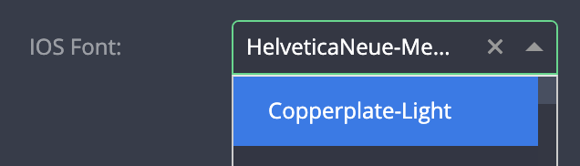

# Font selectors

| type                         | sections                                                          | value type | screenshot                                     |
| ---------------------------- | ----------------------------------------------------------------- | ---------- | ---------------------------------------------- |
| **ios_font_selector**        | assets, data, general, styles, rules, custom_configuration_fields | `string`   |      |
| **android_font_selector**    | assets, data, general, styles, rules, custom_configuration_fields | `string`   |  |
| **samsung_tv_font_selector** | assets, data, general, styles, rules, custom_configuration_fields | `string`   | ""                                             |
| **tvos_font_selector**       | assets, data, general, styles, rules, custom_configuration_fields | `string`   | ""                                             |
| **roku_font_selector**       | assets, data, general, styles, rules, custom_configuration_fields | `string`   | ""                                             |
| **lg_tv_font_selector**      | assets, data, general, styles, rules, custom_configuration_fields | `string`   | ""                                             |
| **web_font_selector**        | assets, data, general, styles, rules, custom_configuration_fields | `string`   | ""                                             |

### Description

Using one of these field type will create a `select` dropdown automatically populated with:

- Matching system fonts of each platform.
- Custom fonts uploaded via the `Edit App > Upload fonts` section.

_**IMPORTANT NOTE**_: When one or more of these field types is put inside `custom_configuration_fields`, only the relevant font selector for the platform will be shown in the Plugin Gallery.

### Example

```
"assets|data|general|styles|rules|": {
  "fields: [
    {
      "key": "my_field_key",                              // Required
      "type": "ios_font_selector|android_font_selector
               |samsung_tv_font_selector|tvos_font_selector
               |roku_font_selector|lg_tv_font_selector
               |web_font_selector",                       // Required
      "initial_value": "AvenirNext-Italic",               // Optional
      "label": "My Field",                                // Recommended
      "placeholder": "select font"                        // Recommended
      "label_tooltip": "...",                             // Recommended
      ...

```

### Notes

- It is possible to provide an initial value (String). When using an initial value, make sure it matches the correct platform.
- Do _not_ provide any `"options"` object in the field's configuration - the options to select will be automatically populated by Zapp.
