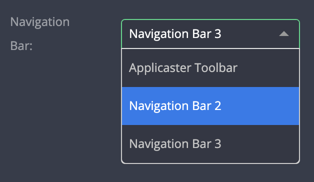

# Nav Bar Selector

| type                 | sections                             | value type | screenshot                                |
| -------------------- | ------------------------------------ | ---------- | ----------------------------------------- |
| **nav_bar_selector** | assets, data, general, styles, rules | `string`   |  |

### Description

Used in [Screen Plugins](/screen/screen-plugin-general.md) only.

Creates a `select` input that allows overriding the default navigation bar in screen plugins. Initial value is the `nav_bar_id` of the default navigation bar.

### Example

```
"identifier": "my_screen_plugin",
...
"type": "general",                      // Required
"screen": true,                         // Required
...
"assets|data|general|styles|rules|": {
  "fields: [
    {
      "key": "nav_bar_id",              // Required (! see notes !)
      "type": "nav_bar_selector",       // Required
      "label": "Alternate Nav Bar",     // Recommended
      "label_tooltip": "...",           // Recommended
      ...

```

### Notes

- The plugin using this field must be a [Screen Plugin](/screen/screen-plugin-general.md) with the following attributes in the manifest:
  - A `general` type.
  - A `"screen": true` attribute.
- In order for the nav bar selector to appear, there should be more than one navigation of type `nav_bar` in the layout.
- ⚠️ Caution: Unlike other general / public fields, the `key` attribute must have the value `nav_bar_id`. Please conform to the precise structure shown in the example, it won't work otherwise. ⚠️

#### User stories

> Given the plugin configuration of the example above

- When there are threw navigation bars in the layout (navigation plugins of type `nav_bar)`
  - The Nav Bar selector will be visible
  - It will present three options to choose from
  - Selected nav bar will be shown on the matching screen in the app
- When there is only a single navigation bar in the layout
  - The Nav Bar selector won't be shown
- When the plugin is not marked as a screen (`"screen": true` missing)
  - The Nav Bar selector won't be shown
- When the key value is _anything_ other than `nav_bar_id`
  - The Nav Bar selector will be shown
  - But the screen in the app will still show the default nav bar
