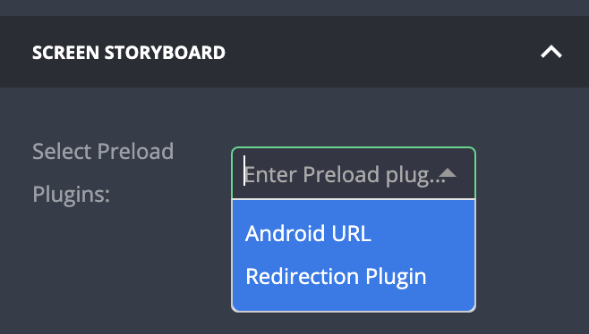

# Preload Plugins Selector

| type                         | section | value type | screenshot                                        |
| ---------------------------- | ------- | ---------- | ------------------------------------------------- |
| **preload_plugins_selector** | hooks   | `string`   |  |

### Description

Used in [Screen Plugins](/screen/screen-plugin-general.md) only.

Creates a `select` input that allows assignement of [Preload Plugins / Screen Hooks](/plugins/general-abilities/screen-hooks/screen-hooks-general.md) in a screen plugin. Initial value is an empty array `[]`.

### Example

```
"identifier": "my_screen_plugin",
...
"type": "general",                         // Required
"screen": true,                            // Required
...
"hooks": {                                 // Required
  "fields: [
    {
      "key": "preload_plugins",            // Required (! see notes !)
      "type": "preload_plugins_selector",  // Required
      "label": "Select Preload Plugins",   // Recommended
      "label_tooltip": "...",              // Recommended
      ...
```

### Notes

- The plugin using this field must be a [Screen Plugin](/screen/screen-plugin-general.md) with the following attributes in the manifest:
  - A `general` type.
  - A `"screen": true` attribute.
- This field can appear _only_ under `"hooks"` section.
- Options will be populated with any core / installed plugin that has a `"preload": true` attribute. See [manifest example](/plugins/general-abilities/screen-hooks/ios/screen-hook-ios.md#manifest).
- ⚠️ Caution: Unlike other general / public fields, the `key` attribute must have the value `preload_plugins`. Please conform to the precise structure shown in the example, it won't work otherwise. ⚠️
- Do _not_ provide any `initial_value` attribute.

#### User stories

> Given the plugin configuration of the example above

- When there are three preload plugins installed (plugins with attribute `"preload": true`):
  - The Preload Plugins selector will be visible
  - It will present three options to choose from
  - Selected plugin will be shown _before_ on the matching screen in the app
- When there are no plugins marked as a "preload"
  - The Preload Plugins Selector will be empty
- When the key value is _anything_ other than `preload_plugins`
  - The Preload Plugins Selector will be shown
  - But the screen in the app will show without any preload plugin
