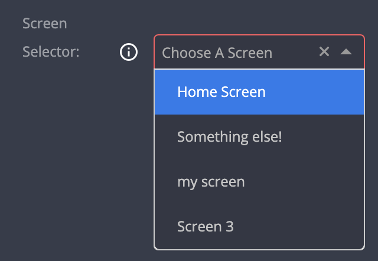

# Screen Selector

| type                | sections                             | value type | screenshot                               |
| ------------------- | ------------------------------------ | ---------- | ---------------------------------------- |
| **screen_selector** | assets, data, general, styles, rules | `string`   |  |

### Description

Creates a `select` input which presents the available screens in the layout. The stored value is the unique `external_id` of the selected screen. Initial value is `undefined`.

Example:

### Example

```
"assets|data|general|styles|rules|": {
  "fields: [
    {
      "key": "my_field_key",             // Required
      "type": "screen_selector",         // Required
      "label": "Screen Selector",        // Recommended
      "placeholder": "Choose A Screen",  // Recommended
      "label_tooltip": "..."             // Recommended
      ...

```

### Notes

- Do _not_ provide any `initial_value` attribute. Options will be filled automatically by the UI Builder.
- When selecting a screen and removing it, the value becomes `null`.
- Take care when deleting screens - some `screen_selector` in a plugin can still "point" to a no-longer-valid `external_id` of an non-existing screen.

#### User stories

> Given the plugin configuration of the example above

- When there are three screens in the layout
  - The Screen selector will be visible
  - It will present three screens to choose from
  - The field value is the `external_id` value of the selected screen
- When the user removes a selected key from the selector
  - The field value is `null`
