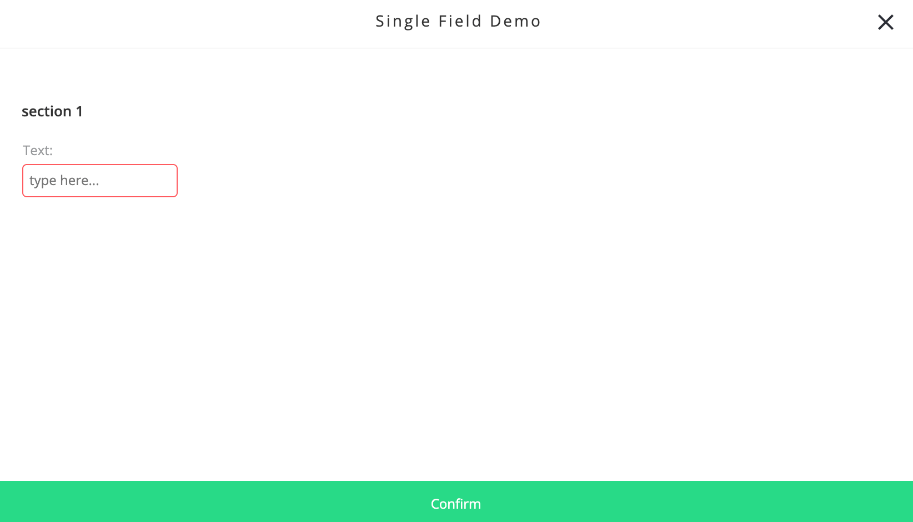
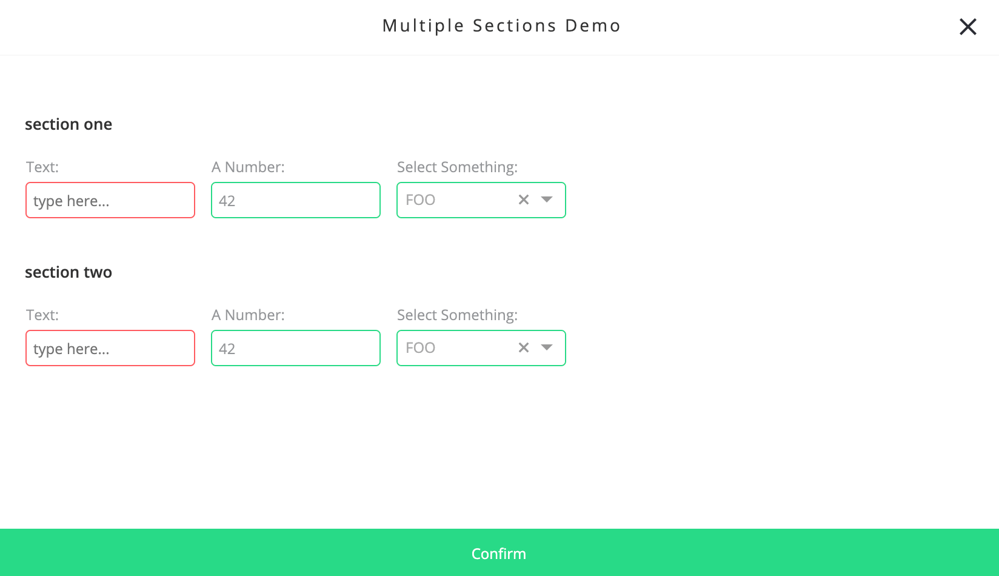
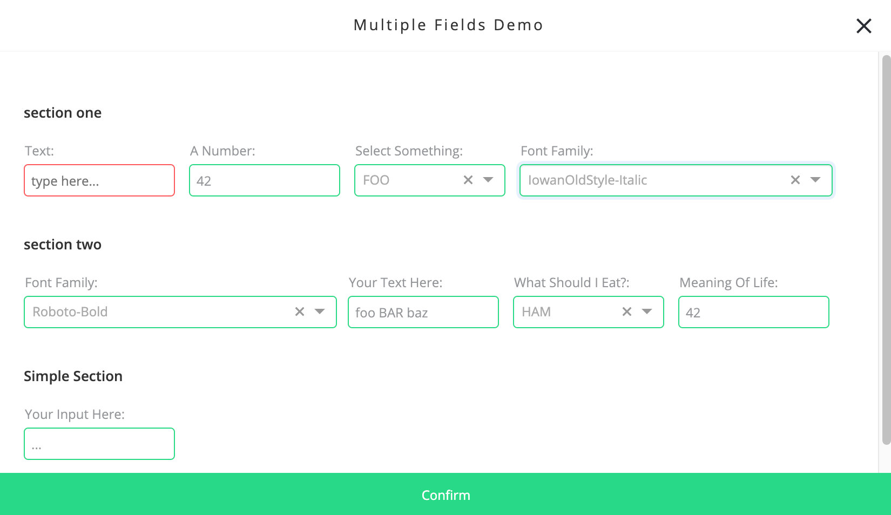

# Text Style

| type           | sections                                                          | value type | screenshot                                |
| -------------- | ----------------------------------------------------------------- | ---------- | ----------------------------------------- |
| **text_style** | assets, data, general, styles, rules, custom_configuration_fields | `object`   |  |

### Description

Creates a `text_style` field which contains a nested configuration. Configuration is shown in a modal, divided by sections.

### Example

```
"assets|data|general|styles|rules|": {
  "fields: [
    {
      "key": "my_text_style_key",  // Required
      "type": "text_style",        // Required
      "label": "My Field",         // Recommended
      "label_tooltip": "...",      // Recommended
      "form_configuration": {      // Required
        "sections: [               // Required
          {
            "label":               // Required
            "key":                 // Required
            "fields": [            // Required
              ...
            ]
          }
        ]
      }
      ...
```

### Snippets

Each snippet shown here has a screenshot of the resulting modal and an example of the resulting data structure. Click on each snippet link to download directly, or right-click to open in a new tab.

#### Single field

_Basic example - a single section with a single nested field_

| snippet                                                                                                                    | modal                                                             |
| -------------------------------------------------------------------------------------------------------------------------- | ----------------------------------------------------------------- |
| <a target="_blank" href="../../snippets/text-style-single-field.json" download="text-style-single-field.json">download</a> |  |

```
"styles": {
  "single_field_demo": {
    "section_1": {
      "my_text_input": "foo bar baz"
  ...
```

#### Multiple sections

_Fields under each section can have the same keys, since they are nested_

| snippet                                                                                                                              | modal                                                                  |
| ------------------------------------------------------------------------------------------------------------------------------------ | ---------------------------------------------------------------------- |
| <a target="_blank" href="../../snippets/text-style-multiple-sections.json" download="text-style-multiple-sections.json">download</a> |  |

```
"general": {
  "multiple_sections_demo": {
    "section_one": {
      "my_text_input": "foo bar baz",
      "my_number_input": 42,
      "my_select": "baz"
    },
    "section_two" {
      "my_text_input": "something else",
      "my_number_input": 1234,
      "my_select": "foo"
    }
  ...
```

#### Multiple fields and sections

_There is no limit on the number of fields or sections, each section can have entirely different fields_

| snippet                                                                                                                          | modal                                                              |
| -------------------------------------------------------------------------------------------------------------------------------- | ------------------------------------------------------------------ |
| <a target="_blank" href="../../snippets/text-style-multiple-fields.json" download="text-style-multiple-fields.json">download</a> |  |

```
"styles": {
  "multiple_fields_demo": {
    "section_one": {
      "my_text_input": "foo bar baz",
      "my_number_input": 42,
      "my_select": "foo",
      "my_font_family: "AppleSDGothicNeo-Light"
    },
    "another_parent_key": {
      "font_family": "Roboto",
      "my_number_input": 1234,
      "my_text_input": "foo BAR baz",
      "egg_or_ham": "ham",
      "my_number_input": 42
    },
    "a_lone_section": {
      "lone_text_input": "..."
    }
  ...
```

### Notes

- Notice that _all_ those keys are required: `form_configuration`, `sections` and the nested `fields` under each section
