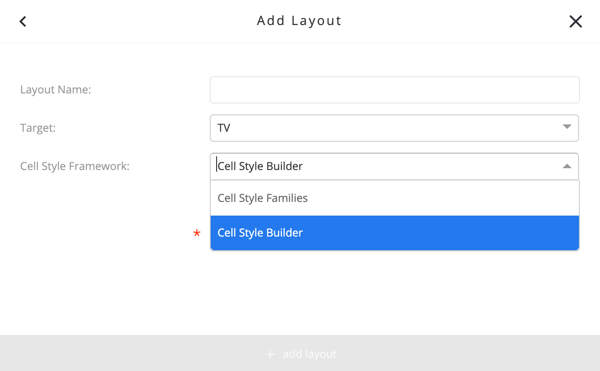
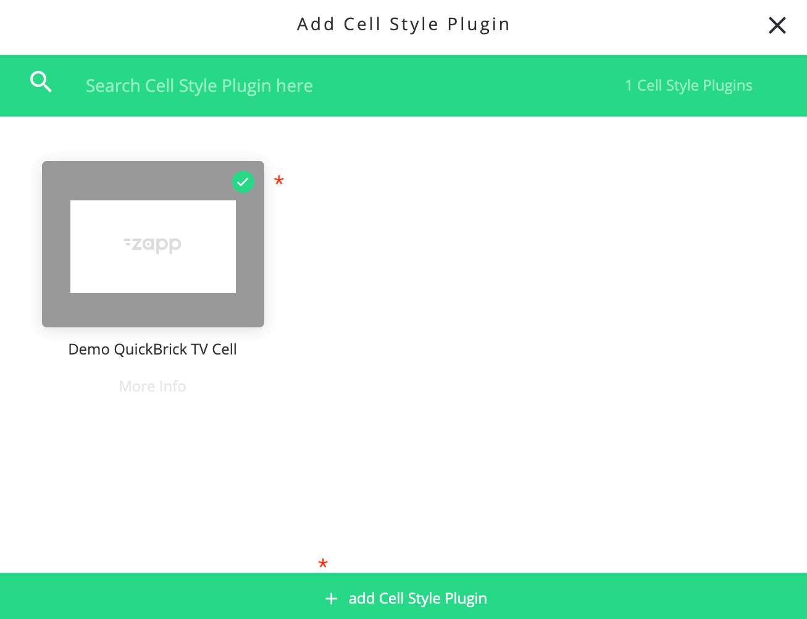
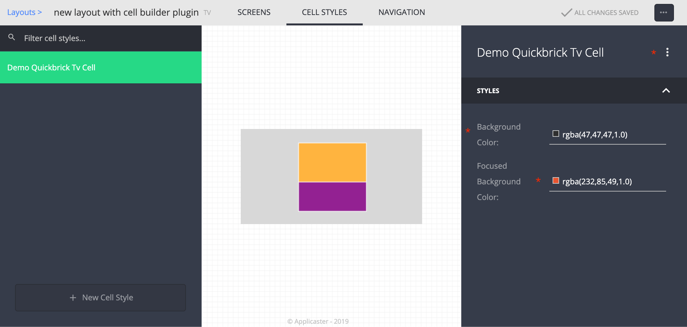
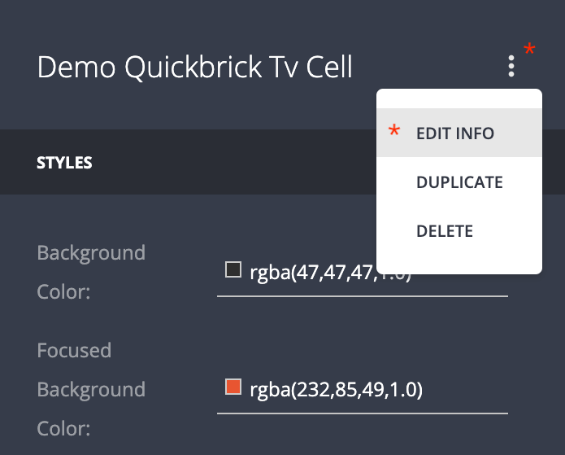
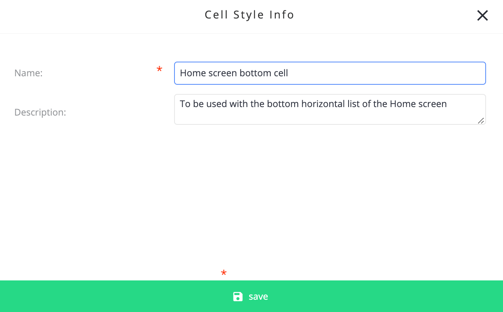
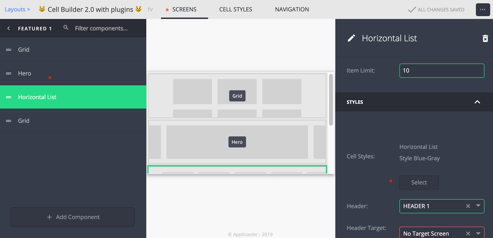
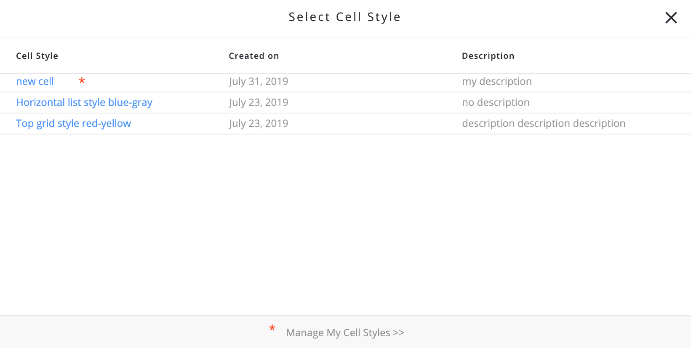

# Layouts with cell styles builder & cell builder plugins

1. <a href="#purpose">Purpose</a>
1. <a href="#supported-platforms1">Supported platforms</a>
1. <a href="#contributing">Contributing</a>
1. <a href="#ui-builder">UI Builder</a>

## Purpose
Allow the user to create and use his own set of stylized cells using the "Cell Style Builder" and plugins of type `cell_builder`, in the _layout_ level. This plugin type is comprised of two parts:
1. The configuration in the manifest, which exposes the configurable parts of the cell.
1. The implementation in the client side for drawing the cell (in react-native / react-native-web).

## Supported platforms[^1]
- [x] tvOS
- [x] Samsung TV / DOM
- [ ] Android TV

## Contributing

The primary repo for cell builder plugins is [applicaster/demo-cell-builder-plugin](https://github.com/applicaster/demo-cell-builder-plugin). Please use it as a reference[^2] when creating a new plugin of the `cell_builder` type (clone, change manifest etc.). It is _highly recommended_ to follow this particular project structure, shown in details in the [plugin guide in Quickbrick](https://github.com/applicaster/QuickBrick/blob/master/DOCS/plugin-setup.md)

## UI Builder

1. **Add Layout:** Select "TV" target and "Cell Style Builder" framework.
    
1. **Organize UI Components:** This stage is indentical to the "Cell Styles Family" framework - create screens and fill them with UI components.
1. **Cell Styles Tab:** Click on the "CELL STYLES" tab, and click on "New Cell Style" button at the bottom-left corner
    
1. **Add Cell Builder Plugin:** Select the default cell builder plugin, or any other plugin of type `cell_builder` which is available for this app. The plugin will be added to all the relevant app versions in the respective platforms[^3]:.
    
1. **Edit Created Cell Style:** Each cell style created in this tab can be configured via the configuration panel on the right. The capabilities of each `cell_builder` plugin will be reflected in the fields that can be manipulated. Here is shown a basic example - a cell with fixed, pre-determined design in terms of ratio, text & and image positioning, and a configurable background color for two states - "default" and "focused".
    
1. **Edit Name & Description:** It is recommended to give each cell style a proper name and description, via the "EDIT INFO" dropdown. This will help a great deal when assigning a cell style to a UI component in the next step.
   
   
1. **Assign Cell Style to UI Component:** Switch to the "SCREENS" tab select a UI component. A "Cell Styles" button will appear in under the "STYLES" section in the configuration panel. Click on it and the select the desired cell style that was created in the previous steps. As you can see, having proper name and description for each cell style is quite helpful here. Clicking on the "Manage My Cell Styles" section in the modal will redirect you back to the "CELL STYLES" tab.
   
   
1. **Save & Build:** Don't forget to save frequently. Each change in the cell styles builder, including creation or assignment, requires re-triggering a build of the app version[^3] using this particular layout.

---

[^1]: There is a plan to extend the support also to mobile platforms
[^2]: Pull requests are welcomed! Any change in that repo will benefit _all_ supported platforms
[^3]: The created cell styles are _scoped_ to a particular _layout_, and are not interchangeable between layouts
