# Focus Manager on TV platforms

### Cell states:
Common cells are available in 2 states:
- focused
- unfocused

Menu cells are available in 4 states:
- unfocused and unselected
- focused and unselected
- unfocused and selected
- focused and selected

In the following diagrams, the components will be marked in blue, and the potential targets of focus movement will be marked in green. See table below.

| Normal states    | Target states           |
| ------------- |:-------------:|
| 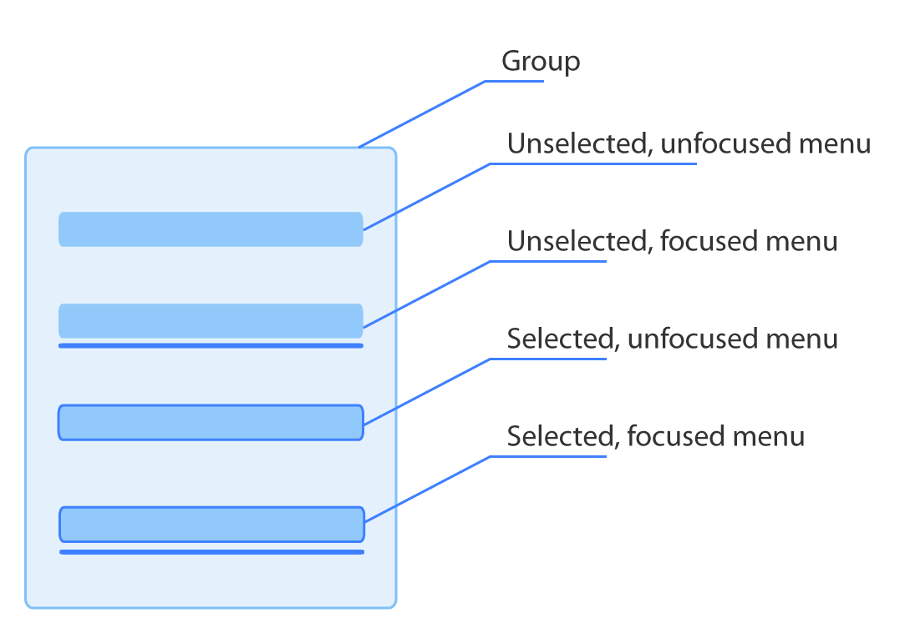    | 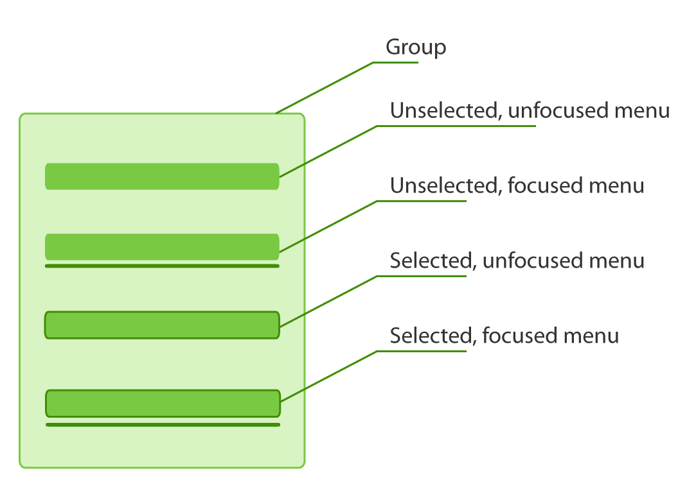 |


### Directions:

The direction of potential targets areas is calculated from the edge of the component holding the "focused" state.
There are 4 directions:
- left
- up
- right
- down

| Vertical   | Horizontal       |
|:-------------:|:-------------:|
| Up   | Right       |
|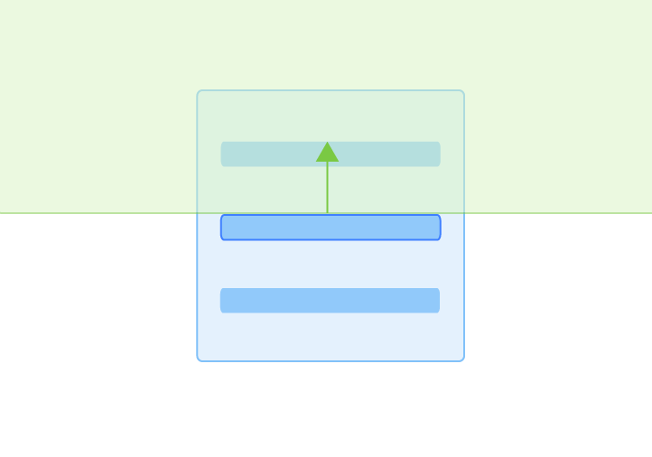 | 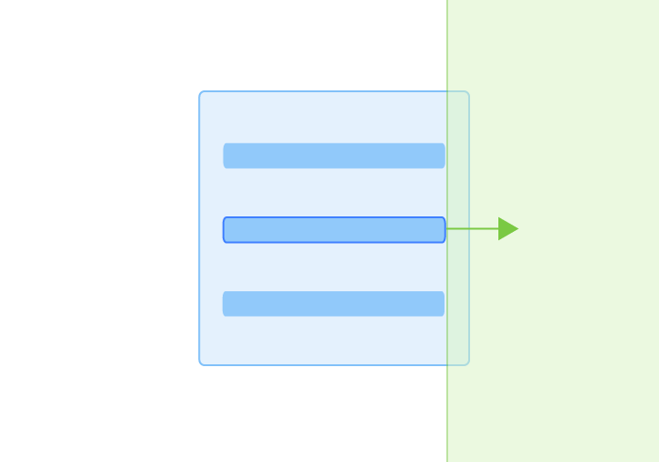 |
| Down   | Left       |
| 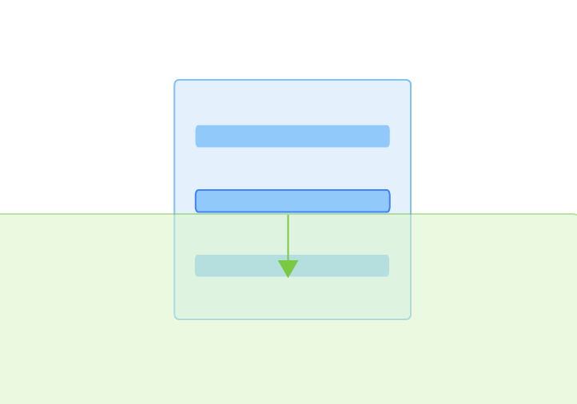    | 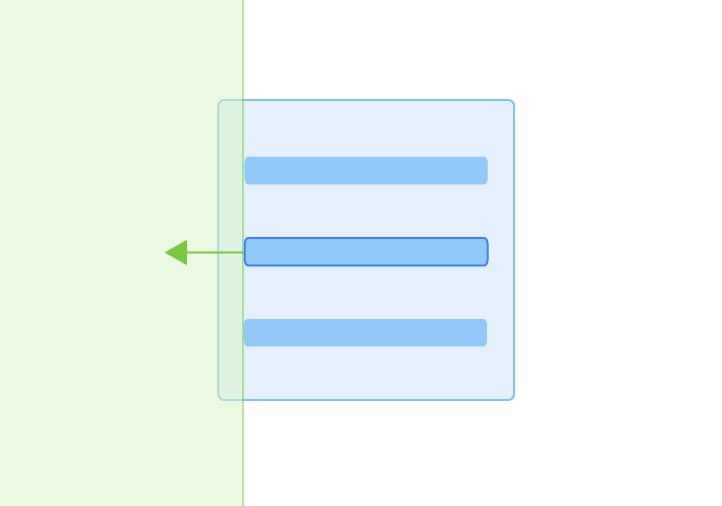 |

### Tree structure:

All focusable items are kept in a logical tree which makes focus movement between items easier and quicker. `Focusable`, as well as `FocsuableGroups` items, are wrapped in nodes. The node contains the following information:
 - `id` - for root component, it is `root.`
 - `component`- `Focusable` or `FocusableGroup`or `null` for root.
 - `parent`- parent node
 - `children`- array of nodes inside of group
 - `lastFocusedItem` if this is a group node it might hold id of last selected item in group.

Two nodes inside of the same group will be called siblings. Diagram below shows how components and siblings are structured:

| Components in tree    | Siblings in tree         |
| ------------- |:-------------:|
| 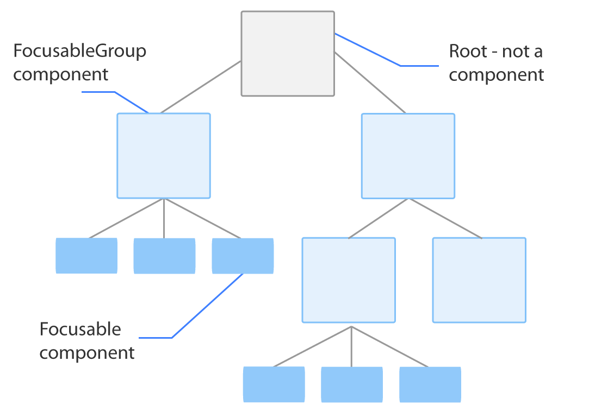    | 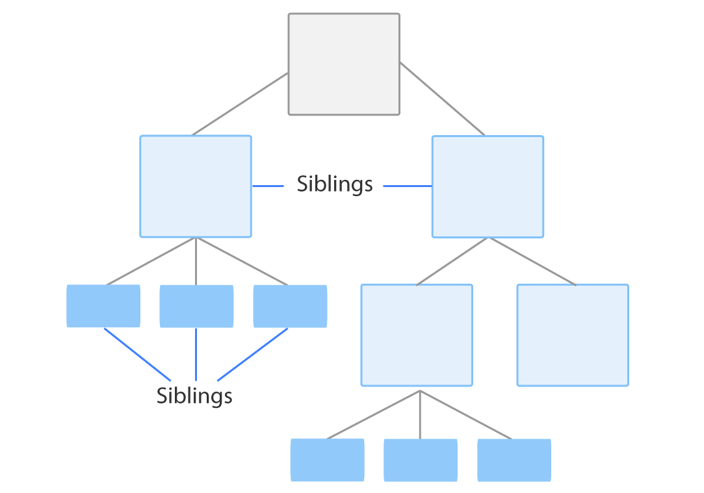 |

### Targets:
Targets are siblings of the currently focused component or siblings of the parent in a specified direction. If there are no targets in the current group, the algorithm goes up the tree until it finds a sibling. If a sibling has been found the algorithm will try to find the most accurate focusable item based on distance and priorities.

##### Siblings found in group:

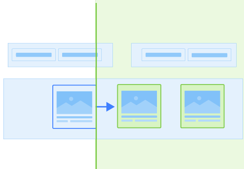

##### Siblings found for parent group

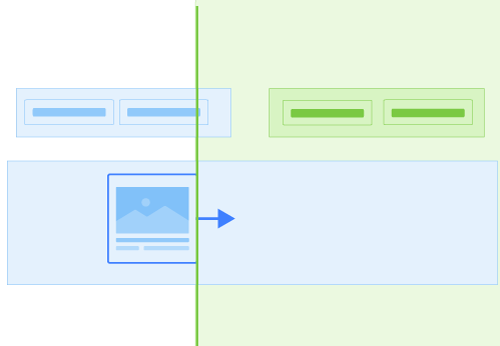

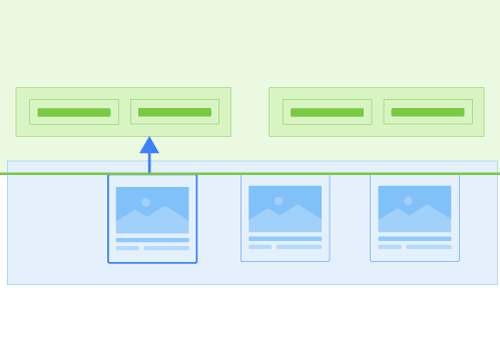

##### No siblings at any level
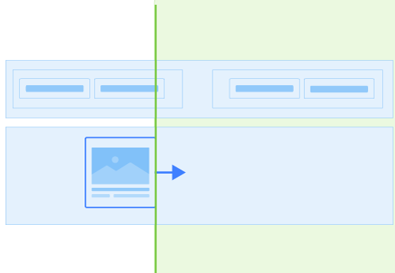


### Focus priorities:
1. Currently selected item - like a menu item
2. Previously focused item in the parent group
3. Preferrable items - items which have been marked as preferable
4. The first item on the list - if by any accident above priories are not satisfied

### Focusable component:
In code, the component which supposes to be focusable will have to be wrapped with `Focusable` component from package `react-native-ui-components` and can provide optional selected state. Each focusable component has to have defined unique `id` as well as it needs to provide `groupId`. As a developer, you can define your preferable focus by adding `preferredFocus`. The focused state will be provided as below:
```javascript
     <Focusable
        id={id}
        groupId={"menu"}
        preferredFocus={index === 0}//optional
        selected={isSelected}>//optional
        {focused => (
            <YourComponent/>
        )}
     </Focusable>
```
### FocusableGroup component:
Each `Focusable` item has to be placed in `FocusableGroup`. `FocusableGroup` can containt either `FocusableGroup` or `Focusable`, however all children need to be the same.
```javascript
     <FocusableGroup
        id={id}
        groupId={"xyz"}//optional
        preferredFocus={index === 0}>//optional
            <Focusable/>
            <Focusable/>
            <Focusable/>
     </FocusableGroup>
```
### Focus events sequence:
Focus events are propagated to two `Focusable` items, `current` and `next`, when moving focus in following sequence:
- `current.willLoseFocus`
- if `next` has been found
  - `next.willReceiveFocus`
  - `current.blur`
  - `current.hasLostFocus`
  - `next.focus`
  - `next.hasReceivedFocus`
- else
  - `current.failedLostFocus`


