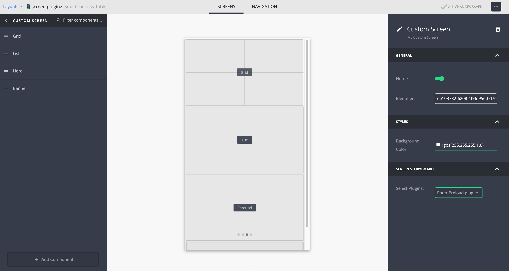

# Screen Plugins with UI Components

There are two core / built-in plugins that can hold UI Components:
- `general_content`
- `favorites`

#### `general_content`
Main building block in the Ui Builder - a container that holds [Ui Components](/ui-components/ui-component-general.md)

#### `favorites`
A container that contains the list of the favorites item selected by the user. In addition to that list, it can hold  [Ui Components](/ui-components/ui-component-general.md) exactly like `general_content`.

---

# How to create a Custom Screen Plugin with UI Components
Add those properties in the plugin manifest:
```
  "screen": true,
  "type": "general",
  "ui_builder_support": true,
  "characteristics": {
    "can_have_components": true,
  }
```

### Full Example
_A simple screen plugin with configurable backgroud color_

| Full Manifest                                                                                                                    | Appearance in UI Builder                                                             |
| -------------------------------------------------------------------------------------------------------------------------- | ----------------------------------------------------------------- |
| <a target="_blank" href="../../plugins-manifest/snippets/screen-with-ui-components.json" download="text-style-single-field.json">download</a> |  |

```
"identifier": "my_custom_screen", // Required
"screen": true,                   // Required
"type": "general",                // Required
"ui_builder_support": true,       // Required
"characteristics": {
  "can_have_components": true     // Required
},
"ui_frameworks": ["quickbrick"],  // Required
"general": {
  "fields": [
    {
      "key": "identifier",        // Recommended
      "type": "text_input",       // Recommended
      "disableField": true        // Recommended
    }
  ]
},
...                               // Other required fields ommited for clarity
```

### Notes
- It is HIGHLY recommended to add a field with the key "identifier" in the general section - this will show the id of the screen so it can be reffered in other places like connected screens etc.
- Available sections to be modified freely: `styles, data, advertising, general, rules, hooks, localizations`
- In this example there are three visible fields in various sections:
  - Read-only screen identifier
  - Backgound color selector
  - Preload plugin selector
