## How to install on AppleTV

### Introduction
This Document will explain how to download & setup a debug version of an app on your Apple TV device using the Quickbrick SDK.

[Official Apple Documentation](https://support.apple.com/en-us/HT208124)

#### Supported Apple TV variant:
Apple TV gen 4+ device, minimum OS version TvOS 11.0

#### Availible Zapp SDK: v6.0.0

### Content
* <a href="#requirments">Mandatory Requirements</a>
* <a href="#pairMac">Pair your Mac to your Apple TV</a>
* <a href="#installConfigurator">Install Apple Configurator 2</a>
* <a href="#downloadApp">Download your app from Zapp</a>
* <a href="#sideloadApp">Sideload your app</a>

<a name="requirments" />

### Mandatory Requirements

Before being able to start you must have the following environment set up.

* The latest version of a web browser, `Apple Configurator 2`, iTunes, and macOS High Sierra installed on your Mac.
* An `Apple TV (4th generation)` or `higher`, updated with the latest version of tvOS, which is connected to a display monitor or TV
* Your Mac and Apple TV connected to the same Wi-Fi  or Ethernet IP network.

<a name="pairMac" />

#### Step One - Pair your Mac to your Apple TV

You will need to pair your Mac with your Apple TV to enable developer features, record screenshots or capture video from your Apple TV. Here's how

1. On your Apple TV menu, go to `Settings` > `Remotes and Devices` > `Remote App and Devices`.

 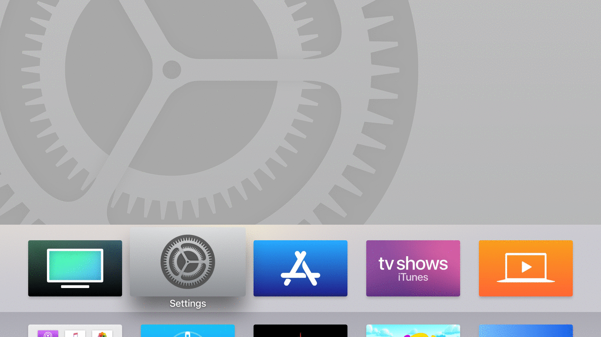

<a name="installConfigurator" />

#### Step Two - Install Apple Configurator 2

1.  Download Apple Configurator on your mac [Apple Configurator 2](https://itunes.apple.com/us/app/apple-configurator-2/id1037126344?mt=12). After installation open it & accept the EULA.

 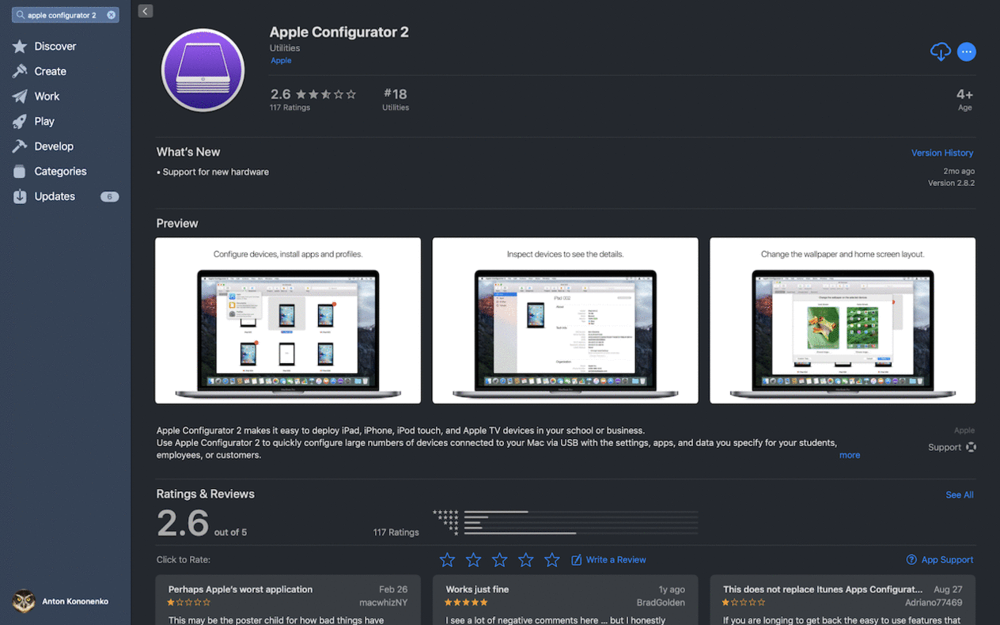

2. Select the First drop down menu  `Apple Configurator 2` and select `Paired Device`. In pop up window you will see your Apple TV device. `Pair` to pair your Apple TV device with your computer.

 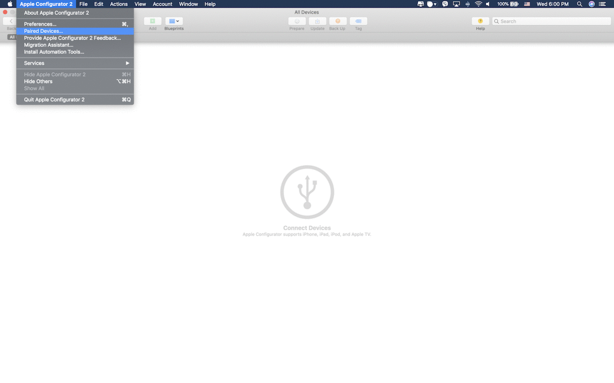

3. The Apple TV will display the verification number which you will then need to input on Apple configurator 2 & pair your mac & the apple TV.

 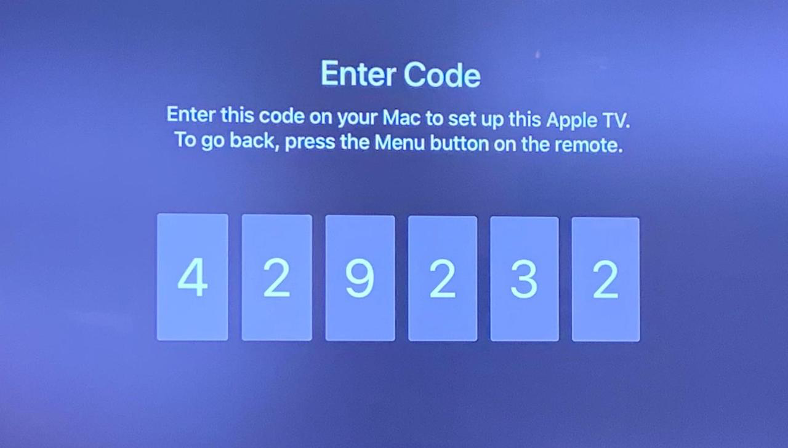
 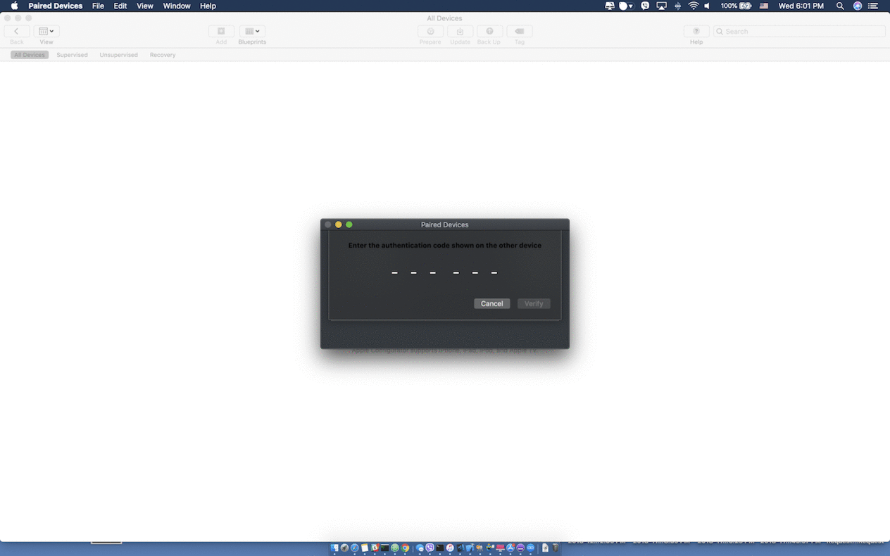

<a name="downloadApp" />

#### Step Three - Download your app from Zapp

1. Open Zapp CMS [Zapp Web-site](https://zapp.applicaster.com) on your computer & log in. Find your Apple TV application and open it.

 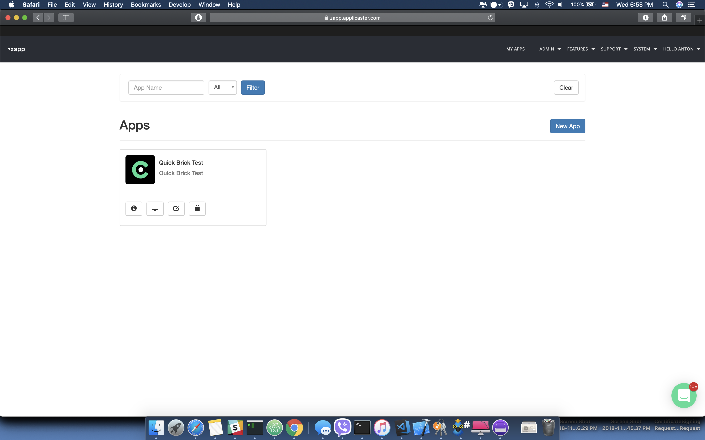

2. Find the version of application that you need and make a build if needed by clicking on the green `Play` button, Then click on `Version` button (arrow on the image).

 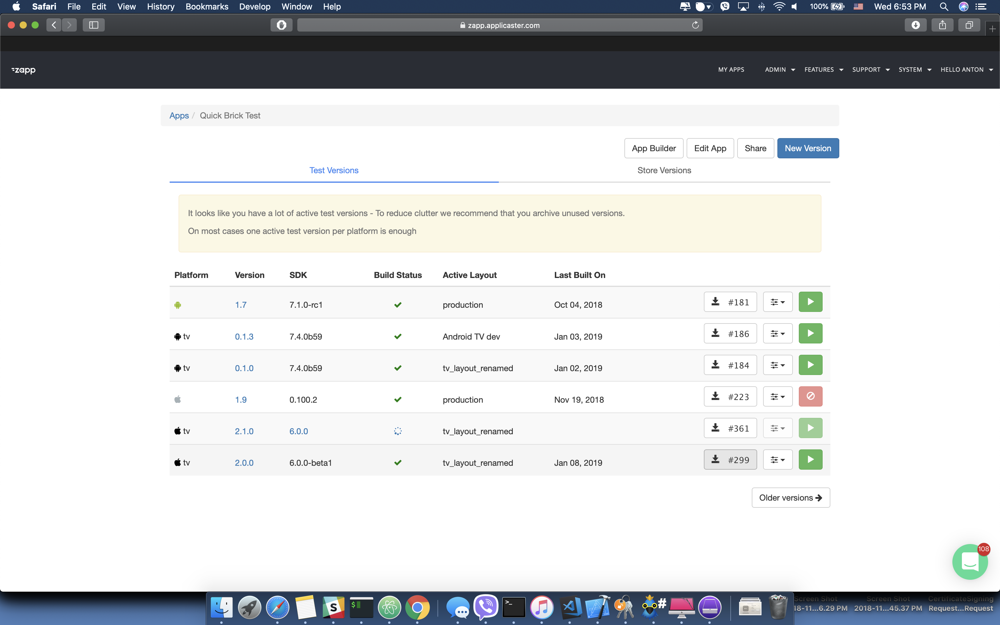

3.  In pop up window select `Debug Version` button.

 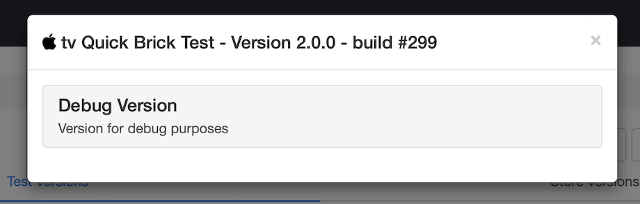

 Clicking on this button will redirect you to https://www.hockeyapp.net)  this website is where your zapp application versions are stored.

4. Then locate the downloaded file in the relevant directory (the default will be in “Downloads”) The file will have the extension `.ipa`
 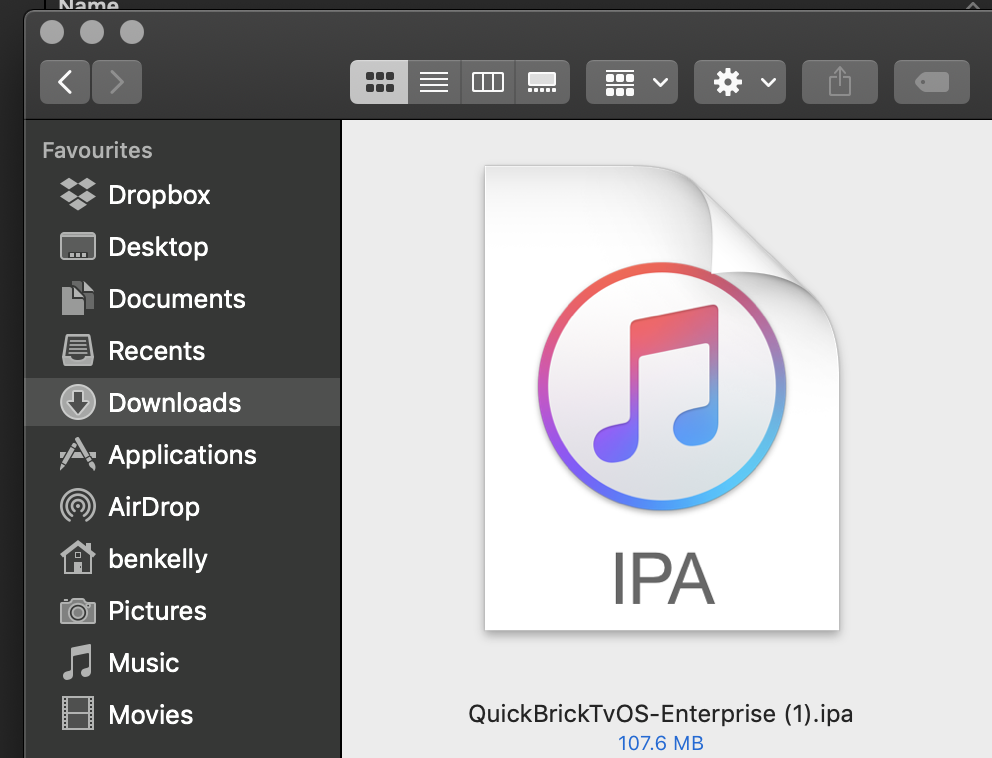

<a name="sideloadApp" />

#### Step Four - Sideload your app

1. Open the `Apple Configurator 2` application, select your Apple TV and then select the `Apps` tab from the:

 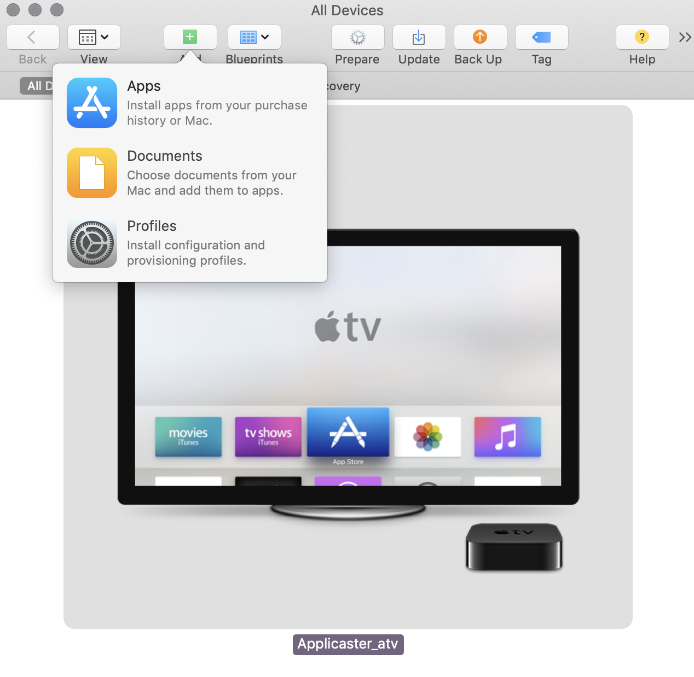

2. Open the Finder with your downloaded `.IPA` file in the finder. Then drag & drop the `.IPA` file into the Apps section of `Apple Configurator 2`. Please wait until the application is installed.

 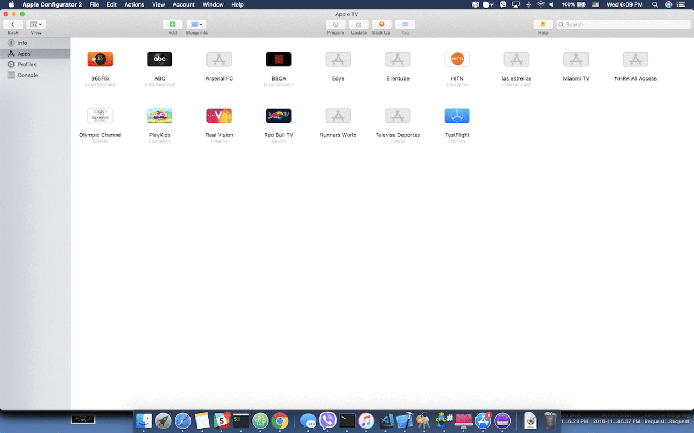

3. The app will then appear on the homescreen of your Apple TV

 

4. To launch the sideloaded application the relevant developer profile must be approved.

 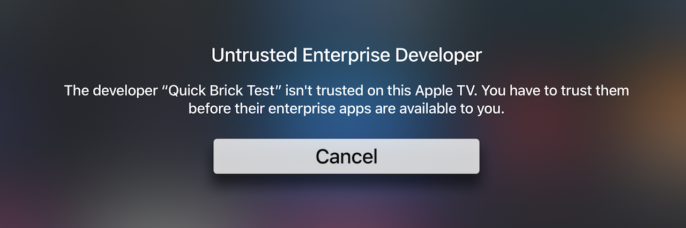

5. To enable the app developer on the Apple TV:
  * Open `Settings` > `General`, then scroll down to `Device Management`
  * Click on `Applicaster Ltd.` under `ENTERPRISE APP` section.
  * Click on the `Trust "Applicaster Ltd." button`.
  * Click on Trust again on the next screen.
  * Your App is now ready to launch!

 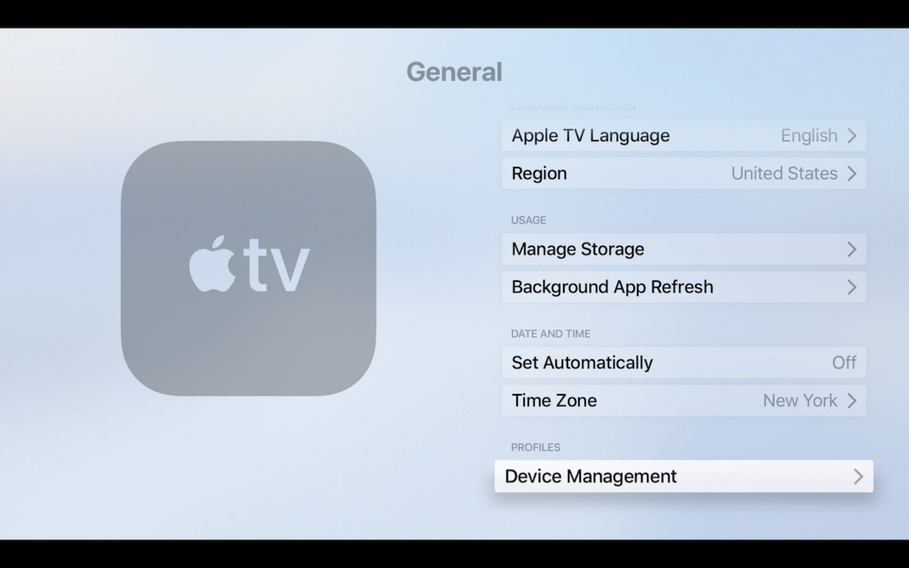

