## How to install Release Build on AppleTV

### Introduction

This Document will explain how to download & setup a release version of an app on your Apple TV device using the Quickbrick SDK.

#### Official Apple Documentation:

[Testflight Overview](https://developer.apple.com/testflight/)
[Testflight Beta Testing](https://help.apple.com/app-store-connect/#/devdc42b26b8)
[Testflight Beta Testing Video](https://itunespartner.apple.com/en/apps/videos#testflight-beta-testing)

#### Supported Apple TV variant:

Apple TV gen 4+ device, minimum OS version TvOS 11.0

#### Availible Zapp SDK: v6.0.0

### Content

- <a href="#requirements">Mandatory Requirements</a>
- <a href="#createReleaseBuild">Create Release build</a>
- <a href="#betaTesting">Beta Testing in Testflight</a>
- <a href="#internalAndExternalTesters">Internal and External Testers</a>
  - <a href="#internalTesters">Internal testers</a>
  - <a href="#extternalTesters">External testers</a>
  - <a href="#expireBetaBuild">How To Expire Beta Test Build</a>
- <a href="#startOnAppleTV">Start Application on Apple TV</a>

<a name="requirements" />

### Mandatory Requirements

Before being able to start you must have the following environment set up.

- The latest version of a web browser, `Apple Configurator 2`, iTunes, and macOS High Sierra installed on your Mac.
- An `Apple TV (4th generation)` or `higher`, updated with the latest version of tvOS, which is connected to a display monitor or TV
- Your Mac and Apple TV connected to the same Wi-Fi or Ethernet IP network.

<a name="createReleaseBuild" />

### Step One - Create Release Build

1. Open Zapp CMS [Zapp Web-site](https://zapp.applicaster.com) on your computer & log in. Find your Apple TV application and open it.

2. Find the version of the application that you need and make a build

- Click green `Play` button.
- Click on button near `Build type` and select `Debug & Release` option.
- Fill credentials for your application:
  _ `Provision Profile`
  _ `Distribution Certificate`
  _ `Distribution Key`
  _ `Distribution Key Password`
  _ `iTunes Connect User`
  _ `iTunes Connect Password` \* `iTunes Application ID`
- Click `Build` button and wait until build will finish.

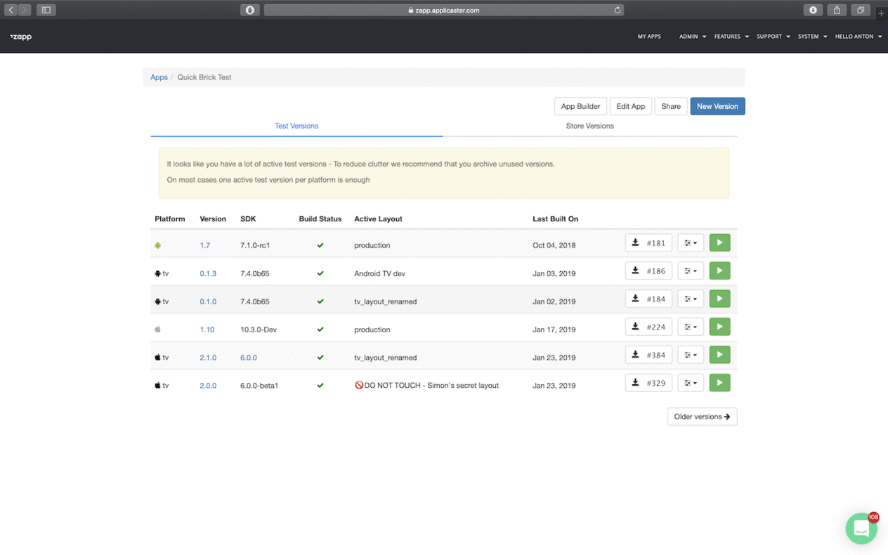

<a name="betaTesting" />

### Step Two - Beta Testing in Testflight

1. Open [iTunes Connect](http://itunesconnect.apple.com/) on your computer & log in with you credentials.

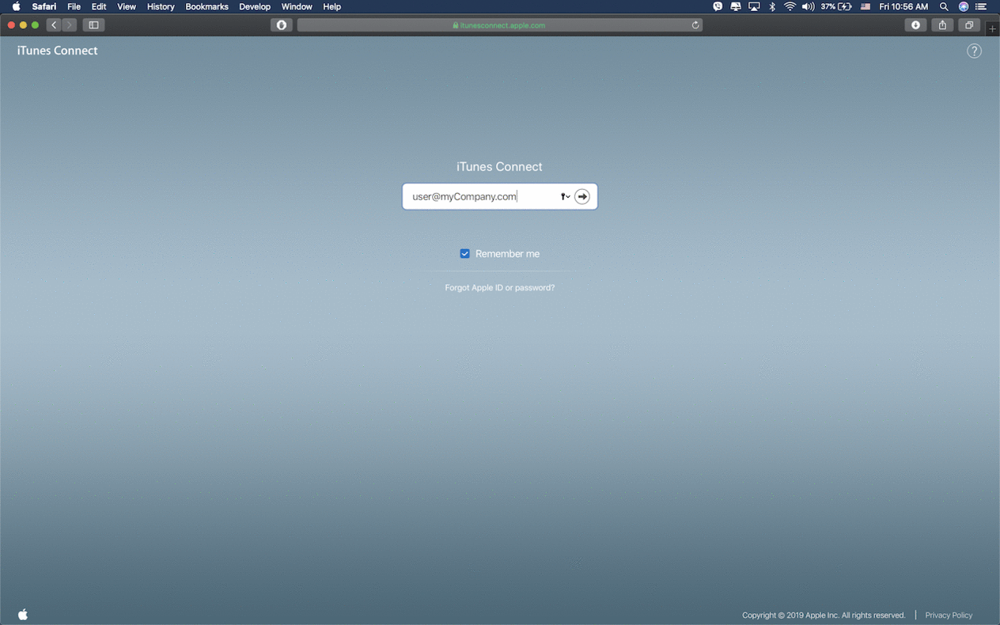

2. Open your application and select `Activity`. Wait until `(Processing)` label will be dismissed and you will see you app logo `(in example build 385)`. Your app will be ready for `Beta Testing`. This processing usually takes anywhere between 5 to 30 minutes.

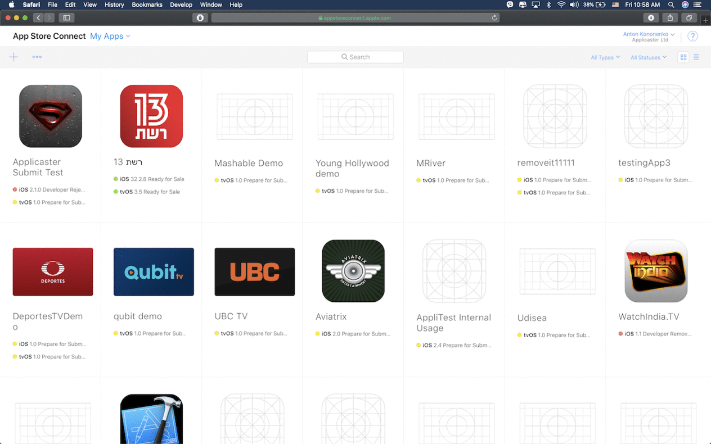

<a name="internalAndExternalTesters" />

### Step Three - Internal and External Testers

In Testflight Apple provide two types of testers:

- `Internal` - This types of testers can test application at once application finish precessing to Testflight and are registered iTunes connect users in the selected `Development Apple program`. There is a limit of `25` internal users
  The following roles for example will have access to these builds: Admin, Developer, App Manager.
- `External` - These users will only have access to versions they are invited to. It is recommended to create user lists by roles for external users.
  **Example:** External QA testers, open beta testers.

1. Open `Testflight` tab on the top of your browser:

- Select `tvOS` tab on left side to open Apple TV apps that availible for testing.
- Select your uploaded version of the application.

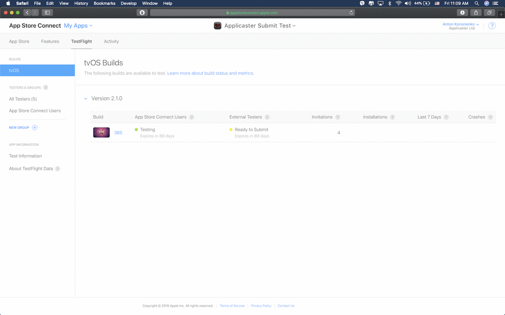

**Note:** Under `External Testers` you will see a yellow circle. It means that the application need to be submitted for these types of testers. For `Internal Testers` the application is available for testing by default.

<a name="internalTesters" />

#### Internal Testers

###### Creation of iTunes Connect User

1. On main screen of iTunes Connect select `User and Access`

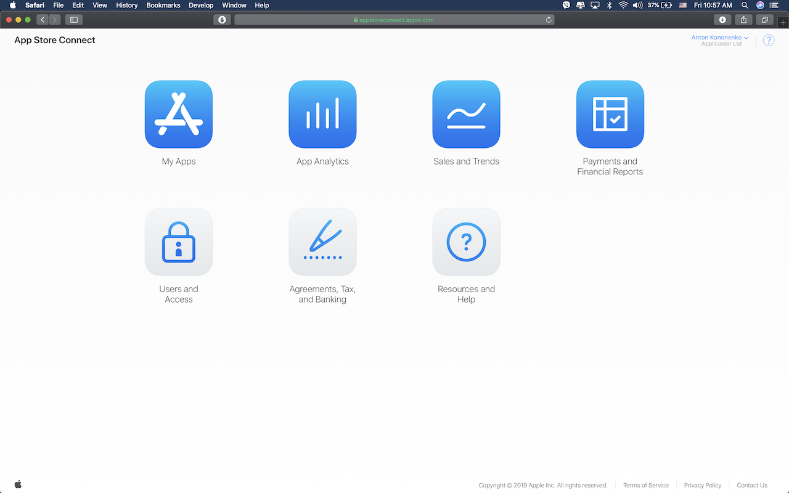

2. Click blue `Plus` button to add new user:

- Fill user login and password
- Select a role
- Select an app if you want to restrict access to this app only. By default, the user will have access to all existing apps under the current `Development Program`.
- Click `Invite` button.
- Invitation will be send to the user's `e-mail`.

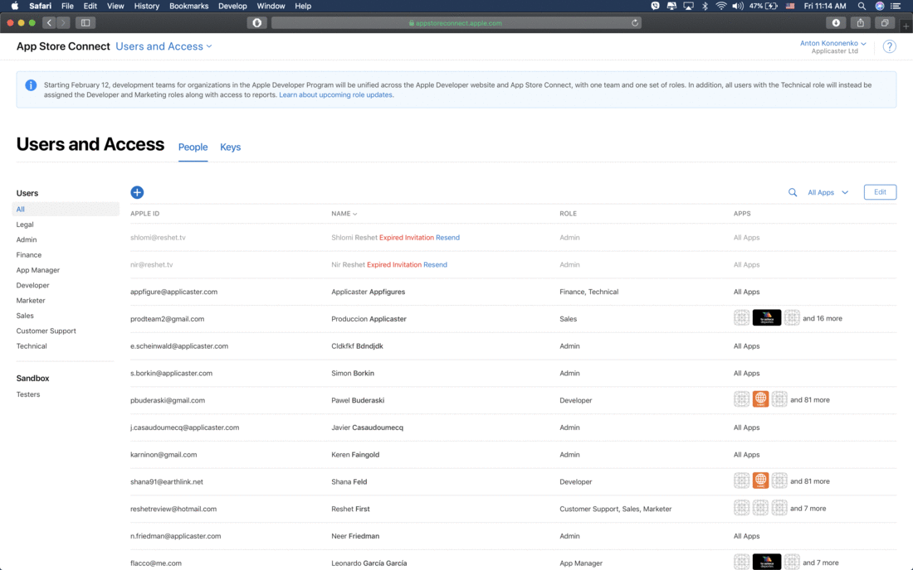

3. User will need to activate his/her account.

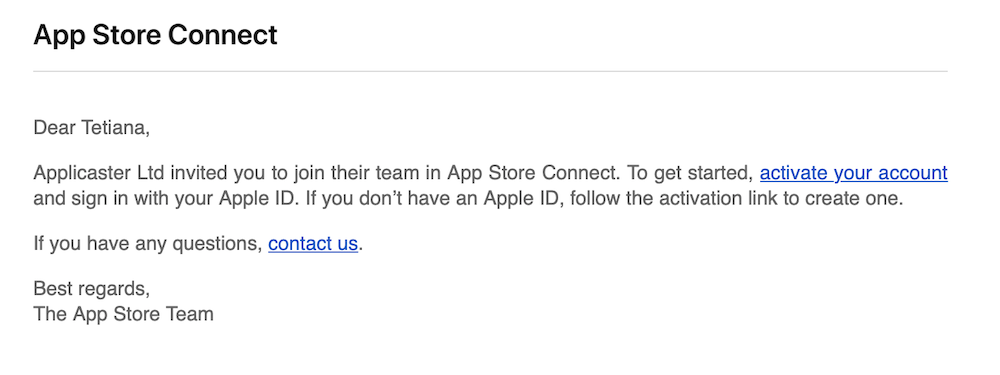

###### Add iTunes Connect User to Application

1. Open your application and select `Testflight` tab on the top of your browser:.

- Select `App Store Connect Users` tab on left side.
- Click `Plus`button near `Testers` label.
- Find `User` that you want to add.
- Check it ner his name.
- Click `Add` button.

3. User will get `e-mail` with notification.

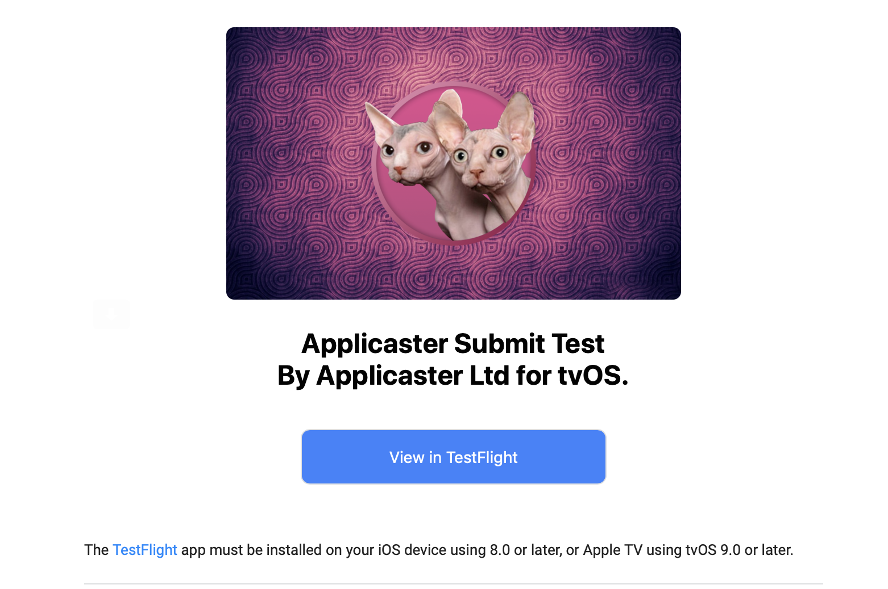

4. Click on `View in TestFlight` button to get code with Test Flight code

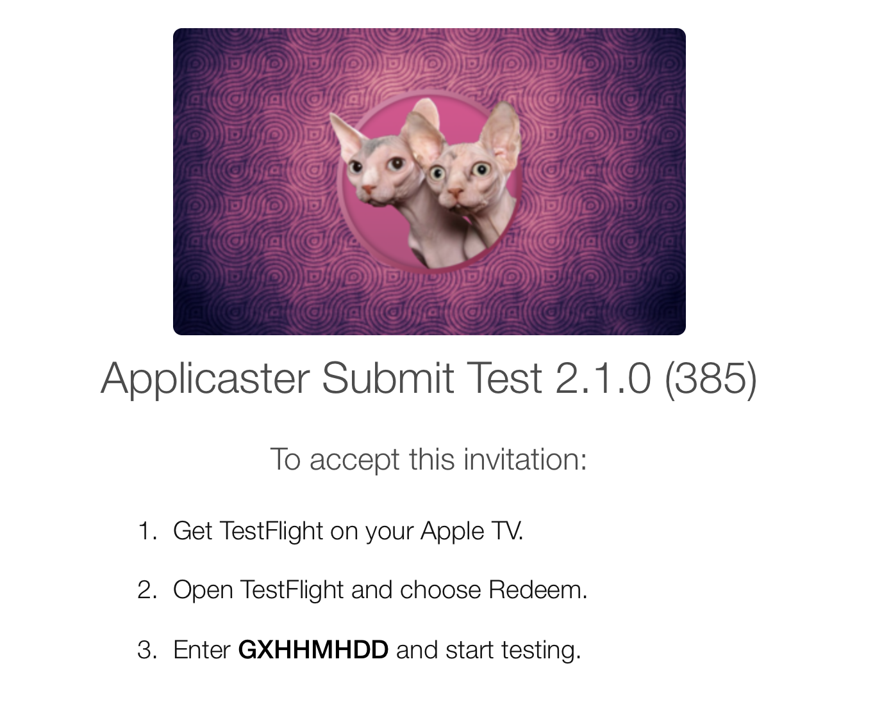

<a name="extternalTesters" />

#### External Testers

1. Open your application and select `Testflight` tab on the top of your browser:

- Click on your application version that you want to start beta testing.
- Near label `Individual Testers` push `Plus` button near `Testers` label.
- Select `Add New Testers`
- Fill the fields of `e-mail`, `First name` and `Last name`.
- Add more if you needed.
- Click `Next` and `Done`

2. Users will get `e-mail` with notification.

3. Click on `View in TestFlight` button to get code with Test Flight code

##### Submit build for external beta testers.

1. Apple will ask you to submit your build for review. Usually additional builds with the same major version will require submitting for review - but will not require manual review by Apple. Review time varies but usually takes around 24 hours.
2. Type in what's new in this build, or what you want testers to check.
3. Click `Submit for Review`

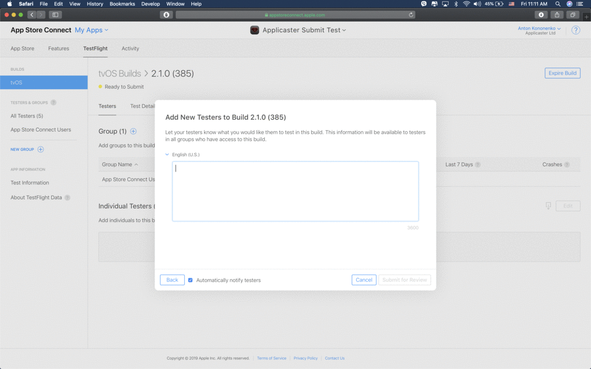

<a name="expireBetaBuild" />

#### How To Expire Beta Test Build

1. Open your application and select `Testflight` tab on the top of your browser:
2. Select iOS or TVOS from the side menu.

- Click on your application version that you want to `Expire`.
- On top right of the browser push `Expire Build` button.
- In new window push `Expire` and push `Done`.
- Expired builds buils will not be availible anymore for `Beta Testing`.

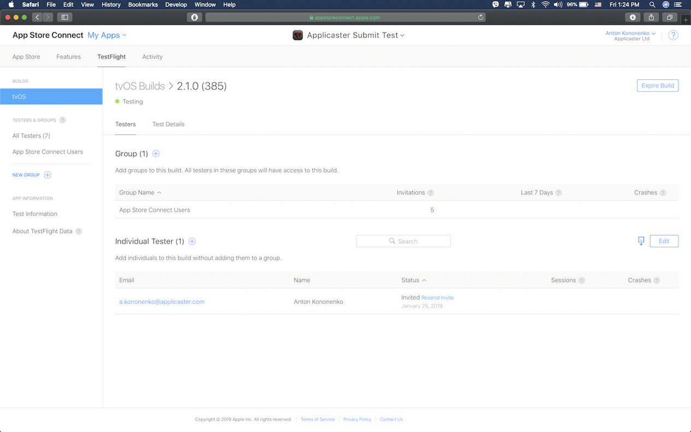

<a name="startOnAppleTV" />

### Step Four - Start Application on Apple TV

1. On your Apple TV menu, go to `Settings` > `Accounts` > `iTunes and Apple Store`.

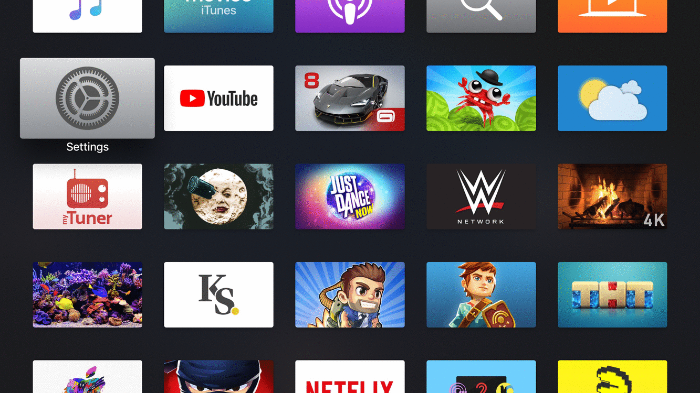

2. Sign In to your account that was added into `iTunes Connect`.

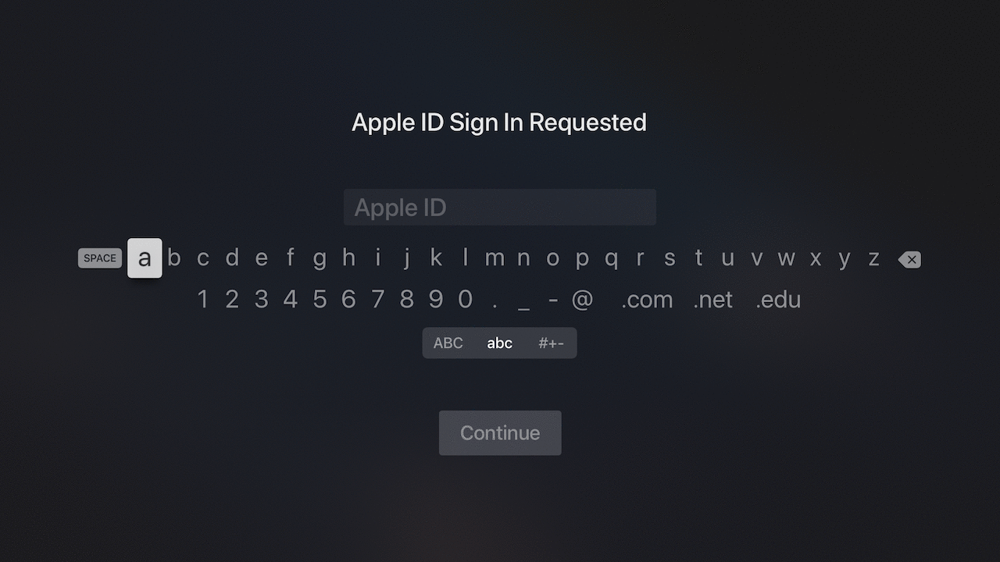

3. Download the `Testflight` Application to your Apple TV from the App Store.

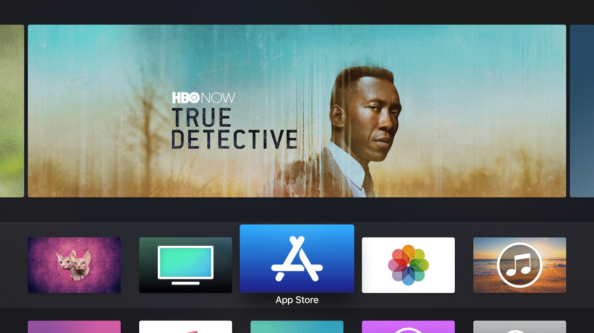

4. Open `TestFlight`:

- Go to `Redeem` tab.
- Enter the code that was provided by `e-mail` with `iTunes Connect` invitation.
- Install Application.

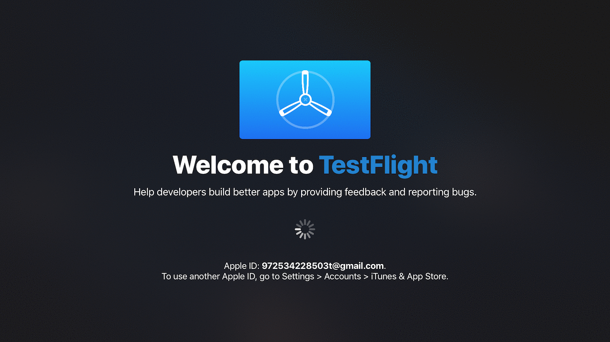

5. Application is ready for use.

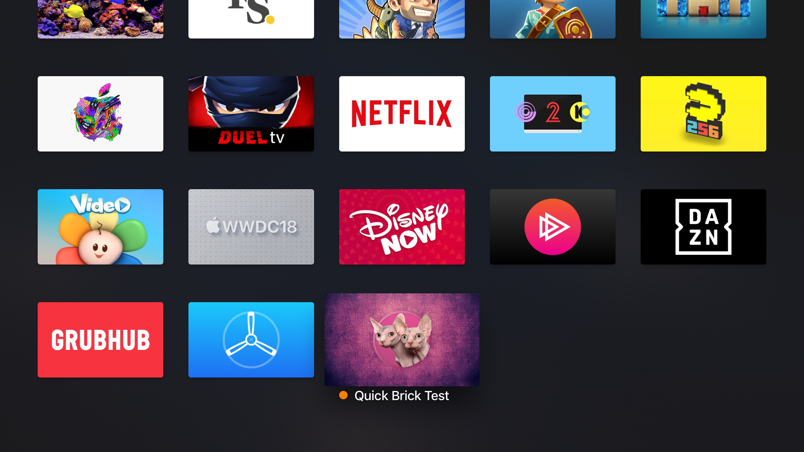
