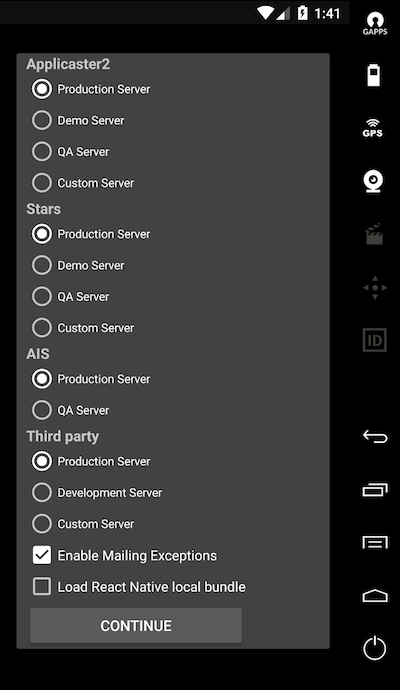

## Debugging in Android

### Enabling debug and loading bundle from your local host
Android is a bit different when it comes to allow developers to load their React Native local bundles into the app. Instead of pointing your bundle url to your local host, we need to configure the bridge differently depending if you want to load a remote or local bundle. 

To facilitate your life, we have created a simple checkbox in the debug menu of the app (then one appering the first time you launch the debug app) which will allow you to configure the application internally to load your local bundle and enable all the cool developer tools React Native has to offer. 

**REMEMBER:** Please follow the intrusctions in the [Running on device](/react-native/android/running-on-device.md) if you haven't setup your ADB to forward your remote port to your local machine. 

  

### Enable 'Draw over other apps' permissions
In order to be able to draw the React Native developer menu, you will need to allow your application to draw over other applications. In order to do this follow this simple steps:

1. Open Android settings
2. Select **Apps**
3. Select your application
4. Scroll to the bottom and enable the option of **'Draw over other apps'** under the **Advanced** section. 

### Accessing the In-App Developer Menu
If you have enable the previous checkbox and you are running your bundle locally, you will be able to open the React native developer menu from within your React Native views. You can access the developer menu by shaking your device or by selecting the menu hardware button. Also you can use `⌘M` when running in an Android emulator or Genymotion.

**NOTE:** Remember that the React Native developer dialog will **only** appear when you are in a view which contains a React Native view. 

