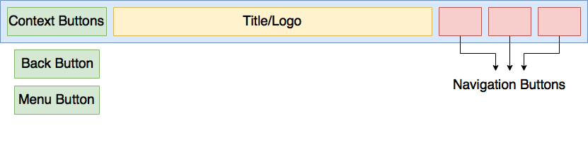
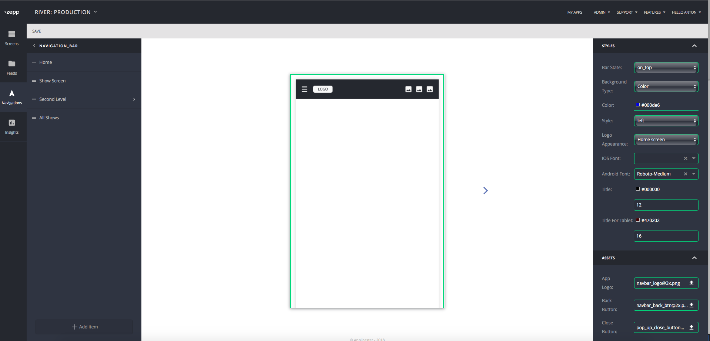
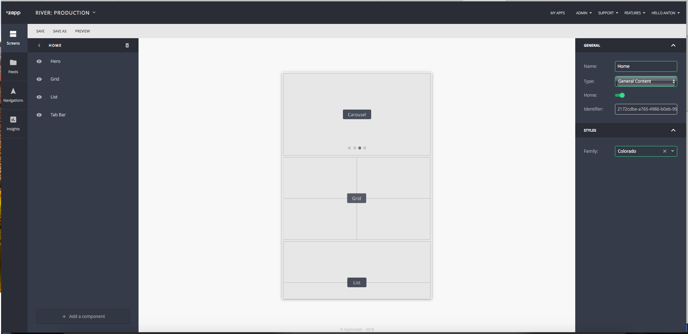
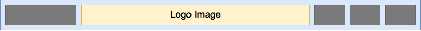
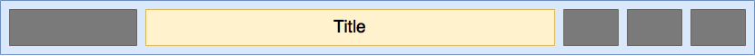
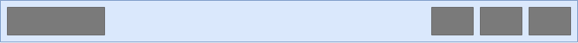
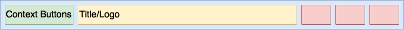
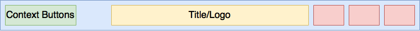

##Navigation Bar Plugin
This plugin provides a `Toolbar` to be placed within the `Zapp Android` activities.

1. <a href="#description">Description</a>
2. <a href="#generalBehaviours">General behaviours</a>
3. <a href="#classes">Classes</a>
4. <a href="#model">Model</a>
5. <a href="#createNavBarPlugin">Creation new Navigation Bar plugin</a>

* * *

<a name="description" />
##### Description



The navigation bar can be customized in the UI Builder via the Navigation section, illustrated below. The customized navigation bar will be available on each screen via the `river.json`.


***

<a name="generalBehaviours" />

##### General behaviours

The navigation bar plugin provides general features which will be implemented in any plugin of this type.

###### Customization per screen
The nagivation bar can be customized per screen. This gives the ability to use different settings for each screen as it relates to the customer’s needs. Behind the scenes, when the end-user selects a new screen, the application will send a notification to update the navigation bar title and navigation bar model.

__Note:__ Screens which do not have the navigation model (like white label screens including `Settings` and `Epg`) will use the navigation model from the Home screen.

The `Home` screen can be defined in the UI Builder in the Screen section, as illustrated below.


###### Navigation bar view style.
The navigation bar can have different styles. The Zapp user can select the layout for the style they’d like.

###### Presentation state
This feature defines placements of the Toolbar within the activity.
The presentation states are _On top_, _Overlay_, and _Hidden_, as illustrated below


__Note__: All white label screens (such as `Settings` and `EPG`) will use the state: OnTop to avoid possible support issues.

###### Presentation style
This feature allows the navigation bar to present Logo or Title differently on the screen level. More details can be found in the documentation on <a href="#api">UIBuilder Api</a> and <a href="#generalNavBarPlugin">UI Builder general navigation bar</a>.

Examples:

__Logo__


__Title__


__Hidden__


######Backgound view
The Navigation bar plugin also enables customization of the background. Currently, there are two types of background view presentations available: `Color` and `Image`.

__Note__: In the UI Builder, the Zapp user will only have one of these options available, but the plugin developer will get both keys if it was defined in the development of the plugin. In this case, items must be used according to their priority. Image has a higher priority than Color. During implamentation new plugins important to use same behaviour.

######Context buttons
Context buttons are buttons which control the screen or root navigation. Context buttons are not controlled by the user, but all these buttons must be implemented in the development of new plugins.

1. `Action Button`: Can be either `Menu button` or `Back button`.
The Root plugin is responsible to call the `ToolbarManager.setActionButton` method, whenever its state is changed (Opening a new activity, adding a fragment, and getting back to a fragment/activity).
The plugin present the `Menu Button` if the app shows the main activity, with an empty back stack, or the `Back button` otherwise.
* `Menu button`. This button, if enabled, asks the Root plugin to open its menu. Please Note: This button will be visible only if the Root plugin defines so in its `hasToggleableMenu()` method. Please be aware of this when developing new nav bar plugins.

* `Back button` ask the Root Plugin to handle a back press.
###### Navigation Buttons
This button is responsible for navigation items tat make presentation - present generic screen, open url, open white label screen, etc.
__Please Note__: Except url-scheme, he navigation buttons will always navigate to a new activity.

The number of `navigation button` is defined in the UI Builder, but the style of the navigation bar may create a limitation which would not allow to show more than one button within the suitable view.


Availible Navigation Buttons:

| Button type | Description                 | Api button key         |
|-------------|-----------------------------| ---------------------- |
| Screen      | Opens generic screen        | button                 |
| URL         | Opens external URL          | button                 |
| Live        | Opens Live Drawer component | live_drawer            |
| Crossmates  | Opens Crossmates component  | applicaster_crossmates |
| Feed        | Opens Feed component        | applicaster_feed       |
| Chromecast  | Opens Cromecast player      | chromecast             |

***

<a name="classes" />
##### Classes

<a name="ToolbarManager" />
##### Toolbar Plugin Interface

The `ToolbarPlugin` interface defines method to do the following actions: Create the toolbar; populate it with menu items and styles; set its title; set its action button, and return its presentation state;
##### Toolbar Manager

The Toolbar manager is a class which controls the work of the `Toolbar Plugin`.
Zapp Android will never use a `Toolbar Plugin` directly, but only via the toolbar manager.
It is responsible to get the correct plugin, fetch the relevant data before invoking methods within it, and cache it.
The Toolbar Manager will receive calls from Zapp Android to initilize the toolbar,  to populate it, to set its title, and to set its action button.

<a name="api" />

<a name="model" />
##### Model

Navigation Bar api placed in `navigations` array inside `screen model`
`category` - of the navigation model is define navigation model type. Navigation model has type `nav_bar`

Example:
```
{
        "id" : "uniqueID",
        "category": "nav_bar",
        "rules": {},
        "nav_items" : [
            {
                "id" : "uniqueID",
                "title" : "Home Screen",
                "type" : "button",

                "data" : {
                    "target" : "c320c5d90661-d241-410b-81fb-c320c5d90661"
                    "connected": true,
                    "source": "URL",
                    "type": "APPLICASTER_ATOM_FEED"
                },
                "assets" : {},
                "nav_items" : [],
                "rules" : {},
                "styles" : {}
            }
        ],
        "styles": {},
        "assets" : {}
    }
```
***
__Navigation Bar model schema: styles__

| key                 | Type         | Description                                      |
|-------------------- |--------------| ------------------------------------------------ |
|  background_color   |  String in `#ARGB HEX` | Background color of the navigation bar view |
|  android_font_family    |  String                | Font Family Name |
|  title_color        |  String in `#ARGB HEX` | Title label text color|
|  title_color_tablet |  String in `#ARGB HEX` | Tablet title label text color|
|  title_size	      |  String in number      | Title label font size|
|  title_size_tablet  |  String in number      | Tablet title label font size|
|  presentation_style |  String in enum        | Defines presentation of logo or label in nav bar|
|  style              |  String in enum        | Defines xib style for the navigation bar|
|  state              |  String in enum        | Define placements for the navigation bar accouring root|

***
__styles: schema: "presentation_style"__

| Values | Discription |
|-------------|-------------|
| logo        | `Navigation Bar` will present logo image|
| title       | `Navigation Bar` will present title label |
| hidden      | `Navigation Bar` will hide title label and logo image|
***
__styles: schema: "style"__

| Values | Discription |
|-------------|-------------|
| left        | This style define `context buttons` on left and `navigation buttons` on right of the navigation bar view. Free space will be fully provided to `logo image view` or `title label`. Aligment of text in `title label` and image in `logo image view` - `left`.|
| center      | This style define `context buttons` on left and `navigation buttons` on right of the navigation bar view.`logo image view` or `title label` will take biggest width of `context button container` or `navigation buttons summ` and use it as offset left and right form navigation bar view. Aligment of text in `title label` and image in `logo image view` - `centered` |

__Left__



__Center__


***
__styles: schema: "state"__

| Values | Discription |
|-------------|-------------|
| on_top      | `Toolbar` view stub placed on top of  `content frame` |
| overlay      | `Toolbar` overlaying the  `content frame`. `content frame`  take full availible space.` |
| hidden  | `Toolbar` is hidden. ``content frame` take full availible space. |

***
__Navigation Bar model schema: assets__

| key                 | Type           | Description                                      |
|-------------------- |----------------| ------------------------------------------------ |
|  app_logo           |  String in URL | Logo image URL |
|  back_button        |  String in URL | Back Button image URL |
|  close_button       |  String in URL | Close Button image URL |
|  menu_button        |  String in URL | Menu Button image URL |
|  background         |  String in URL | Background image URL |
|  background_tablet  |  String in URL | Background tablet image URL |

***

<a name="createNavBarPlugin" />
##### Creation new Navigation Bar plugin

##### Library
1. Create a new Android library.
2. In the app's `build.gradle` add dependencies to the `Applicaster-Android-SDK`, and the `Zapp-Root` libraries.
Implement the `ToolbarPlugin` interface, as documented in the code.
3. Add to the proguard rules -
```
-keep public class com.your.toolbar.plugin.class {
public *;
}
```
4. Publish to Bintray.
##### UIBuilder
1. Create manifest for new navigation plugin with plugin type `nav bar`. How to create manifest please check zappifest documentation
2. Upload manifest to the zapp.

