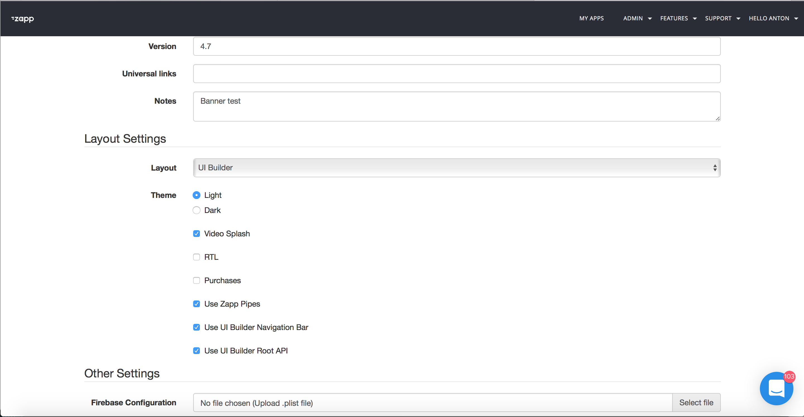

##Root Menu Plugin infrastructure
These plugins provide a main navigation structure for the application.

1. <a href="#description">Description</a>
2. <a href="#general">General behaviours</a>
3. <a href="#datasource">Data Source</a>
4. <a href="#helperClasses">Helper classes</a>
5. <a href="#api">UIBuilder Api</a>
6. <a href="#createMenuPlugin">How to create a new Root menu plugin</a>

* * *

<a name="description" />

##### Description
Root navigation plugins are the main navigation of the app. They provide a UI to present different screens. Each screen will fill the provided application container, and can control navigation bar view.

The Root menu can be customized in the UI Builder via the Navigation section, as illustrated below. The customized navigation bar will be available on each screen as part of zapp rivers api.


***

<a name="general" />

##### General behaviours

The Root menu plugin infrastructure  provides general features which will be implemented in any plugin of this type.

###### Data
If  `UI Builder Root API` flag on App version general settings is ebabled, the application uses the `Navigation` model as its navigation meta data.
The menu will get the `Navigation` from the river item (`river.json`), defined as `isHome=true`.

###### `Menu` Plugin Selection
The app will use the `menu` plugin defined in the `Navigation` model (`navigation_type` field), mentioned above.
The application will find it, using the `PluginManager`.
As a fallback, if the plugin does not exist in the app, the first `menu` plugin found will be used.


Example:
__Note:__ Some unnecessary items were removed from example
__Plugin json:__ key -`identifier` representation of the `menu` plugin unique id
```
[
    {
        "plugin": {
            "api": {
                "class_name": "com.applicaster.zapproot.root_managers.SideMenuRootActivityManager",
            },

            "identifier": "side_menu",
            "manifest_version": "0.1.0",
            "name": "Side Menu",
            "type": "menu",
        }
    },
    {
	"plugin": {
		"api": {
			"class_name": "com.applicaster.reactnative.plugins.APReactNativeAdapter",
		},

		"dependency_version": "0.3.0",
		"identifier": "two_level_rn_menu",
		"manifest_version": "0.4.0",
		"name": "2-Level Menu",
		"type": "menu",
	}
]
```

__Rivers json:__ key -`navigation_type` representation of the `menu` plugin unique id
```
[
    {
        "home": true,
        "id": "87706774-8436-4273-87bd-9a5cfa9f37ff",
        "name": "Home",
        "navigations": [{
                "category": "menu",
                "id": "736c94c4-f5ca-4edf-83fe-969591f688b8",
                "name": "2-Level Menu",
                "nav_items": [...navigation items],
                "navigation_type": "two_level_rn_menu"
            }],
        "styles": {
            "family": "FAMILY_1"
        },
        "type": "general_content",
        "ui_components": [...ui components]
    }
]
```

__Result:__ In this example, plugin with identifier `side_menu` will be ignored. Application will take plugin with identifier `two_level_rn_menu`.

######Home screen
Each app has home screen defined in rivers API (Please add example). The home screen is the main screen of the application and will use custom rules regarding other plugins.
In `menu` plugin this screen must be presented as first screen of the application.
The home key appears as a boolean in the api.

######Addressing the navigation bar presentation style
The `Menu` plugin defines the screen's layout, and should hold a view stub fot the navigation bar (id=`toolbar`).
By default, this view stub will follow the `On Top` style. Meaning, will be above (y axis) the content frame.
The `menu` plugin needs to handle the Navigation bar `overlay` style - having the Navigation bar above (z axis) the content frame.
This should be addressed by programmatically manipulatting the view hierarchy inside the `configureContent` method.
The `Hidden` style is handled by the OS, and needs no special attention ftom the menu plugin.
* To get the Navigation bar state, simply use the `ToolbarManager`.
For more deatails please check documentation of the [Nav bar plugin](http://zapp-tech-book.herokuapp.com/ui-builder/android/NavigationBarPlugins.html)


######Navigation bar Action Button
Some menu plugins will require communication with `Navigation Bar`.
__Example:__ Menu button on nav bar will send action to `root menu` to present side menu

This behavior is optional. When a plugin wants to communicate with the `Navigation Bar` plugin, the menu button must implement return `true` in its `hasToggleableMenu()` method.
If the method was implemented, `Navigation Bar` will present the menu button in the place that was defined in the Navigation Bar Style.
__important__: When presenting an inner activity, or having a non-empty backstack, the Action Button should appear as a Back Button.
As the `menu` plugin controls the navigation in general, it is responsible, to update about changes in the state. It is done by easily
calling `ToolbarManager.getInstance().setActionButton` in the following cases:
* A new activity is opened - `configureContent`
* A fragment is added to the backstack - `addFragment`
* A fragment is removed from the backstack - `handleBackPress`
__Please Note__: Api supports only one button of this type.

######Customization per screen
The root menu can be customized per screen. This gives the ability to use different settings for each screen as it relates to the customer’s needs. Behind the scenes, when the end-user selects a new screen, the application will send a notification to update the navigation bar title and navigation bar model.
Example: Tab Bar plugin change tabs color regarding presentation of a screen.

<a name="datasource" />
#####Data Source
Data source for `Root menu` plugin must be taken from [Rivers.json](Rivers.md) under `navigations`.
The data is accessible from the `NavigationDataManager`.


Availible Navigation Items for menu:

| Button type | Description                         | Api button key         |
|-------------|-------------------------------------| ---------------------- |
| Screen      | Opens generic screen                | label                  |
| URL         | Opens URL or WebView                | label                  |
| Header      | Used to define header object        | live_drawer            |
| EPG         | Respresentation of EPG sceen        | applicaster_epg        |
| Settings    | Respresentation Settings screen     | applicaster_settings   |
| Nested Menu | Model that consist nested nav items | nested_menu            |

__Please Note__: It is the `Menu` developer responsibility to add supportted navigation items to plugin manifest
***

<a name="helperClasses" />

##### Helper Classes

Root menu plugin can use helper classes that help to use generic behaviour for all menu plugins. Such classes will be described bellow

###### ToolbarManager
This class manages all the communication with the `navigation bar` plugin. As both of the plugins are decoupled as possible, there's still some communication needed.

###### NavigationDataManager
All the navigation data is accesible via this class. It gets the menu navigation items, styles, etc.

<a name="api" />

To make more understanding of this section Please read: [Rivers.json API](Rivers.md) for more details

Navigation Bar api placed in `navigations` array inside `screen model`
The `category` - of the navigation model is defined in navigation model. Navigation model type is `nav_bar`

Example:
```
{
        "id" : "uniqueID",
        "category": "menu",
        "rules": {},
        "nav_items" : [
            {
                "id" : "uniqueID",
                "title" : "Home Screen",
                "type" : "label",

                "data" : {
                    "target" : "c320c5d90661-d241-410b-81fb-c320c5d90661"
                    "connected": true,
                    "source": "URL",
                    "type": "APPLICASTER_ATOM_FEED"
                },
                "assets" : {},
                "nav_items" : [],
                "rules" : {},
                "styles" : {}
            },
            {
                "id" : "uniqueID",
                "title" : "Home Screen",
                "type" : "nested_menu",

                "data" : {
                    "target" : "c320c5d90661-d241-410b-81fb-c320c5d90661"
                    "connected": true,
                    "source": "URL",
                    "type": "APPLICASTER_ATOM_FEED"
                },
                "assets" : {},
                "nav_items" : [
                         {
                        "id" : "uniqueID",
                        "title" : "All Shows",
                        "type" : "label",

                        "data" : {
                            "target" : "c320c5d90661-d241-410b-81fb-c320c5d90662"
                            "connected": false,
                            "source": null,
                            "type": null
                        },
                        "assets" : {},
                        "nav_items" : [],
                        "rules" : {},
                        "styles" : {}
                    }
                ],
                "rules" : {},
                "styles" : {}
            }
        ],
        "styles": {},
        "assets" : {}
    }
```
***

<a name="createMenuPlugin" />
##### How to create a new Root menu plugin

1. Create a new Android library.
2. In the app's `build.gradle` add dependencies to the `Applicaster-Android-SDK`, and the `Zapp-Root` libraries.
3 .Extend the `RootActivityManager` abstract class.
4. Don't forget to address the `Navigation bar` plguin Action Button, and presentatino state.
5. Add to the proguard rules -
```
-keep public class com.your.toolbar.plugin.class {
public *;
}
```
4. Publish to Bintray.

##### UIBuilder
1. Create manifest for new navigation plugin with plugin type `menu`. How to create manifest please check zappifest documentation.
2. Add supported navigation items for menu, more detail in <a href="#datasource">Data Source</a> section
2. Upload manifest to the zapp.

