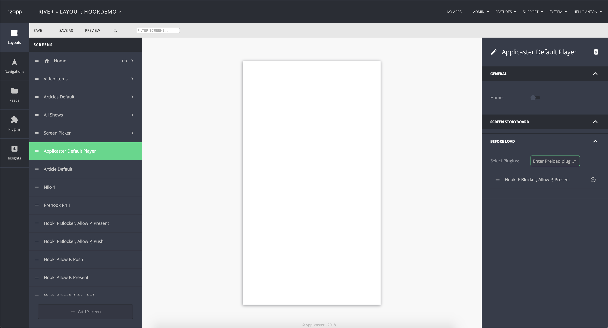

## Zapp Screen Hooks

Infrastructure that enables development of pre- and post-loading hooks for UIBuilder's screens.

1. <a href="#description">Description</a>
2. <a href="#general">General</a>
3. <a href="#client">Client Side</a>
4. <a href="#example">Example Of Implementation</a>
5. [Native Hook Example](https://github.com/applicaster/Android-HookDemoScreen)
6. [RN Hook Example](https://github.com/applicaster/PreHookExample-RN)

***

<a name="description" />

#### Description
`Screen Hooks` are hooks that are presented before or after loading the screens. They can be attached to a screens launched from navigation bar, root (menu) or on cell click inside application. Screen hooks can be native or react native. In this document you'll find a guide that explains how to configure such a plugin.   
This feature is available as of `7.4.0`.   


***

<a name="general" />

#### General   

`Hooks Plugins` can be two types.
1. `Screen Plugin Hooks` - This types of hooks are `Screen Plugins` that can defined and customized from UIBuilder and conform all of the rules of [Screen Plugins](/ui-builder/android/ScreenPlugin.md) for navigation structure, navigation bar etc. As example `Login` and `Storefront` screens.
2. `Hooks Plugin` - This types of plugin not screens. If they have `UI` It must fully controlled by the developer. Prefered usage of this type of plugin as example: `Analytics` and `Advertisment`. That do not need presentation of UI or use of the 3rd party frameworks that API we can not fully control.   

***
<a name="client" />

#### Client Side Explanation

##### Screen Hook manager

To oversee the flow of Hook Screens we introduced `HookScreenManager` class. It decides
if hooks should be executed and caches executed hooks.   
`HookScreenManager` public methods:
  - `init(context: Context, screenId: String, hookManagerListener: HookScreenMangerListener, hookMap: List<Any>?)` - initializes the Hook Screen flow
  - `failCurrentHook(hookProps: Map<String, Any>?)` - fails current Hook and passes `hookProps` to it.
  - `completeCurrentHook(hookProps: Map<String, Any>?)` - completes current Hook and passes `hookProps` to it.
  Main private methods:
  - `processHook(context: Context, hook: HookScreen, hookCacheName:String, hookProps: Map<String, Any>?)` - executes `hook` and passed `HookScreenListener` and `hookProps` to it.   

The general idea is that we initialize `HookScreenManager` with list of `HookScreen` and `HookScreenMangerListener`. `HookScreenManager` will traverse through each hook, one at a time, through calling a coroutine method `processHook(context: Context, hook: HookScreen, hookCacheName:String, hookProps: Map<String, Any>?)` as soon as `HookScreen` completes, it will trigger `HookScreenListener` with `hookCompleted` or `hookFailed`. This should be the only way to exit `HookScreen`. `hookCompleted` will trigger `HookScreenManager` to resume coroutine and process next hook, when `hookFailed` will trigger `hookManagerFailed`. Once all hooks are completed we will call `hookManagerCompleted`.   


##### Screen Hooks Interface

Any screen plugin can be defined as Screen Hook. In order to do so please implement `HookScreen`. The interface provides those methods to the plugin:  
  - `isFlowBlocker()` - Determines if failed hook will abort.  
  - `shouldPresent()` - Determines if hook screen will be presenting to UI.  
  - `isRecurringHook()` - Determines if hook can me presented every time specific screen loads.  
  - `hookDismissed()` - Specifies the logic for cases when user dismissed the hook.
  - `executeHook(context: Context, hookListener: HookScreenListener, hookProps: Map<String, Any>?)` - execute hook
  - `getListener()` - Android specific method to return the `hookListener` from Screen Hook   

##### Native Hooks

[Native Hook Example](https://github.com/applicaster/Android-HookDemoScreen)   

Any native hook needs to implement `HookScreen` interface.

##### RN Hooks

[React Native Hook Example](https://github.com/applicaster/PreHookExample-RN)   

On top of native hook requirements, RN side of screen hook will call `hookFinishedWork(hookFinishedWork: Boolean, errorMessage: String?, hookProps: ReadableMap, isFlowBlocker: Boolean)` of `ReactNativeHookScreenBridge`.
    - `hookFinishedWork: Boolean` - defines if hook is failed/completed
    - `errorMessage: String` - custom error message
    - `hookProps: ReadableMap` - map of properties we pass between hooks
    - `isFlowBlocker: Boolean` - defines if flow should be interrupted


##### Player and Articles hook support  

For `Player` and `Article` plugins: Plugin should be converted to `Plugin Screen` and make sure to disable default storefront in plugin manifest by adding to `custom_configuration_fields` for `Player` plugins:  
  ```
    {
      "type": "checkbox",
      "key": "ignore_default_subscription",
      "default": 0
    }
  ```

##### Screen Hooks Rivers API

Rivers' API will add to every screen that needs hooks.

```
"hooks": {  
   "preload_plugins":[  
      {  
         "screen_id": "screen id",
         "identifier": "plugin identifier",
         "type": "plugin type",
         "weight": "plugin weight"
      },
      {  
         "screen_id": "screen id",
         "identifier": "plugin identifier",
         "type": "plugin type",
         "weight": "plugin weight"
      }
   ]
}
```
***
<a name="example" />

#### Example Of Implementation   

For an example we will set up a `Player` plugin to use `Screen Hooks`.  

1. Set up `Player` plugin:   
    - Implement `PluginScreen` interface for the `Player`, [Screen Plugins](/ui-builder/android/ScreenPlugin.md)   
    - Disable storefront, adding to manifest's `custom_configuration_fields`:   
    ```   
    {
      "type": "checkbox",
      "key": "ignore_default_subscription",
      "default": 0
    }   
    ```
    - Add screen hook configuration support for UiBuilder: by adding to manifest:   
    ```
      "hooks": {
          "fields": [
            {
              "group": true,
              "label": "Before Load",
              "folded": true,
              "fields": [
                {
                  "key": "preload_plugins",
                  "type": "preload_plugins_selector",
                  "label": "Select Plugins"
                }
              ]
            }
          ]
        }
     ```   

2. Set up screen hooks in `UIBuilder` for the `Player` plugin screen.

3. Configure each plugin that we use as a `Screen Hook` to implement a `HookScreen` interface.  
