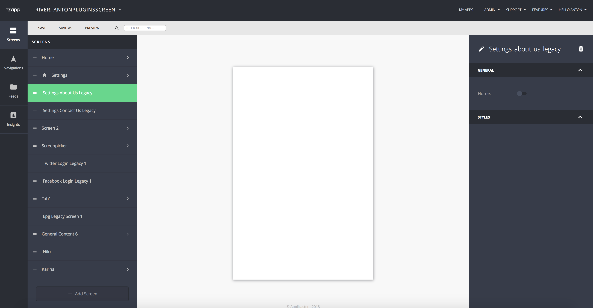
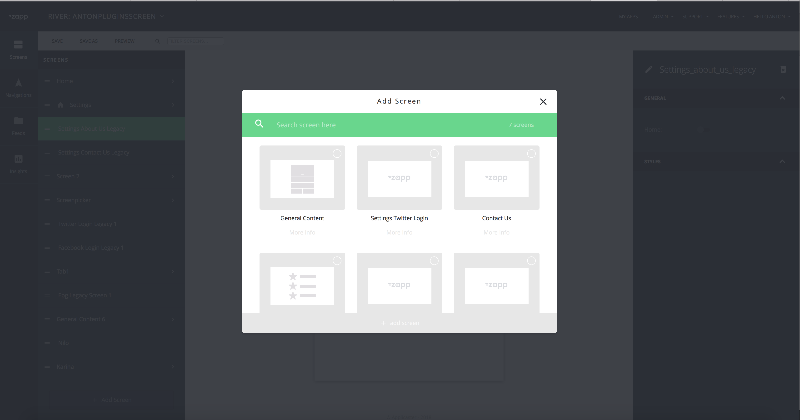

## Zapp Screen Plugins infrastructure
Infrastructure that enables development of standalone screen (views) plugins.

1. <a href="#description">Description</a>
2. <a href="#general">General</a>
3. <a href="#connection">Connection Plugins Screen with River.json</a>
4. <a href="#clientExplanation">Client side explanation</a>
4. <a href="#keys">Styles, keys and data source</a>
5. <a href="#screens">React Native screen and Native screens</a>

* * *

<a name="description" />

##### Description
`PluginScreen` are plugins that are presented as standalone screens. A user can trigger the launch of a screen from navigation bar, root (menu) or click on any cell inside application. Screen plugins can be native or react native. In this document you'll find a guide that explains how to configure such a plugin. In addition, a screen plugin provides an API that gives developers to ability to customize their plugin via Zapp's UI-Builder.


***

<a name="general" />

##### General

Any plugin can be defined as Screen Plugin. In order to do so please follow the steps below:
1. Implement `PluginScreen`. This interface provides a simple initialization for your plugin. This is a simple initialization for your plugin.  
The interface provides 4 parameters to the plugin:  
`Context context` - Current context.  
`HashMap<String, Object> screenMap` - Map of properties.  
`APAtomEntry dataSource` - Data source of your screen plugin (optional). In some cases, your screen will require dynamic data source configured by the user. If you want to allow users to launch the screen from a tap on a cell the data source of the cell (as defined in the data source entry) will be passed automatically.  
`boolean isActivity` - Present as fragment or activity.  

```
    void present(Context context, HashMap<String, Object> screenMap, APAtomEntry dataSource, boolean isActivity);
```
2. In the manifest of the plugin the `screen`: `true` key must be added. This key is needed to explain UI Builder that this plugin can be added in the screen section. [Plugins manifest format](https://developer-zapp.applicaster.com/zappifest/plugins-manifest-format.html)
3. A default presentation should be provided, read more below. <a href="#clientExplanation">Client side explanation</a>

<a name="connection" />

##### Connect Plugin with Rivers API

After adding `screen: true` flag on Zapp manifest, you will able to see your plugin in the available screens list when adding a screen in the UI Builder.

__Example:__ Contact Us or Settings Twitter Login


When user will select `Screen Plugins`, behind a scenes the `UI Builder` will add plugin the relevant plugin to `plugins.json` that will be sent to app during application creation process.

The `Screen Plugins` can be used from the root menu or the app navigation like any other Zapp screen.

###### River.json screen plugin example
This is an example of screen plugin that will be passed with `river.json`
`type` field is representation of your plugin id `settings_contact_us_legacy`. Using this ID, the client will locate the plugin and will try to create it with `PluginScreen` initialization method.

```
    {
        "id": "7e8bca21-5f98-4f1b-8541-ce084fffffa6",
        "name": "settings_contact_us_legacy",
        "type": "settings_contact_us_legacy",
        "data": {},
        "styles": {
            "family": "FAMILY_1"
        },
        "advertising": {},
        "general": {},
        "rules": {},
        "home": false,
        "ui_components": []
	}
```
<a name="clientExplanation" />

##### Client side explanation
###### ScreenPluginUtils

`PluginScreenUtils` is a helper class with default methods to present RN and Native screens and helper methods.

<a name="keys" />

##### Styles, keys and data source
Screen plugin allows you to pass additional customization that are set in the UI Builder.

Here manifest example:  
__Note:__
1. Key `background_color` will allow user to select background color with a color picker.
2. You can use the special data keys to leverage the feeds that are set in the Feeds section in the UI Builder, allowing the users to set data feeds on the screen plugin, more info could be found in Zappifest documentation. [Zapp Plugins Manifest](/zappifest/plugins-manifest-format.md)
```
{  
   "api":{  
      "require_startup_execution":false,
      "class_name":"com.applicaster.genericapp.fragments.settingsinnerfragments.SettingsTwitterDetailsFragment",
      "modules":[  

      ]
   },
   "dependency_repository_url":[  

   ],
   "platform":"android",
   "author_name":"Anton Kononenko",
   "author_email":"a.kononenko@applicaster.com",
   "manifest_version":"0.1.0",
   "name":"Settings Twitter Login",
   "description":"Twitter login screen allows users to connect to their twitter account. Connecting user twitter account is required for advanced interactions via Twitter (sharing, tweeting, etc.)",
   "type":"login",
   "identifier":"twitter_login_legacy",
   "screen":true,
   "ui_builder_support":true,
   "whitelisted_account_ids":[  
      "57d7bee06466610018000000"
   ],
   "min_zapp_sdk":"6.5.0",
   "deprecated_since_zapp_sdk":"",
   "unsupported_since_zapp_sdk":"",
   "react_native":false,
   "custom_configuration_fields":[  

   ],
   "styles": {
       "fields": [
           {
               "key": "presentation",
               "type": "hidden",
               "initial_value": "push"
           },
           {
               "key": "force_nav_bar_hidden",
               "type": "hidden",
               "initial_value": true
           },
           {
               "key": "background_color",
               "label": "Background Color",
               "type": "color_picker",
               "initial_value": "rgba(43,43,43, 1)",
               "label_tooltip": "Background color of cards."
           },
       ]
   },
   "data": {
       "fields": [
           {
               "key": "source",
               "type": "text_input"
           },
           {
               "key": "type",
               "type": "select"
           }
       ]
   }
}
```
<a name="screens" />

##### React Native screen and Native screens
This section describes the difference between React Native and native screen plugins.

###### Native

Native Screen plugins must implement `PluginScreen` and override `present` method. `PluginScreenUtil` has a default method to present a Native fragment `presentNativeFragment`. If your plugin will have data source it will be passed as `APAtomEntry`.

###### React Native

If you use custom RN plugin and you implement subclass of `APReactNativeAdapter` you may want to update `present` method
Implementation for React Native screens in `ReactNativeFragment`

During presentation of interface method we use standard method of initialization and passing data source and screen models as initial props where we use method `getProp(screenMap, dataSource)` to retrieve the props from data source `APAtomEntry` and Map of `ZappScreen`.
```
@Override
public void present(Context context, HashMap<String, Object> screenMap, APAtomEntry dataSource, boolean isActivity) {

    HashMap<String, Object> props = getProp(screenMap, dataSource);
    String title = (String) screenMap.get(TITLE);

    Fragment fragment = ReactNativeFragment.createFromUIBuilder(props);

    if(isActivity) {
        presentRNFragmentActivity(context, title, fragment);
    } else {
        presentRNFragment(context, fragment);
    }
}
```

Example of receiving props:
1. `ZappScreen` is passed as `uibuilder_screen_model` props
2. If we have data source we will pass map of the data source, regardless if it's an single entry or list of entries, with key `data_source_model`.  
3. For backward compatibility reasons, we will flat map of `ZappScreen` dictionary to give ability to retrieve keys without additional migration. Note This is a temporary solution and plugin should be migrated to use `ZappScreen` props.
At the end you will get something like this
```
        {
        "uibuilder_screen_model": {
            "id": "7e8bca21-5f98-4f1b-8541-ce084fffffa6",
            "name": "settings_contact_us_legacy",
            "type": "settings_contact_us_legacy",
            "data": {},
            "styles": {
                "family": "FAMILY_1"
            },
            "advertising": {},
            "general": {},
            "rules": {},
            "home": false,
            "ui_components": []
        },
        "data_source_model": {
            "source": "general-provider://fetch_data?url=aHR0cDovL2Fzc2V0cy1wcm9kdWN0aW9uLmFwcGxpY2FzdGVyLmNvbS9hY2hpZXZlbWVudC1jZW50ZXIvZ2VuZXJpYy1kYXRhLXNvdXJzZS9uZXdzLnhtbC9OZXdzLUJ1c2luZXNzLnhtbA%3D%3D&type=APPLICASTER_ATOM_FEED",
            "type": "APPLICASTER_ATOM_FEED"
        },
        "family": "FAMILY_1"
        }

```

###### Screen Picker with RN plugin screens

In order to support multiple React Native context in Screen Picker we had to deviate from regular flow and use `RNPluginScreenFragment` with inflated `ReactNativeContent` layout.
