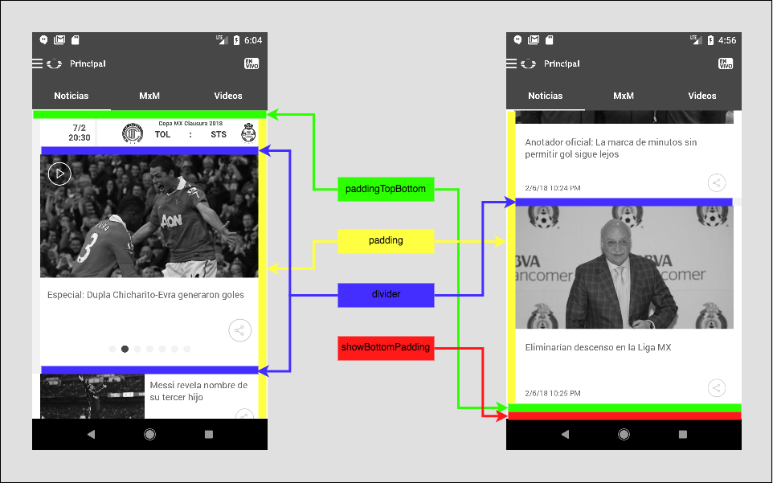
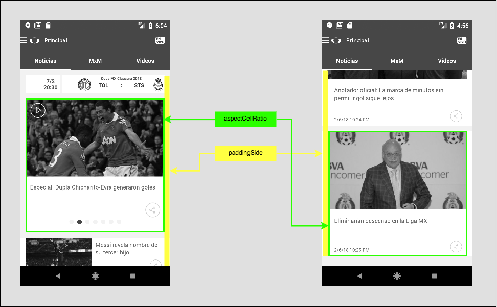
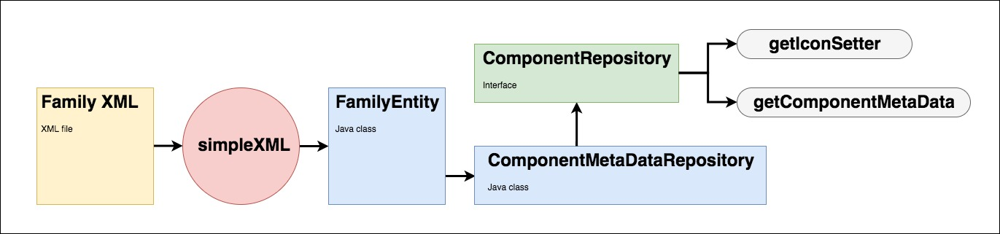
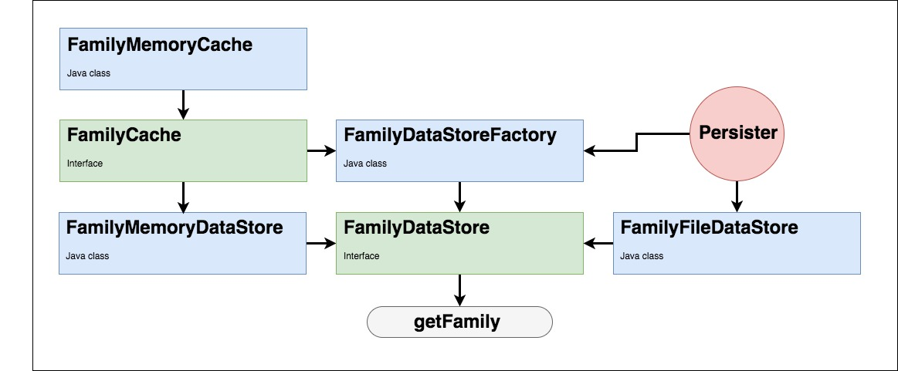
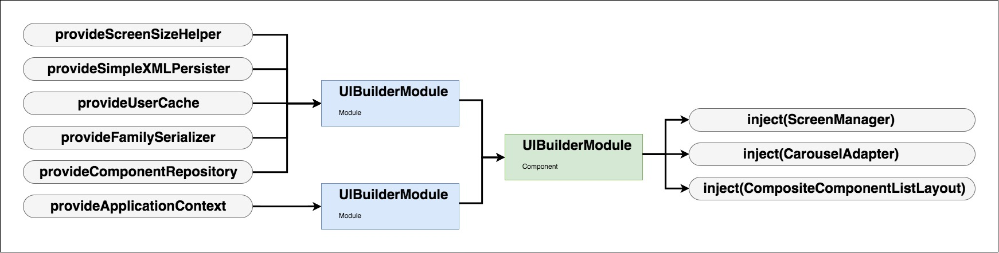

## Android Family Interface

Explanation about how to use family interface to create new families and corresponding ComponentMetaData.

## Creating New Family

Creating new family starts with `<Family>` tag.
```
<Family name="FAMILY_1" showBottomPadding="true">
```
`name` attribute is a family name and when parsing it should match with `ZappScreen.styles.family`  
`showBottomPadding` adds a padding to the very end of the screen.

Then we define `<Screens>` for `<Family>`
```
<Screens>
    <Screen type="default" divider="12" padding="12" paddingTopBottom="12" />
    <Screen type="sw600" divider="12" padding="10" paddingTopBottom="10" />
</Screens>
```
  

`type` defines the screen type by dimensions. Default is phone, sw600 is tablet.   
`divider` set a horizontal separation between the elements of the component.  
`padding` sets padding unless `paddingSide` is defined, then `paddingSide` overwrites it.  
`paddingTopBottom` adds padding to the very top and bottom of the screen.

#### Component
Next step is to add XML for components. We define all of the components under `<Components>` tag, e.g.
```
<Components>
  <ListComponent name="LIST" columns="2">
    ...
  </ListComponent>
  <GridComponent/>
  <HeroComponent/>
</Components>
```
Component's `name` is a component type and matched to `ZappScreen.ZappUiComponent.type`   
`columns` defines the number of columns in the component.  

#### CellStyle
Each component consists of `<Cell>` that are component's CellStyle.  

```
<ListComponent name="LIST" columns="2">
  <Cell name="LIST_1" layoutId="layout_01_list_01">
    ...
  </Cell>
  <Cell/>
  <Cell/>
</ListComponent>
```

Cell's `name` CellStyles name that is represented by `ZappScreen.ZappUiComponent.styles.cellStyles`.  
`layoutId` is an xml layout's name.  
<b>NOTE:</b> Also it should match CellLayout enum, in our case it indeed matches `LAYOUT_01_LIST_01`. In case enum doesn't match the xml layout, e.g. `TAB_01("component_tab_cell_01")` - we need to add extra attribute `layout` and specify the proper enum name `layout = "TAB_01"`.    

Each `<Cell>` has it's own `<Screens>`:
```
<Cell name="LIST_1" layoutId="layout_01_list_01">
    <Screens>
        <Screen type ="default" aspectCellRatio = "0.9" paddingSide = "12"/>
        <Screen type ="sw600" aspectCellRatio = "0.9"  paddingSide = "10" columns="3"/>
    </Screens>
</Cell>
```
  

`paddingSide` adds padding on component level.  
`aspectCellRatio` is an aspect ratio of the CellStyle.  
`columns` here overwrite the `<ListComponent>`'s padding.  
<b>NOTE:</b> Alternative way to define aspectCellRatio is to provide cellHeight, cellWidth, and columns, and let `ComponentDataMapper` calculate the rest.
```
        <Screens>
          <Screen type ="default" cellHeight = "309" cellWidth="360" innerSpacing="12" columns = "1"/>
          <Screen type ="sw600" cellHeight = "330" cellWidth="400" innerSpacing="12" columns = "3"/>
        </Screens>
```


#### DisplayRules
```
<Cell name="LIST_1" layoutId="layout_01_list_01">
    <Screens/>
    <DisplayRules>
      ...
    </DisplayRules>
</Cell>
```
`<DisplayRules>` is used to build an IconSetter. It of a list of `<DisplayRule>` items.
```
         <DisplayRules>
             <DisplayRule type="GENERIC">
                 <View
                     name="nativeShareButton"
                     visibility="VISIBLE" />
                 <View
                     name="broadcastDateTextView"
                     visibility="VISIBLE" />
             </DisplayRule>
             <DisplayRule type="ATOM_FEED/>
          </DisplayRules>   
```
`type` is CellItemType.  
`<View>` is a CellViewHolder's element, e.g "nativeShareButton". We can set these attributes in it:  
`visibility` sets visibility, e.g VISIBLE, GONE, INVISIBLE  
`isNull` sets CellViewHolder to NULL.  
`drawable` specifies CellViewHolder's image resource.  
`isTransparent` sets CellViewHolder's image resource to `android.R.color.transparent`.   
Multiple attributes can be specified per one `<View>`  

In order to optimize XML we can use `isGeneric` and `copyOf` attributes on `<DisplayRule>`   
<b>NOTE:</b> "GENERIC" is not a Zapp's CellType, but rather a collection of most repeated elements that we can reuse setting `isGeneric = "true"`
```
             <DisplayRule type="ATOM_ARTICLE" isGeneric = "true">
                 <View
                     name="programPlayButton"
                     drawable="cell_article_button_selector" />
             </DisplayRule>
```
Here, before creating an IconSetter, we will get a list of "GENERIC" elements, traverse it and add to it or overwrite it with "ATOM_ARTICLE" elements. This way we can greatly shrink the size of final XML file.
```
             <DisplayRule type="ATOM_VIDEO" copyOf="ATOM_PLAYLIST">
             </DisplayRule>
```
In case the CellType has completely identical elements we can use `copyOf` attribute to point to the `<DisplayRule>` we want to copy. No elements will be overwritten or added, thus context of this tag can be empty.

## Family Implementation

#### High level overview



Family XML is being parsed by simpleXML <link>http://simple.sourceforge.net</link> to `FamilyEntity`. We decided to use this library as it provides an easy and clean way to parse complex xml files. Parsed family is stored in memory for future use and in order to access it we have to call main interface `ComponentRepository` that provides us with option of creating `ComponentMetaData` and `IconSetter`.  
We added Dagger 2 to inject `ComponentRepository`, that also providing us with easier testing for all of the dependencies.  
At the moment, only FAMILY_1 is supported with this new implementation.

#### FamilyEntity
Java class that is used by simpleXML to parse XML file. simpleXML uses annotations and is pretty straight forward to use. One thing to notice is that we use a simpleXML's `Dictionary` that acts like a Map<String, Object> and let's us to get it's members by String name. In order to support that, every member of the `Dictionary` should implement `Entry` interface.

#### ComponentRepository
Main interface for `ComponentMetadataRepository`. Has two methods to get `ComponentMetaData` and `IconSetter`.

#### ComponentMetadataRepository
Our main repository that implements `ComponentRepository` and has two dependencies `FamilyDataStoreFactory` and `ScreenDataMapper`.  
`FamilyDataStoreFactory` is in charge of creating or retrieving from memory of `FamilyEntity`.  
`ScreenDataMapper` contains the logic to map `FamilyEntity` to `ComponentMetaData`

## Family Caching


#### FamilyDataStoreFactory
One of the dependencies of `ComponentMetadataRepository`. We utilize a factory pattern to provide the proper `FamilyDataStore` depending whether we have necessary family cached or we need to parse it from XML.

#### FamilyCache
The interface that represents the minimum methods a caching mechanism `FamilyMemoryCache` needed to be implemented.

#### FamilyMemoryCache
It is an implementation of `FamilyCache` contract to store in memory a collection of the families already loaded

#### FamilyDataStore
A contract that allows to get a `FamilyEntity` from XML file or cache.

#### FamilyMemoryDataStore
Implementation of `FamilyDataStore` contract that provides stored `FamilyEntity` from `FamilyCache`

#### FamilyFileDataStore
Implementation of `FamilyDataStore` contract that parses new `FamilyEntity` from `FamilyXmlFileApi` and then stores it with `FamilyCache`

#### FamilyXmlFileApi
Implementation of simpleXML parser.

## ComponentMetaData mapping
`ComponentMetadataRepository` calls `ScreenDataMapper` to transforms `ZappScreen` and `FamilyEntity` into `ComponentMetaData`. `ScreenDataMapper` maps `<Family>` attributes and it's `<Screen>` elements from XML then traverse through `<Components>` list and calls `ComponentDataMapper` on them. Within `ComponentDataMapper` we map component level attributes and call `CellDataMapper` to map cell's `<Screen>` elements.

#### ScreenDataMapper
One of the dependencies of `ComponentMetadataRepository`. Maps top level of `FamilyEntity` to `ComponentMetaData`, alters meta data for specific components like `SCREEN_PICKER` and `SECTION_PICKER`.

#### ComponentDataMapper
Maps `ComponentMetaData`, `ComponentStyle` and `ComponentHeaderMetaData` on component's level. Also has a method to create an inner `ComponentMetaData` for `SECTION_PICKER`.

#### CellDataMapper
Decorates `ComponentMetaData` on CellStyle level. Also has a method to calculate aspectRatio based on height, width and columns of the Cell.

#### WebUrlDecoder
Utility class that helps us to decode urls.

#### ScreenSizeHelper
Utility class that helps us to differentiate between phone and tablet screens.

## IconSetter creation
`ComponentMetadataRepository` provides a method to create an `IconSetter` from `<DisplayRule>`. First we get `<DisplayRule>` for a specified CellType, if it has `copyOf` attribute we substitute CellType with the value of `copyOf` and get a `<DisplayRule>` for that CellType. Next, we check if it has `isGeneric` attribute. If so, we traverse every element of "GENERIC" and copy them onto our `<DisplayRule>` unless we already have it. Next, we pass that `<DisplayRule>` into `ActionMapper`.

#### ActionMapper
Class containing logic to map `<DisplayRule>` to `cellViewHolder`.

## Family Integration


In order to glue everything together and inject `ComponentRepository` we use Dagger 2. `GenericApplicationModule` provides Context and `UIBuilderModule` provides all the dependencies we need for `ComponentRepository`.  
