##Navigation Bar Plugin
This plugin provides a navigation structure and UI at the top of the application. It is placed on top of the `root plugin` and directs navigation behavior.

1. <a href="#description">Description</a>
2. <a href="#general">General behaviours</a>
3. <a href="#protocol">Protocols</a>
4. <a href="#navigationBarManager">Navigation Bar Manager</a>
5. <a href="#api">UIBuilder Api</a>
6. <a href="#navigationBarPlugins">Navigation Bar Plugins</a>
	* <a href="#generalNavBarPlugin">UI Builder general navigation bar</a>
		* <a href="#generalNavBarPluginAddingNewStyle">Adding new style</a>
7. <a href="#createNavBarPlugin">Creation new Navigation Bar plugin</a>
	* <a href="#devEnv">How to prepare development environment</a>
	* <a href="#howToTest">How to test</a>

* * *

<a name="description" />

##### Description

This is a plugin that provides top navigation strucrure of the application and placed on top of the `Root plugin` and provides navigation behaviour.
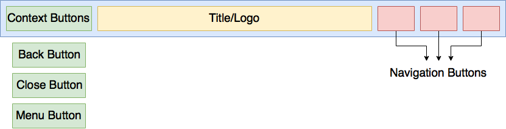

The navigation bar can be customized in the UI Builder via the Navigation section, illustrated below. The customized navigation bar will be available on each screen via the `river.json`.

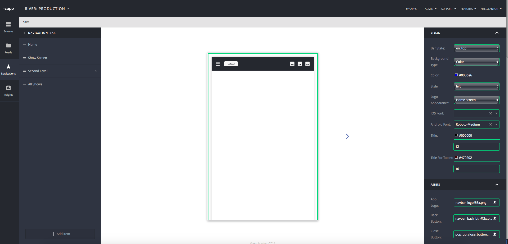
***

<a name="general" />

##### General behaviours

The navigation bar plugin provides general features which will be implemented in any plugin of this type.

######Customization per screen
The nagivation bar can be customized per screen. This gives the ability to use different settings for each screen as it relates to the customer’s needs. Behind the scenes, when the end-user selects a new screen, the application will send a notification to update the navigation bar title and navigation bar model.

Note: Screens which do not have the navigation model (like white label screens including `Settings` and `Epg`. Will use navigation model from the `Home` screen.

The `Home` screen can be defined in the UI Build in the Screen section, as illustrated below.
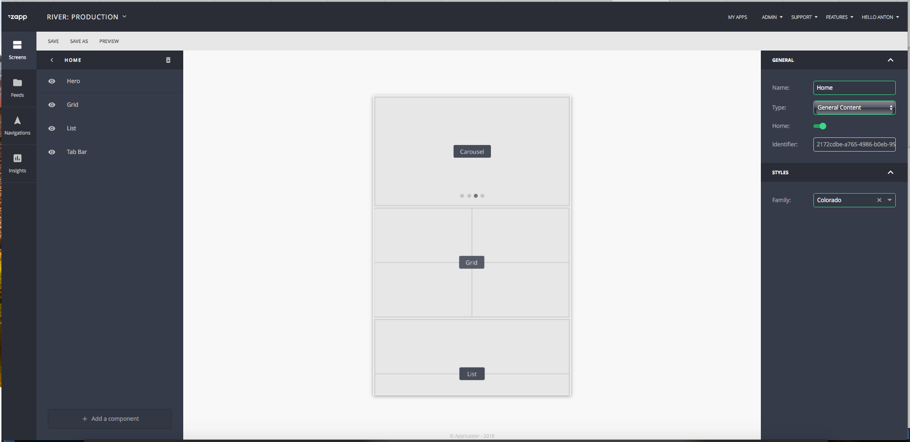

######Navigation bar view style.
The navigation bar can have different styles. The Zapp user can select the layout for the style they’d like.

######Presentation state
This feature defines placements of the Navigation Bar View according to the Root Plugin. More details can be found in the documentation on  <a href="#api">UIBuilder Api</a> and  <a href="#generalNavBarPlugin">UI Builder general navigation bar</a> section.

__Note__: All white label screens (such as `Settings` and `EPG` will use the state: OnTop to avoid possible support issues.

Example:
1. __On top__
2. __Overlay__
3. __Hidden__

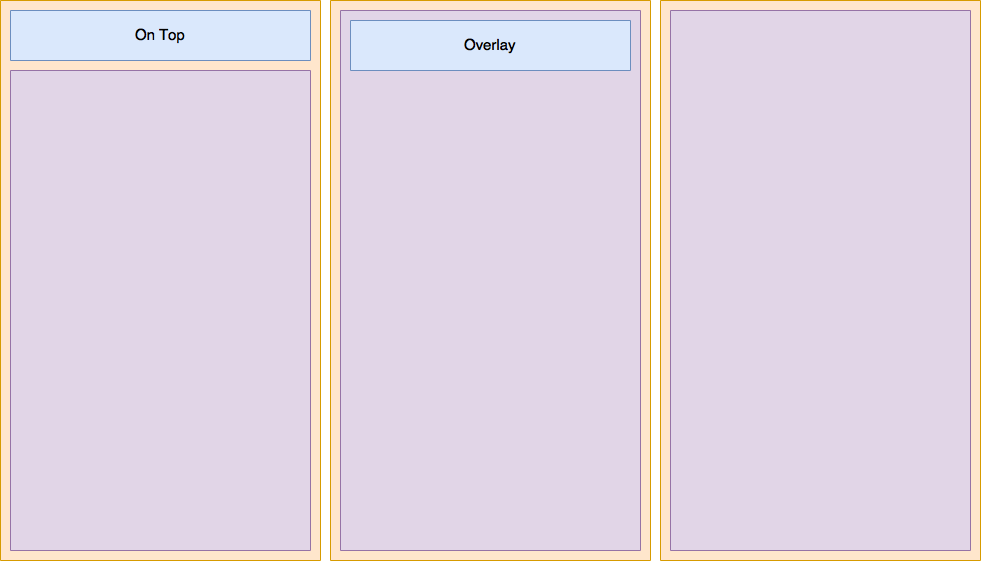

######Presentation style
This feature allows the navigation bar to present Logo or Title differently on the screen level. More details can be found in the documentation on <a href="#api">UIBuilder Api</a> and <a href="#generalNavBarPlugin">UI Builder general navigation bar</a>.

Examples:

__Logo__
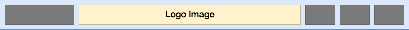

__Title__
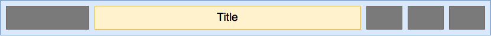

__Hidden__
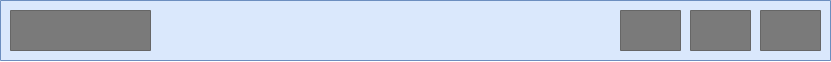

######Backgound view
The Navigation bar plugin also enables customization of the background. Currently, there are two types of background view presentations available: `Color` and `Image`.

__Note__: In the UI Builder, the Zapp user will only have one of these options available, but the plugin developer will get both keys if it was defined in the development of the plugin. In this case, items must be used according to their priority. Image has a higher priority than Color. During implamentation new plugins important to use same behaviour.

######Context buttons
Context buttons are buttons which control the screen or root navigation. Context buttons are not controlled by the user, but all these buttons must be implemented in the development of new plugins.

1. `Menu button` or `Special button`. This button, if enabled, sends to Root plugin the action that root must call some specific Root behaviour. Please Note: This button will be visible only if Root plugin implemented protocol of this button, otherwise it will be hidden. Please be aware of this when developing new nav bar plugins.

2. `Back button` This button becames visible when user `push` ViewController to current nav bar stack view and direct user to previous ViewController.

3. `Close button` this button becomes visible when user presents a screen from the nav bar. Pushing on this button will close the presented view controller and come back to the previous stack. For more details please read about `Navigation Buttons`

__Please Note__: Only one type of context button can be visible per screen.
######Navigation Buttons
This button is responsible for navigation items tat make presentation - present generic screen, open url, open white label screen, etc.

The number of `navigation button` is defined in the UI Builder, but the style of the navigation bar may create a limitation which would not allow to show more than one button within the suitable view.

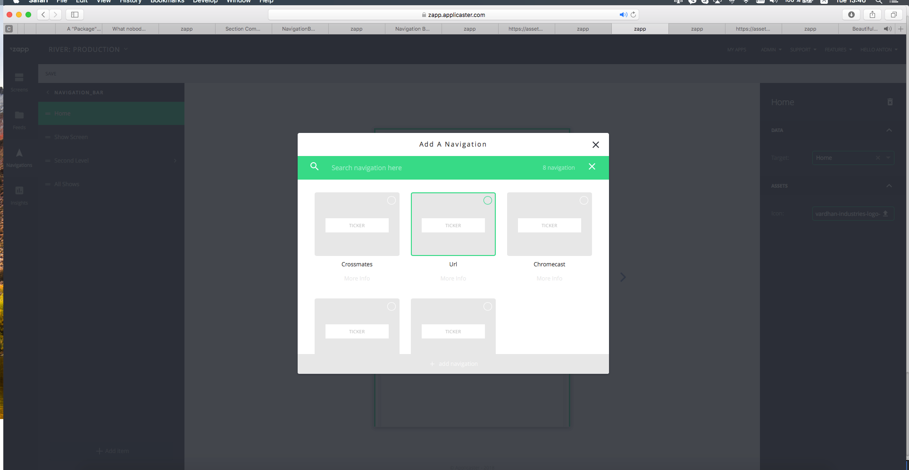

Availible Navigation Buttons:

| Button type | Description                 | Api button key         | Class in Code              |
|-------------|-----------------------------| ---------------------- | ---------------------------|
| Screen      | Opens generic screen        | button                 | NavigationButton           |
| URL         | Opens external URL          | button                 | NavigationButton           |
| Live        | Opens Live Drawer component | live_drawer            | NavigationButton           |
| Crossmates  | Opens Crossmates component  | applicaster_crossmates | CrossmatesNavigationButton |
| Feed        | Opens Feed component        | applicaster_feed       | FeedNavigationButton       |
| Chromecast  | Opens Cromecast player      | chromecast             | ChromecastNavigationButton |

__Please Note__: Different buttons use different classes, so the logic of each can be different.
***

<a name="protocol" />
##### Protocols
`ZPNavigationBarCustomizationHelperDelegate` - This protocol defines a helper object that helps to retrive data.
`ZPNavigationBarUIBuilderProtocol` - This protocol contects `navigation bar view` plugin adapter with `navigation bar view`
`ZPNavigationBarViewDelegate` - This protocol delegates logic from `navigation bar view` like navigation button was pushed

***

<a name="navigationBarManager" />

##### Navigation Bar Manager

The navigation bar manager is a class which controls the work of the `Navigation Bar` plugin adapaters

The navigation bar manager will receive calls from the nav bar adapter to take an action from a navigation button. There is no need to implement all of these calls when developing a new nav bar plugin; simply send the information to the `GANavigationBarManager`

NavigationBarManager has a mechanism for creating the screens that were generated when an end-user pushed on a Navigation Button from the navbar.

######ZPNavigationBarManagerDelegate

`func navigationButton(for model:NSObject) -> UIButton?` - Request from navigation bar to create `NavigationButton` instance from `ZLNavigationItem`

`func isSpecialButtonUsedByRoot() -> Bool ` - Request navigation bar manager if root adapter implemented logic of the `Special` button.

######NavigationBarCatchingItem
This class defines caching model for Screens that was created from `Navigation Bar Manager`.
Structure of presenting screen is next
`GARootViewContainerController` -> `ZPNavigationViewController` -> `GenericViewController`

######ZPNavigationBarViewDelegate
Instance of the `GANavigationBarManager` conforms protocol `ZPNavigationBarViewDelegate`
This protocol send info that one of the navigation button was push. Navigation bar manager transfer call to proper place of app of `GARootHelper`

__Note:__ For more information please read about [Zapp-iOS Application Structure](NavigationStructure.md)

<a name="api" />

To make more understanding of this section please review: [Rivers.json API](NavigationStructure.md)

Navigation Bar api placed in `navigations` array inside `screen model`
`category` - of the navigation model is define navigation model type. Navigation model has type `nav_bar`

Example:
```
{
        "id" : "uniqueID",
        "category": "nav_bar",
        "rules": {},
        "nav_items" : [
            {
                "id" : "uniqueID",
                "title" : "Home Screen",
                "type" : "button",

                "data" : {
                    "target" : "c320c5d90661-d241-410b-81fb-c320c5d90661"
                    "connected": true,
                    "source": "URL",
                    "type": "APPLICASTER_ATOM_FEED"
                },
                "assets" : {},
                "nav_items" : [],
                "rules" : {},
                "styles" : {}
            }
        ],
        "styles": {},
        "assets" : {}
    }
```
***
<a name="navigationBarPlugins" />
#### Navigation Bar Plugins
Here you can read information about Availible navigation bar plugins

<a name="generalNavBarPlugin" />
* * *
##### UI Builder general navigation bar
This is a default navigation plugin that will be presented in case if user will not select and new plugin using UIBuilder application.

Api Example with all availible keys:

```
{
        "id" : "uniqueID",
        "category": "nav_bar",
        "rules": {},
        "nav_items" : [
            {
                "id" : "uniqueID",
                "title" : "Screen with difined data source",
                "type" : "button",
                "data" : {
                    "target" : "c320c5d90661-d241-410b-81fb-c320c5d90661"
                    "connected": null,
                    "source": null,
                    "type": null
                },
                "assets" : {},
                "nav_items" : [],
                "rules" : {},
                "styles" : {}
            },
            {
				"id" : "uniqueID",
                "title" : "Screen with difined data source",
                "type" : "button",
                "data" : {
                    "target" : "c320c5d90661-d241-410b-81fb-c320c5d90661"
                    "connected": true,
                    "source": "URL",
                    "type": "APPLICASTER_ATOM_FEED"
                },
                "assets" : {},
                "nav_items" : [],
                "rules" : {},
                "styles" : {}
            },
             {
				"id" : "uniqueID",
                "title" : "URL",
                "type" : "button",
                "data" : {
                    "target" : null
                    "connected": null,
                    "source": "URL",
                    "type": "WEB_URL"
                },
                "assets" : {},
                "nav_items" : [],
                "rules" : {},
                "styles" : {}
            },
             {
				"id" : "uniqueID",
                "title" : "Other Types",
                "type" : "live_drawer"/"applicaster_crossmates"/"applicaster_feed"/"chromecast",
                "data" : {
                    "target" : null,
                    "connected": null,
                    "source": null,
                    "type": null
                },
                "assets" : {},
                "nav_items" : [],
                "rules" : {},
                "styles" : {}
            }
        ],
        "styles": {
			"background_color": "#ARGB HEX",
            "ios_font_family": "Font Family ID",
            "presentation_style" : "logo"/"title"/"hidden",
            "style": "left"/"center",
            "title_color: "#ARGB HEX",
            "title_color_tablet: "#ARGB HEX",
            "title_size: "Font Size",
            "title_size_tablet: "Font Size",
            "state': "on_top"

        },
        "assets" : {
        	"app_logo" : "URL",
			"back_button" : "URL",
            "close_button" : "URL",
            "menu_button" : "URL",
            "background": : "URL"
            "background_tablet" : "URL"
        }
    }
```

***

__Navigation Bar model schema: styles__

| key                 | Type         | Description                                      |
|-------------------- |--------------| ------------------------------------------------ |
|  background_color   |  String in `#ARGB HEX` | Background color of the navigation bar view |
|  ios_font_family    |  String                | Font Family ID |
|  title_color        |  String in `#ARGB HEX` | Title label text color|
|  title_color_tablet |  String in `#ARGB HEX` | Tablet title label text color|
|  title_size	      |  String in number      | Title label font size|
|  title_size_tablet  |  String in number      | Tablet title label font size|
|  presentation_style |  String in enum        | Defines presentation of logo or label in nav bar|
|  style              |  String in enum        | Defines xib style for the navigation bar|
|  state              |  String in enum        | Define placements for the navigation bar accouring root|

***
__styles: schema: "presentation_style"__

| Values | Discription |
|-------------|-------------|
| logo        | `Navigation Bar` will present logo image|
| title       | `Navigation Bar` will present title label |
| hidden      | `Navigation Bar` will hide title label and logo image|
***
__styles: schema: "style"__

| Values | Discription |
|-------------|-------------|
| left        | This style define `context buttons` on left and `navigation buttons` on right of the navigation bar view. Free space will be fully provided to `logo image view` or `title label`. Aligment of text in `title label` and image in `logo image view` - `left`.|
| center      | This style define `context buttons` on left and `navigation buttons` on right of the navigation bar view.`logo image view` or `title label` will take biggest width of `context button container` or `navigation buttons summ` and use it as offset left and right form navigation bar view. Aligment of text in `title label` and image in `logo image view` - `centered` |

__Left__

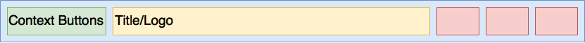

__Center__

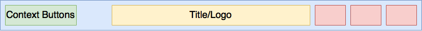
***
__styles: schema: "state"__

| Values | Discription |
|-------------|-------------|
| on_top      | `Navigation Bar container` placed on top of `root container`. |
| overlay      | `Navigation Bar container` placed overlay of the `root container`. `Root container` take full availible space.` |
| hidden      | `Navigation Bar container` is hidden. `Root container` take full availible space. |

***

__Navigation Bar model schema: assets__

| key                 | Type           | Description                                      |
|-------------------- |----------------| ------------------------------------------------ |
|  app_logo           |  String in URL | Logo image URL |
|  back_button        |  String in URL | Back Button image URL |
|  close_button       |  String in URL | Close Button image URL |
|  menu_button        |  String in URL | Menu Button image URL |
|  background         |  String in URL | Background image URL |
|  background_tablet  |  String in URL | Background tablet image URL |

***
<a name="generalNavBarPluginAddingNewStyle" />
###### How to add new style

1. In ZappNavigationBarPlugins repo create new xib file in `DefaultUIBuilder/xibs`
2. Xib name must must have prefix `DefaultNavigationBar` + `styke key from Zapp`. Example: `DefaultNavigationBarMyNewStyle`
3. Make sure that new style will define `Context buttons`, `Title`, `Logo` and `Navigation buttons`
4. Open PR.
5. Realase new closed version of ZappNavigationBar plugin sdk
6. Add to Navigation bar plugin manifest new style and upload it with new version

***


<a name="createNavBarPlugin" />
##### Creation new Navigation Bar plugin

#### ZappNavigationBarPlugin
1. Create target for your new plugin `MyAwesomeNavBarPlugin`
2. Inside your tartget folder add files that you will want to use.
3. Add your target as `dependency` to `BuildAll` target. It will be needed to create crosed sdk.
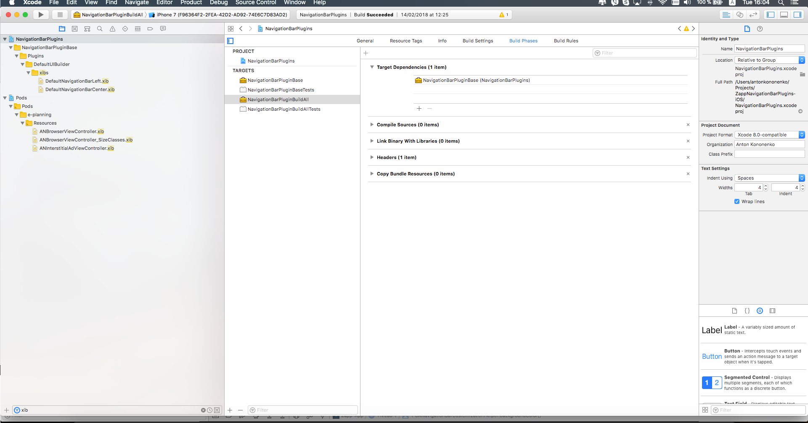
4. Add in `pofile` new target for building with all relevant dependencies. Please look example of `Base` target in podfile
5. Add in `NavigationBarPlugins.podspec` and `NavigationBarPlugins-Dev.podspec` subspec of your new plugin.
6. Implement navigation bar plugin.
7. Make sure that helper class will conform protocol `ZPNavigationBarCustomizationHelperDelegate` that you can use. If you prefer you can use your own helper methig ignoring default one.
8. You navigation bar adapter must inherit from class `NavigationBarBaseAdapter` or conform protocol `ZPAdapterNavBarProtocol` if you do not want to use existing logic.
9. Make sure that your navigation bar view is conforming `ZPNavigationBarUIBuilderProtocol` and call `ZPNavigationBarViewDelegate` passing to `GANavigationBarManager` delegate that button from navigation bar view was pushed.
10. When code will be ready. Write unit-tests.

##### UIBuilder
1. Create manifest for new navigation plugin with plugin type `nav bar`. How to create manifest please check zappifest documentation
2. Upload manifest to the zapp.

<a name="devEnv" />
###### How to use dev environment
1. Clone in `folderPath` `https://github.com/applicaster/ZappNavigationBarPlugins-iOS.git`
2. In Podfile of Zapp-iOS project remove  line `pod 'NavigationBarPlugins', '~> *`
3. Add in podfile
```
    pod 'NavigationBarPluginBase', :path => 'folderPath/ZappNavigationBarPlugins-iOS/NavigationBarPluginBase-Dev.podspec
    pod 'NavigationBarPlugins', :path => 'folderPath/ZappNavigationBarPlugins-iOS/NavigationBarPlugins-Dev.podspec'
```
4. This will give ability to create develompent pod of the NavigationBarPlugin
5. Make sure that this test changes will not be merged to Zapp-iOS __This is only for your testing__

<a name="howToTest" />
###### How to test

1. Open UI Builder and add your navigation plugin in `navigation` section.
2. Customize your navigation menu plugin accourding your setting and add navigation buttons.
3. Copy ID of the application version of your tesing application
4. Use ZappTool to prepare application environment. (How to work with Zapptool please read zapptool documentation)
5. If your plugin has dependencies and you are using dev env for navigation plugin. Find in podfile of Zapp-iOS pod with your plugin dependency under `# Zaptool pods - Do not remove or change.` section. It will look something like `pod 'NavigationBarPlugins/MyAwesomePlugin', '~> 0.4.1'` and change it to `pod 'NavigationBarPlugins/MyAwesomePlugin', :path => 'folderPath/ZappNavigationBarPlugins-iOS/NavigationBarPlugins-Dev.podspec`. This will remove issue with dependecy conflicts


