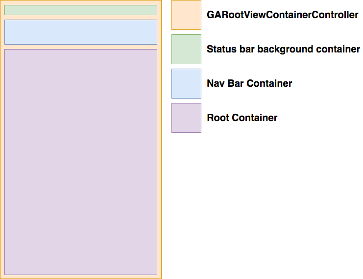

### Zapp-iOS Root Navigation Flow

#### Motivation
This document is explaining general structure of the workflow that Zapp-iOS is using during initialization proccess.
It helps to understand how Root container view controller cooperate wit navigation bar plugin and root menu plugin..

1. ZAZappAppManager when called On `didFinishLaunchingWithOptions` GARooHelper create an instance gdysyr of `GARootViewContainerController` with `root` state, about <a href="#states">states</a> read below.
2. Application will try to retrieve root adapter instance of `ZPAdapterRootProtocol` from the plugins manifest.
3. GASideMenuViewController will be created in case no root plugin defined.
4. <a href="#rootViewContainer">GARootViewContainerController</a> (read below) instance will be created with defined root adapter. In case application is `ui_builder`. Root must use data source of the root from the `rivers.json` otherwise `Applicaster 2` collection with ui_tag: `side_menu_collection`.
5. GANavigationBarManager will create navigation bar instance of NavigationBarBaseAdapter (Plugin adapter instance). In case application is using the ui_builder, Navigation Bar must use data source of the root from rivers.json API. Otherwise it will expect Applicaster 2 Collection with ui_tag: `navbar_collection`.
6. RootContainer ready for use.
7. In end of initialization of the Application instance of `GARootViewContainerController` will be added to App

<a name="rootViewContainer" />
#####GARootViewContainerController
Zapp-iOS is using main component View Controller `GARootViewContainerController`.
This Component is used to present `Navigation Bar` plugin and `Root` plugin

Structure example below:



<a name="states" />
##### Availible states:

######Root State:

Creation of this state define by specific initializer

```
init(rootPluginAdapter:ZPAdapterRootProtocol)
```
`rootPluginAdapter` - instance of the `root adapter` plugin

Creation of this state in the method `application:didFinishLaunchingWithOptions:` inside `ZAZappAppManager` when application finishing loading process.
This state is used to present `Root adapter` and `Navigation Bar` plugins inside application

__Note__:
1. Since GARootViewContainerController is first item for the application. If you need present any View Controller. Please add VC that you need to add on top of GARootViewContainerController not `Root adapter` plugin.
2. This component fully control background color of status bar. Do not implement status bar background on root adapter side. If need this behaviour can be implemented in app connector delegate and ask app to change it.

######Presentation State:

Creation of this state define by specific initializer

```
init(innerNavController:ZPNavigationController)
```
`innerNavController` - instance of the `ZPNavigationController` controller with generic screen as root

This state is used to present screens from `navigation bar`, when user push one of the `navigation buttons`.
__Note__: Each instance of the `presentation state` will use own instance of the `navigation bar adapter` plugin

#####ZPRootViewContainerControllerDelegate
Protocol of root view container that helps to define presentation logic of the `navigation bar` plugin.

Navigation bar plugin is called this method to present navigation bar view.

```
@objc func placeNavBarToContainer(navigationBar: UIView,
                                  placementType: ZPNavBarPlacement)
```
__Note__: If `Root` plugin will implement this protocol `ZPRootViewContainerControllerDelegate`. `GARootViewContainerController`  will pass delegation of the presentation `Navigation Bar` view on `Root` plugin, otherwise, container view controller will do it itself.

###### Navigation bar sates:
1. __On Top__ - `Navigation Bar container` placed on top of `root container`.
2. __Overlay__ - `Navigation Bar container` placed overlay of the `root container`. `Root container` take full availible space.
3. __Hidden__ - `Navigation Bar container` is hidden. `Root container` take full availible space.

Example:


