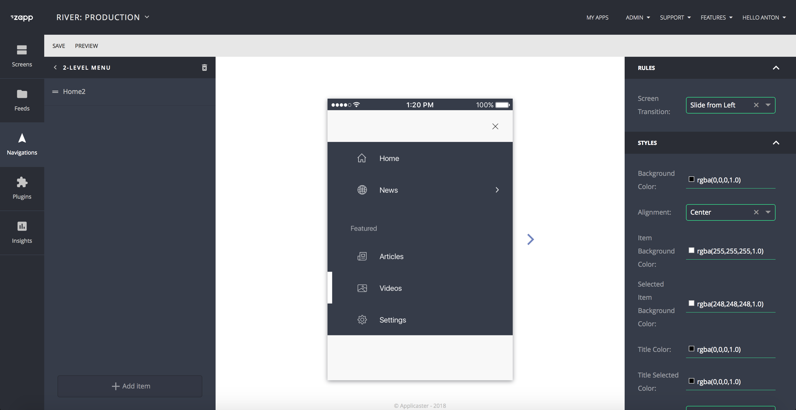
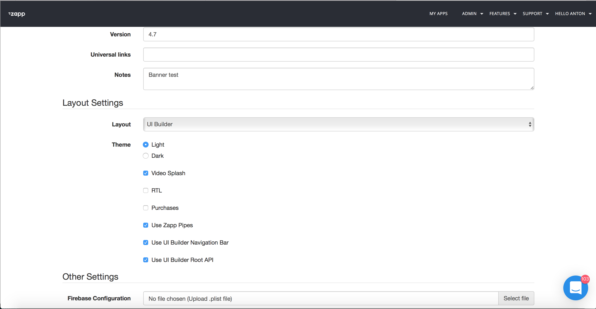

##Root Menu Plugin
This plugin provides a main navigation structure for the application.

1. <a href="#description">Description</a>
2. <a href="#general">General behaviours</a>
3. <a href="#datasource">Data Source</a>
4. <a href="#helperClasses">Helper classes</a>
4. <a href="#protocol">Protocols</a>
5. <a href="#api">UIBuilder Api</a>
6. <a href="#createMenuPlugin">Creation new Root Menu plugin</a>
	* <a href="#devEnv">How to prepare development environment</a>
	* <a href="#howToTest">How to test</a>

* * *

<a name="description" />

##### Description
This plugin provides a main navigation structure for the application. It provides main ui to present screen screen it takes whole availible space of application container + it can control navigation bar view if implemented specific protocol that will be explained below.
Root plugin provides navigation behaviour to present prepared screens.


The Root menu can be customized in the UI Builder via the Navigation section, illustrated below. The customized navigation bar will be available on each screen via the `river.json`.


***

<a name="general" />

##### General behaviours

The root menu plugin provides general features which will be implemented in any plugin of this type.

######Plugin creation
By default logic during creation of root menu. `ZPRootPluginFactory` will try to create first `menu` plugin from `plugins.json` that availible.

Note: This behaviour will be default in future
If enabled in general setting of the app key `Use UI Builder Root API`.
Application will get first `menu` plugin from the `home` screen navigations and take it identifier. Next phase `ZPRootPluginFactory` will try to find `menu` plugin with specific identifier in `plugins.json`. If it will not find it will try to use current default logic


######Home screen
Each application have a `home screen`. This screen means main screen of the application and will use custom rules regarding other plugins.
In `menu` plugin this screen must be presented as first screen of the application.
Can be founded in `ZLScreenModel` in `isHomeScreen` property in `river.json` a key for it `"home": false`. Please check [Rivers.json](Rivers.md) documentation for more details and <a href="#datasource">Data Source</a> section for understanding data source creation.

######Controlling of the navigation bar view
By default navigation bar container is controlling by `GARootViewContainerController`.
If new navigation bar has simple structure, developer can use default behaviour.

But in some cases with complicated UI or other problems. Root menu need to control `navigationBarView`. In this case developer should implement protocol `ZPRootViewContainerControllerDelegate`. If root menu conforming this protocol  `GARootViewContainerController` will delegate all logic configure navigation bar view on the root menu.
In this case developer __must__ implement all cases to support default behavoiurs of the nav bar, like `presentation_type` (on_top or overlay).
For more deatails please check documentation of the nav bar plugin


######Menu button or special button
Some menu plugins need to support cooperation with navigation bar.
Example: Menu button on nav bar will send action to `root menu` to present side menu

This optional behavoir, if menu plugin need this connection with navigation bar plugin,
menu button must be implemented on plugin level method `performSpecialAction:` part of protocol `ZPAdapterRootProtocol`.
If this method will be implemented nav bar will present menu button in place where in was defined in style of the navigation bar

__Please Note__: At that moment Api supports only one button of this type.

######Customization per screen
The root menu can be customized per screen. This gives the ability to use different settings for each screen as it relates to the customer’s needs. Behind the scenes, when the end-user selects a new screen, the application will send a notification to update the navigation bar title and navigation bar model.
Example: Tab Bar plugin change tabs color regarding presentation of a screen.

<a name="datasource" />
#####Data Source
Data source for `Root menu` plugin must be taken from [Rivers.json](Rivers.md) under `navigations` dict in `ZLNavagationModel` of your `ZLScreenModel`.
Developer must take `ZLNavigationModel` of the `menu plugin` from `ZLScreenModel of home` screen.
Plugin `ZLNavigationModel` consist `children` with `ZLNavigationItem` array, that must be parsed and used as data source for `menu` plugin.

######ZLNavagationItem Types
In `menu` plugin must be defined types of the navigation items that can be supported by current plugin.

__Please note:__ That from each plugin can have different supported naviagation items. As example, Tab bar plugin does not supports `nested_menu` since it does not have ability to present children of the children


Availible Navigation Items for menu:

| Button type | Description                         | Api button key         |
|-------------|-------------------------------------| ---------------------- |
| Screen      | Opens generic screen                | label                  |
| URL         | Opens URL or WebView                | label                  |
| Header      | Used to define header object        | live_drawer            |
| EPG         | Respresentation of EPG sceen        | applicaster_epg        |
| Settings    | Respresentation Settings screen     | applicaster_settings   |
| Nested Menu | Model that consist nested nav items | nested_menu            |

__Please Note__: `Menu` developer responsibility to add supportted navigation items to plugin manifest
***

<a name="protocol" />
##### Protocols
`ZPAdapterRootProtocol` - This protocol defines main interface for Root Menu, each menu plugin must conform this protocol.

`ZPRootViewContainerControllerDelegate` - This protocol defines interface to use presentation for nav bar view. If this procol will be implemented, `GARootViewContainerController` will not implement navigation bar logic, and menu plugin will responsible to control it, itself.

***

<a name="helperClasses" />

##### Helper Classes

Root menu plugin can use helper classes that hellps to use generic behaviour for all menu plugins. Such classes will be described bellow

######ZappAppConnector
This framework provide bridge between application and plugin. It can be used to get any information from plugin.
To use it call `ZAAppConnector.sharedInstance()` and select protocol type what you want to use.
__Note:__ Each plugin and each native framework visible `ZAAppConnector` so it can be called almost from any place of the application.

######GARootHelper
This class is bridge between `menu` plugin and rest of application. Each action that application need send to `menu` plugin will be send to `GARootHelper` and then `GARootHelper` will send action to `root menu` plugin

######GAViewControllerFactory
This class is using to create view controller from ZLNavigationItems that will crate screen.
` class open func viewController(fromNavigationItem navigationItem:Any) -> UIViewController?` - Call this method to retrive ViewController from ZLNavigationItem.

<a name="api" />

To make more understanding of this section please review: [Rivers.json API](Rivers.md)

Navigation Bar api placed in `navigations` array inside `screen model`
`category` - of the navigation model is define navigation model type. Navigation model has type `nav_bar`

Example:
```
{
        "id" : "uniqueID",
        "category": "menu",
        "rules": {},
        "nav_items" : [
            {
                "id" : "uniqueID",
                "title" : "Home Screen",
                "type" : "label",

                "data" : {
                    "target" : "c320c5d90661-d241-410b-81fb-c320c5d90661"
                    "connected": true,
                    "source": "URL",
                    "type": "APPLICASTER_ATOM_FEED"
                },
                "assets" : {},
                "nav_items" : [],
                "rules" : {},
                "styles" : {}
            },
            {
                "id" : "uniqueID",
                "title" : "Home Screen",
                "type" : "nested_menu",

                "data" : {
                    "target" : "c320c5d90661-d241-410b-81fb-c320c5d90661"
                    "connected": true,
                    "source": "URL",
                    "type": "APPLICASTER_ATOM_FEED"
                },
                "assets" : {},
                "nav_items" : [
                         {
                        "id" : "uniqueID",
                        "title" : "All Shows",
                        "type" : "label",

                        "data" : {
                            "target" : "c320c5d90661-d241-410b-81fb-c320c5d90662"
                            "connected": false,
                            "source": null,
                            "type": null
                        },
                        "assets" : {},
                        "nav_items" : [],
                        "rules" : {},
                        "styles" : {}
                    }
                ],
                "rules" : {},
                "styles" : {}
            }
        ],
        "styles": {},
        "assets" : {}
    }
```
***

<a name="createMenuPlugin" />
##### Creation new Root Menu plugin

#### ZappRootPlugins
1. Create target for your new plugin `MyAwesomeRootPluginPlugin`
2. Inside your tartget folder add files that you will want to use.
3. Add your target as `dependency` to `BuildAll` target. It will be needed to create crosed sdk.

4. Add in `pofile` new target for building with all relevant dependencies. Please look example of `Base` target in podfile
5. Add in `ZappRootPlugins.podspec` and `ZappRootPlugins-Dev.podspec` subspec of your new plugin.
6. Implement navigation root menu plugin, according remars provided in this document.
7. Make sure that menu adapter will conform protocol `ZPAdapterRootProtocol` that you can use.
8. If you menu plugin wants to control navigation bar view behaviour, make sure that you will implement `ZPRootViewContainerControllerDelegate`
9. If you need to suppor `menu button` make sure that method of `ZPAdapterRootProtocol` is implemented `performSpecialAction:`
10. When code will be ready. Write unit-tests.

##### UIBuilder
1. Create manifest for new navigation plugin with plugin type `nav bar`. How to create manifest please check zappifest documentation.
2. Add supported navigation items for menu, Navigation items types described in this document.
2. Upload manifest to the zapp.

<a name="devEnv" />
###### How to use dev environment
1. Clone in `folderPath` `https://github.com/applicaster/ZappRoot-iOS.git`
2. In Podfile of Zapp-iOS project remove  line `pod 'ZappRootPlugins', '~> *`
3. Add in podfile
```
    pod 'ZappRootPluginBase', :path => 'folderPath/ZappRoot-iOS/ZappRootPluginBase-Dev.podspec
    pod 'ZappRootPlugins', :path => 'folderPath/ZappRoot-iOS/ZappRootPlugins-Dev.podspec'
```
4. This will give ability to create develompent pod of the RootMenuPlugin
5. Make sure that this test changes will not be merged to Zapp-iOS __This is only for your testing__

<a name="howToTest" />
###### How to test

1. Open UI Builder and add your navigation plugin in `navigation` section.
2. Customize your navigation menu plugin accourding your setting and add navigation buttons.
3. Copy ID of the application version of your tesing application
4. Use ZappTool to prepare application environment. (How to work with Zapptool please read zapptool documentation)
5. If your plugin has dependencies and you are using dev env for navigation plugin. Find in podfile of Zapp-iOS pod with your plugin dependency under `# Zaptool pods - Do not remove or change.` section. It will look something like `pod 'ZappRootPlugins/MyAwesomePlugin', '~> 0.4.1'` and change it to `pod 'ZappRootPlugins/MyAwesomePlugin', :path => 'folderPath/ZappRoot-iOS/ZappRootPlugins-Dev.podspec`. This will remove issue with dependecy conflicts


